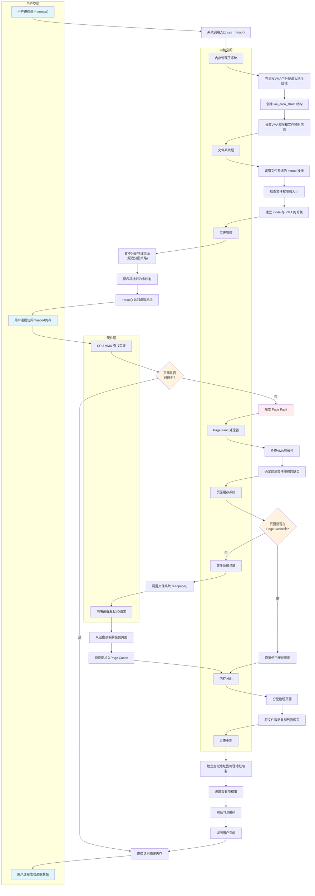

> [!question] 如果我需要mmap一个文件, 然后再读取这个文件内容, 涉及的底层流程是怎样的?
> 

# Linux内核内存管理架构

<svg width="900" height="700" xmlns="http://www.w3.org/2000/svg">
  <!-- 背景 -->
  <rect width="900" height="700" fill="#f8f9fa"/>
  
  <!-- 标题 -->
  <text x="450" y="25" text-anchor="middle" font-family="Arial, sans-serif" font-size="18" font-weight="bold" fill="#333">Linux内核内存管理架构</text>
  
  <!-- task_struct区域 -->
  <rect x="30" y="60" width="200" height="120" fill="#e8f5e8" stroke="#4caf50" stroke-width="2" rx="5"/>
  <text x="130" y="50" text-anchor="middle" font-family="Arial, sans-serif" font-size="14" font-weight="bold" fill="#2e7d32">task_struct</text>
  
  <rect x="50" y="90" width="80" height="25" fill="#c8e6c9" stroke="#388e3c" stroke-width="1" rx="3"/>
  <text x="90" y="105" text-anchor="middle" font-family="Arial, sans-serif" font-size="10" fill="#1b5e20">pid: 1234</text>
  
  <rect x="140" y="90" width="80" height="25" fill="#c8e6c9" stroke="#388e3c" stroke-width="1" rx="3"/>
  <text x="180" y="105" text-anchor="middle" font-family="Arial, sans-serif" font-size="10" fill="#1b5e20">mm: ptr</text>
  
  <rect x="50" y="125" width="80" height="25" fill="#c8e6c9" stroke="#388e3c" stroke-width="1" rx="3"/>
  <text x="90" y="140" text-anchor="middle" font-family="Arial, sans-serif" font-size="10" fill="#1b5e20">state</text>
  
  <rect x="140" y="125" width="80" height="25" fill="#c8e6c9" stroke="#388e3c" stroke-width="1" rx="3"/>
  <text x="180" y="140" text-anchor="middle" font-family="Arial, sans-serif" font-size="10" fill="#1b5e20">active_mm</text>
  
  <!-- mm_struct区域 -->
  <rect x="280" y="60" width="200" height="160" fill="#fff3e0" stroke="#ff9800" stroke-width="2" rx="5"/>
  <text x="380" y="50" text-anchor="middle" font-family="Arial, sans-serif" font-size="14" font-weight="bold" fill="#f57c00">mm_struct</text>
  
  <rect x="300" y="90" width="80" height="25" fill="#ffcc02" stroke="#ff8f00" stroke-width="1" rx="3"/>
  <text x="340" y="105" text-anchor="middle" font-family="Arial, sans-serif" font-size="10" fill="#e65100">pgd: ptr</text>
  
  <rect x="390" y="90" width="80" height="25" fill="#ffcc02" stroke="#ff8f00" stroke-width="1" rx="3"/>
  <text x="430" y="105" text-anchor="middle" font-family="Arial, sans-serif" font-size="10" fill="#e65100">mmap: ptr</text>
  
  <!-- VMA链表 -->
  <rect x="300" y="130" width="70" height="30" fill="#ffe0b2" stroke="#f57c00" stroke-width="1" rx="3"/>
  <text x="335" y="145" text-anchor="middle" font-family="Arial, sans-serif" font-size="10" fill="#e65100">VMA1</text>
  <text x="335" y="157" text-anchor="middle" font-family="Arial, sans-serif" font-size="8" fill="#e65100">代码段</text>
  
  <rect x="300" y="170" width="70" height="30" fill="#ffe0b2" stroke="#f57c00" stroke-width="1" rx="3"/>
  <text x="335" y="185" text-anchor="middle" font-family="Arial, sans-serif" font-size="10" fill="#e65100">VMA2</text>
  <text x="335" y="197" text-anchor="middle" font-family="Arial, sans-serif" font-size="8" fill="#e65100">堆</text>
  
  <rect x="380" y="130" width="70" height="30" fill="#ffe0b2" stroke="#f57c00" stroke-width="1" rx="3"/>
  <text x="415" y="145" text-anchor="middle" font-family="Arial, sans-serif" font-size="10" fill="#e65100">VMA3</text>
  <text x="415" y="157" text-anchor="middle" font-family="Arial, sans-serif" font-size="8" fill="#e65100">栈</text>
  
  <rect x="380" y="170" width="70" height="30" fill="#ffe0b2" stroke="#f57c00" stroke-width="1" rx="3"/>
  <text x="415" y="185" text-anchor="middle" font-family="Arial, sans-serif" font-size="10" fill="#e65100">VMA4</text>
  <text x="415" y="197" text-anchor="middle" font-family="Arial, sans-serif" font-size="8" fill="#e65100">文件映射</text>
  
  <!-- 页表层次结构 -->
  <rect x="520" y="60" width="150" height="160" fill="#e8eaf6" stroke="#3f51b5" stroke-width="2" rx="5"/>
  <text x="595" y="50" text-anchor="middle" font-family="Arial, sans-serif" font-size="14" font-weight="bold" fill="#3f51b5">页表层次</text>
  
  <rect x="540" y="90" width="110" height="25" fill="#c5cae9" stroke="#303f9f" stroke-width="1" rx="3"/>
  <text x="595" y="105" text-anchor="middle" font-family="Arial, sans-serif" font-size="10" fill="#1a237e">PGD (页全局目录)</text>
  
  <rect x="540" y="125" width="110" height="25" fill="#c5cae9" stroke="#303f9f" stroke-width="1" rx="3"/>
  <text x="595" y="140" text-anchor="middle" font-family="Arial, sans-serif" font-size="10" fill="#1a237e">PUD (页上级目录)</text>
  
  <rect x="540" y="160" width="110" height="25" fill="#c5cae9" stroke="#303f9f" stroke-width="1" rx="3"/>
  <text x="595" y="175" text-anchor="middle" font-family="Arial, sans-serif" font-size="10" fill="#1a237e">PMD (页中级目录)</text>
  
  <rect x="540" y="195" width="110" height="25" fill="#c5cae9" stroke="#303f9f" stroke-width="1" rx="3"/>
  <text x="595" y="210" text-anchor="middle" font-family="Arial, sans-serif" font-size="10" fill="#1a237e">PTE (页表项)</text>
  
  <!-- 虚拟内存区域 -->
  <rect x="700" y="60" width="150" height="160" fill="#fff3e0" stroke="#ff9800" stroke-width="2" rx="5"/>
  <text x="775" y="50" text-anchor="middle" font-family="Arial, sans-serif" font-size="14" font-weight="bold" fill="#f57c00">虚拟内存页</text>
  
  <rect x="720" y="90" width="110" height="25" fill="#ffcc02" stroke="#ff8f00" stroke-width="1" rx="3"/>
  <text x="775" y="105" text-anchor="middle" font-family="Arial, sans-serif" font-size="10" fill="#e65100">虚拟页1</text>
  
  <rect x="720" y="125" width="110" height="25" fill="#ffcc02" stroke="#ff8f00" stroke-width="1" rx="3"/>
  <text x="775" y="140" text-anchor="middle" font-family="Arial, sans-serif" font-size="10" fill="#e65100">虚拟页2</text>
  
  <rect x="720" y="160" width="110" height="25" fill="#ffcc02" stroke="#ff8f00" stroke-width="1" rx="3"/>
  <text x="775" y="175" text-anchor="middle" font-family="Arial, sans-serif" font-size="10" fill="#e65100">虚拟页3</text>
  
  <rect x="720" y="195" width="110" height="25" fill="#ffcc02" stroke="#ff8f00" stroke-width="1" rx="3"/>
  <text x="775" y="210" text-anchor="middle" font-family="Arial, sans-serif" font-size="10" fill="#e65100">...</text>
  
  <!-- 物理内存区域 -->
  <rect x="520" y="260" width="330" height="100" fill="#fce4ec" stroke="#c2185b" stroke-width="2" rx="5"/>
  <text x="685" y="250" text-anchor="middle" font-family="Arial, sans-serif" font-size="14" font-weight="bold" fill="#c2185b">物理内存</text>
  
  <rect x="540" y="290" width="70" height="25" fill="#f8bbd9" stroke="#ad1457" stroke-width="1" rx="3"/>
  <text x="575" y="305" text-anchor="middle" font-family="Arial, sans-serif" font-size="9" fill="#880e4f">物理页1</text>
  
  <rect x="620" y="290" width="70" height="25" fill="#f8bbd9" stroke="#ad1457" stroke-width="1" rx="3"/>
  <text x="655" y="305" text-anchor="middle" font-family="Arial, sans-serif" font-size="9" fill="#880e4f">物理页2</text>
  
  <rect x="700" y="290" width="70" height="25" fill="#f8bbd9" stroke="#ad1457" stroke-width="1" rx="3"/>
  <text x="735" y="305" text-anchor="middle" font-family="Arial, sans-serif" font-size="9" fill="#880e4f">物理页3</text>
  
  <rect x="780" y="290" width="60" height="25" fill="#f8bbd9" stroke="#ad1457" stroke-width="1" rx="3"/>
  <text x="810" y="305" text-anchor="middle" font-family="Arial, sans-serif" font-size="9" fill="#880e4f">...</text>
  
  <rect x="540" y="325" width="70" height="25" fill="#f8bbd9" stroke="#ad1457" stroke-width="1" rx="3"/>
  <text x="575" y="340" text-anchor="middle" font-family="Arial, sans-serif" font-size="9" fill="#880e4f">物理页N</text>
  
  <rect x="620" y="325" width="70" height="25" fill="#f8bbd9" stroke="#ad1457" stroke-width="1" rx="3"/>
  <text x="655" y="340" text-anchor="middle" font-family="Arial, sans-serif" font-size="9" fill="#880e4f">物理页M</text>
  
  <!-- VFS文件系统区域 -->
  <rect x="30" y="400" width="820" height="180" fill="#f3e5f5" stroke="#7b1fa2" stroke-width="2" rx="5"/>
  <text x="440" y="390" text-anchor="middle" font-family="Arial, sans-serif" font-size="14" font-weight="bold" fill="#7b1fa2">VFS (虚拟文件系统)</text>
  
  <!-- 文件夹结构 -->
  <rect x="60" y="430" width="100" height="35" fill="#ce93d8" stroke="#8e24aa" stroke-width="1" rx="3"/>
  <text x="110" y="448" text-anchor="middle" font-family="Arial, sans-serif" font-size="11" fill="#4a148c">/bin</text>
  <text x="110" y="460" text-anchor="middle" font-family="Arial, sans-serif" font-size="9" fill="#4a148c">可执行文件</text>
  
  <rect x="180" y="430" width="100" height="35" fill="#ce93d8" stroke="#8e24aa" stroke-width="1" rx="3"/>
  <text x="230" y="448" text-anchor="middle" font-family="Arial, sans-serif" font-size="11" fill="#4a148c">/lib</text>
  <text x="230" y="460" text-anchor="middle" font-family="Arial, sans-serif" font-size="9" fill="#4a148c">动态库</text>
  
  <rect x="300" y="430" width="100" height="35" fill="#ce93d8" stroke="#8e24aa" stroke-width="1" rx="3"/>
  <text x="350" y="448" text-anchor="middle" font-family="Arial, sans-serif" font-size="11" fill="#4a148c">/usr</text>
  <text x="350" y="460" text-anchor="middle" font-family="Arial, sans-serif" font-size="9" fill="#4a148c">用户程序</text>
  
  <!-- 文件对象 -->
  <rect x="60" y="480" width="80" height="25" fill="#ba68c8" stroke="#7b1fa2" stroke-width="1" rx="3"/>
  <text x="100" y="495" text-anchor="middle" font-family="Arial, sans-serif" font-size="9" fill="#4a148c">program.elf</text>
  
  <rect x="160" y="480" width="80" height="25" fill="#ba68c8" stroke="#7b1fa2" stroke-width="1" rx="3"/>
  <text x="200" y="495" text-anchor="middle" font-family="Arial, sans-serif" font-size="9" fill="#4a148c">libc.so</text>
  
  <rect x="260" y="480" width="80" height="25" fill="#ba68c8" stroke="#7b1fa2" stroke-width="1" rx="3"/>
  <text x="300" y="495" text-anchor="middle" font-family="Arial, sans-serif" font-size="9" fill="#4a148c">data.txt</text>
  
  <!-- inode -->
  <rect x="60" y="520" width="80" height="25" fill="#9c27b0" stroke="#6a1b9a" stroke-width="1" rx="3"/>
  <text x="100" y="535" text-anchor="middle" font-family="Arial, sans-serif" font-size="9" fill="white">inode 101</text>
  
  <rect x="160" y="520" width="80" height="25" fill="#9c27b0" stroke="#6a1b9a" stroke-width="1" rx="3"/>
  <text x="200" y="535" text-anchor="middle" font-family="Arial, sans-serif" font-size="9" fill="white">inode 102</text>
  
  <rect x="260" y="520" width="80" height="25" fill="#9c27b0" stroke="#6a1b9a" stroke-width="1" rx="3"/>
  <text x="300" y="535" text-anchor="middle" font-family="Arial, sans-serif" font-size="9" fill="white">inode 103</text>
  
  <!-- 磁盘存储 -->
  <rect x="450" y="480" width="120" height="65" fill="#673ab7" stroke="#512da8" stroke-width="1" rx="3"/>
  <text x="510" y="500" text-anchor="middle" font-family="Arial, sans-serif" font-size="11" fill="white">磁盘存储</text>
  <text x="510" y="515" text-anchor="middle" font-family="Arial, sans-serif" font-size="9" fill="white">Block 1</text>
  <text x="510" y="528" text-anchor="middle" font-family="Arial, sans-serif" font-size="9" fill="white">Block 2</text>
  <text x="510" y="541" text-anchor="middle" font-family="Arial, sans-serif" font-size="9" fill="white">...</text>
  
  <!-- 另一个进程示例 -->
  <rect x="30" y="250" width="200" height="80" fill="#e8f5e8" stroke="#4caf50" stroke-width="2" rx="5"/>
  <text x="130" y="240" text-anchor="middle" font-family="Arial, sans-serif" font-size="12" font-weight="bold" fill="#2e7d32">另一个进程</text>
  
  <rect x="50" y="270" width="80" height="20" fill="#c8e6c9" stroke="#388e3c" stroke-width="1" rx="3"/>
  <text x="90" y="282" text-anchor="middle" font-family="Arial, sans-serif" font-size="9" fill="#1b5e20">pid: 5678</text>
  
  <rect x="140" y="270" width="80" height="20" fill="#c8e6c9" stroke="#388e3c" stroke-width="1" rx="3"/>
  <text x="180" y="282" text-anchor="middle" font-family="Arial, sans-serif" font-size="9" fill="#1b5e20">mm: ptr</text>
  
  <rect x="95" y="300" width="80" height="20" fill="#c8e6c9" stroke="#388e3c" stroke-width="1" rx="3"/>
  <text x="135" y="312" text-anchor="middle" font-family="Arial, sans-serif" font-size="9" fill="#1b5e20">独立的mm_struct</text>
  
  <!-- 线程示例 -->
  <rect x="650" y="430" width="180" height="100" fill="#e1f5fe" stroke="#0277bd" stroke-width="2" rx="5"/>
  <text x="740" y="420" text-anchor="middle" font-family="Arial, sans-serif" font-size="12" font-weight="bold" fill="#0277bd">同进程内的线程</text>
  
  <rect x="670" y="450" width="70" height="20" fill="#b3e5fc" stroke="#0288d1" stroke-width="1" rx="3"/>
  <text x="705" y="462" text-anchor="middle" font-family="Arial, sans-serif" font-size="9" fill="#01579b">线程1</text>
  
  <rect x="750" y="450" width="70" height="20" fill="#b3e5fc" stroke="#0288d1" stroke-width="1" rx="3"/>
  <text x="785" y="462" text-anchor="middle" font-family="Arial, sans-serif" font-size="9" fill="#01579b">线程2</text>
  
  <rect x="710" y="480" width="80" height="30" fill="#81d4fa" stroke="#0277bd" stroke-width="1" rx="3"/>
  <text x="750" y="495" text-anchor="middle" font-family="Arial, sans-serif" font-size="10" fill="#01579b">共享同一个</text>
  <text x="750" y="507" text-anchor="middle" font-family="Arial, sans-serif" font-size="10" fill="#01579b">mm_struct</text>
  
  <!-- 箭头连接 -->
  <!-- task_struct到mm_struct -->
  <line x1="230" y1="102" x2="280" y2="102" stroke="#666" stroke-width="2" marker-end="url(#arrowhead)"/>
  
  <!-- mm_struct到页表 -->
  <line x1="380" y1="102" x2="520" y2="102" stroke="#666" stroke-width="2" marker-end="url(#arrowhead)"/>
  
  <!-- mm_struct到VMA -->
  <line x1="430" y1="115" x2="430" y2="130" stroke="#666" stroke-width="1" marker-end="url(#arrowhead)"/>
  
  <!-- VMA到虚拟内存 -->
  <line x1="450" y1="145" x2="720" y2="102" stroke="#ff9800" stroke-width="2" marker-end="url(#arrowhead)"/>
  <line x1="450" y1="185" x2="720" y2="140" stroke="#ff9800" stroke-width="2" marker-end="url(#arrowhead)"/>
  
  <!-- 页表到物理内存 -->
  <line x1="650" y1="210" x2="720" y2="290" stroke="#3f51b5" stroke-width="2" marker-end="url(#arrowhead)"/>
  
  <!-- 文件映射到VMA -->
  <path d="M 350 480 Q 400 400 415 200" stroke="#7b1fa2" stroke-width="2" fill="none" stroke-dasharray="5,5" marker-end="url(#arrowhead)"/>
  
  <!-- 文件到inode -->
  <line x1="100" y1="505" x2="100" y2="520" stroke="#666" stroke-width="1" marker-end="url(#arrowhead)"/>
  <line x1="200" y1="505" x2="200" y2="520" stroke="#666" stroke-width="1" marker-end="url(#arrowhead)"/>
  <line x1="300" y1="505" x2="300" y2="520" stroke="#666" stroke-width="1" marker-end="url(#arrowhead)"/>
  
  <!-- inode到磁盘 -->
  <line x1="140" y1="532" x2="450" y2="512" stroke="#666" stroke-width="1" marker-end="url(#arrowhead)"/>
  <line x1="240" y1="532" x2="450" y2="520" stroke="#666" stroke-width="1" marker-end="url(#arrowhead)"/>
  <line x1="340" y1="532" x2="450" y2="528" stroke="#666" stroke-width="1" marker-end="url(#arrowhead)"/>
  
  <!-- 另一个进程到独立mm_struct -->
  <line x1="230" y1="290" x2="260" y2="290" stroke="#4caf50" stroke-width="2" stroke-dasharray="3,3"/>
  <text x="245" y="285" text-anchor="middle" font-family="Arial, sans-serif" font-size="8" fill="#2e7d32">独立</text>
  
  <!-- 线程共享连接 -->
  <line x1="750" y1="470" x2="380" y2="220" stroke="#0277bd" stroke-width="2" stroke-dasharray="3,3"/>
  <text x="565" y="345" text-anchor="middle" font-family="Arial, sans-serif" font-size="9" fill="#0277bd">共享</text>
  
  <!-- 箭头标记定义 -->
  <defs>
    <marker id="arrowhead" markerWidth="8" markerHeight="6" refX="7" refY="3" orient="auto">
      <polygon points="0 0, 8 3, 0 6" fill="#666"/>
    </marker>
  </defs>
  
  <!-- 缺页异常流程 -->
  <rect x="600" y="430" width="40" height="80" fill="#ffeb3b" stroke="#f57f17" stroke-width="2" rx="5" opacity="0.8"/>
  <text x="620" y="445" text-anchor="middle" font-family="Arial, sans-serif" font-size="9" font-weight="bold" fill="#f57f17">缺页</text>
  <text x="620" y="455" text-anchor="middle" font-family="Arial, sans-serif" font-size="8" fill="#f57f17">异常</text>
  <text x="620" y="470" text-anchor="middle" font-family="Arial, sans-serif" font-size="8" fill="#f57f17">1.查VMA</text>
  <text x="620" y="480" text-anchor="middle" font-family="Arial, sans-serif" font-size="8" fill="#f57f17">2.验证权限</text>
  <text x="620" y="490" text-anchor="middle" font-family="Arial, sans-serif" font-size="8" fill="#f57f17">3.分配物理页</text>
  <text x="620" y="500" text-anchor="middle" font-family="Arial, sans-serif" font-size="8" fill="#f57f17">4.更新页表</text>
  
  <!-- 说明文字 -->
  <text x="30" y="630" font-family="Arial, sans-serif" font-size="12" font-weight="bold" fill="#333">关键设计要点:</text>
  <text x="30" y="650" font-family="Arial, sans-serif" font-size="10" fill="#666">• 每个进程有独立的task_struct和mm_struct，但同进程内线程共享mm_struct</text>
  <text x="30" y="665" font-family="Arial, sans-serif" font-size="10" fill="#666">• VMA定义内存区域策略，页表实现具体的地址翻译机制</text>
  <text x="30" y="680" font-family="Arial, sans-serif" font-size="10" fill="#666">• 文件可通过mmap映射到VMA，实现文件内容与虚拟内存的直接关联</text>
  <text x="30" y="695" font-family="Arial, sans-serif" font-size="10" fill="#666">• 缺页异常时，内核先检查VMA权限，再更新页表建立虚拟-物理页映射</text>
</svg>

# 流程图

# 核心代码调用流程

<svg width="212pt" height="855pt"
 viewBox="0.00 0.00 212.07 855.00" xmlns="http://www.w3.org/2000/svg" xmlns:xlink="http://www.w3.org/1999/xlink">
<g id="graph0" class="graph" transform="scale(1 1) rotate(0) translate(4 851)">
<title>%3</title>
<polygon fill="white" stroke="transparent" points="-4,4 -4,-851 208.07,-851 208.07,4 -4,4"/>
<!-- user_mmap -->
<g id="node1" class="node">
<title>user_mmap</title>
<ellipse fill="#e3f2fd" stroke="black" cx="135.07" cy="-829" rx="34.76" ry="18"/>
<text text-anchor="middle" x="135.07" y="-826.2" font-family="SimHei" font-size="11.00">mmap()</text>
</g>
<!-- sys_mmap -->
<g id="node2" class="node">
<title>sys_mmap</title>
<ellipse fill="#fff3e0" stroke="black" cx="135.07" cy="-747" rx="48.21" ry="18"/>
<text text-anchor="middle" x="135.07" y="-744.2" font-family="SimHei" font-size="11.00">sys_mmap()</text>
</g>
<!-- user_mmap&#45;&gt;sys_mmap -->
<g id="edge1" class="edge">
<title>user_mmap&#45;&gt;sys_mmap</title>
<path fill="none" stroke="black" d="M135.07,-810.64C135.07,-800.3 135.07,-786.94 135.07,-775.22"/>
<polygon fill="black" stroke="black" points="138.57,-775.05 135.07,-765.05 131.57,-775.05 138.57,-775.05"/>
<text text-anchor="middle" x="149.07" y="-785.8" font-family="SimHei" font-size="9.00">syscall</text>
</g>
<!-- do_mmap -->
<g id="node3" class="node">
<title>do_mmap</title>
<ellipse fill="#fff3e0" stroke="black" cx="135.07" cy="-674" rx="46.11" ry="18"/>
<text text-anchor="middle" x="135.07" y="-671.2" font-family="SimHei" font-size="11.00">do_mmap()</text>
</g>
<!-- sys_mmap&#45;&gt;do_mmap -->
<g id="edge2" class="edge">
<title>sys_mmap&#45;&gt;do_mmap</title>
<path fill="none" stroke="black" d="M135.07,-728.81C135.07,-720.79 135.07,-711.05 135.07,-702.07"/>
<polygon fill="black" stroke="black" points="138.57,-702.03 135.07,-692.03 131.57,-702.03 138.57,-702.03"/>
</g>
<!-- vma_create -->
<g id="node4" class="node">
<title>vma_create</title>
<ellipse fill="#e8f5e8" stroke="black" cx="135.07" cy="-592" rx="36.86" ry="18"/>
<text text-anchor="middle" x="135.07" y="-589.2" font-family="SimHei" font-size="11.00">VMA创建</text>
</g>
<!-- do_mmap&#45;&gt;vma_create -->
<g id="edge3" class="edge">
<title>do_mmap&#45;&gt;vma_create</title>
<path fill="none" stroke="black" d="M135.07,-655.64C135.07,-645.3 135.07,-631.94 135.07,-620.22"/>
<polygon fill="black" stroke="black" points="138.57,-620.05 135.07,-610.05 131.57,-620.05 138.57,-620.05"/>
<text text-anchor="middle" x="153.57" y="-630.8" font-family="SimHei" font-size="9.00">VMA分配</text>
</g>
<!-- user_access -->
<g id="node5" class="node">
<title>user_access</title>
<ellipse fill="#e3f2fd" stroke="black" cx="135.07" cy="-510" rx="37.07" ry="18"/>
<text text-anchor="middle" x="135.07" y="-507.2" font-family="SimHei" font-size="11.00">内存访问</text>
</g>
<!-- vma_create&#45;&gt;user_access -->
<g id="edge4" class="edge">
<title>vma_create&#45;&gt;user_access</title>
<path fill="none" stroke="black" d="M135.07,-573.64C135.07,-563.3 135.07,-549.94 135.07,-538.22"/>
<polygon fill="black" stroke="black" points="138.57,-538.05 135.07,-528.05 131.57,-538.05 138.57,-538.05"/>
<text text-anchor="middle" x="158.07" y="-548.8" font-family="SimHei" font-size="9.00">mmap返回</text>
</g>
<!-- page_fault -->
<g id="node6" class="node">
<title>page_fault</title>
<ellipse fill="#fff9c4" stroke="black" cx="98.07" cy="-428" rx="37.07" ry="18"/>
<text text-anchor="middle" x="98.07" y="-425.2" font-family="SimHei" font-size="11.00">缺页异常</text>
</g>
<!-- user_access&#45;&gt;page_fault -->
<g id="edge5" class="edge">
<title>user_access&#45;&gt;page_fault</title>
<path fill="none" stroke="black" d="M127.23,-492.03C122.24,-481.25 115.68,-467.08 110.05,-454.9"/>
<polygon fill="black" stroke="black" points="113.16,-453.27 105.78,-445.67 106.8,-456.21 113.16,-453.27"/>
<text text-anchor="middle" x="127.57" y="-466.8" font-family="SimHei" font-size="9.00">缺页</text>
</g>
<!-- filemap_fault -->
<g id="node7" class="node">
<title>filemap_fault</title>
<ellipse fill="#fce4ec" stroke="black" cx="83.07" cy="-346" rx="55.15" ry="18"/>
<text text-anchor="middle" x="83.07" y="-343.2" font-family="SimHei" font-size="11.00">filemap_fault()</text>
</g>
<!-- page_fault&#45;&gt;filemap_fault -->
<g id="edge6" class="edge">
<title>page_fault&#45;&gt;filemap_fault</title>
<path fill="none" stroke="black" d="M94.89,-410.03C92.94,-399.6 90.39,-386.01 88.16,-374.11"/>
<polygon fill="black" stroke="black" points="91.58,-373.4 86.3,-364.22 84.7,-374.69 91.58,-373.4"/>
<text text-anchor="middle" x="110.07" y="-384.8" font-family="SimHei" font-size="9.00">fault处理</text>
</g>
<!-- page_cache -->
<g id="node8" class="node">
<title>page_cache</title>
<ellipse fill="#fce4ec" stroke="black" cx="80.07" cy="-264" rx="50.52" ry="18"/>
<text text-anchor="middle" x="80.07" y="-261.2" font-family="SimHei" font-size="11.00">页面缓存查找</text>
</g>
<!-- filemap_fault&#45;&gt;page_cache -->
<g id="edge7" class="edge">
<title>filemap_fault&#45;&gt;page_cache</title>
<path fill="none" stroke="black" d="M82.42,-327.64C82.03,-317.3 81.53,-303.94 81.09,-292.22"/>
<polygon fill="black" stroke="black" points="84.59,-291.91 80.71,-282.05 77.59,-292.17 84.59,-291.91"/>
<text text-anchor="middle" x="100.57" y="-302.8" font-family="SimHei" font-size="9.00">查找缓存</text>
</g>
<!-- io_read -->
<g id="node9" class="node">
<title>io_read</title>
<ellipse fill="#f3e5f5" stroke="black" cx="33.07" cy="-182" rx="33.15" ry="18"/>
<text text-anchor="middle" x="33.07" y="-179.2" font-family="SimHei" font-size="11.00">I/O读取</text>
</g>
<!-- page_cache&#45;&gt;io_read -->
<g id="edge8" class="edge">
<title>page_cache&#45;&gt;io_read</title>
<path fill="none" stroke="black" d="M58.64,-247.52C52.42,-242.02 46.2,-235.35 42.07,-228 39.02,-222.57 37,-216.26 35.65,-210.12"/>
<polygon fill="black" stroke="black" points="39.08,-209.4 33.98,-200.12 32.18,-210.56 39.08,-209.4"/>
<text text-anchor="middle" x="65.07" y="-220.8" font-family="SimHei" font-size="9.00">缓存未命中</text>
</g>
<!-- page_map -->
<g id="node10" class="node">
<title>page_map</title>
<ellipse fill="#e8f5e8" stroke="black" cx="102.07" cy="-100" rx="37.07" ry="18"/>
<text text-anchor="middle" x="102.07" y="-97.2" font-family="SimHei" font-size="11.00">页表映射</text>
</g>
<!-- page_cache&#45;&gt;page_map -->
<g id="edge9" class="edge">
<title>page_cache&#45;&gt;page_map</title>
<path fill="none" stroke="blue" stroke-width="2" d="M84.37,-245.99C85.7,-240.3 87.08,-233.9 88.07,-228 93.83,-193.93 97.76,-154.31 99.96,-128.5"/>
<polygon fill="blue" stroke="blue" stroke-width="2" points="103.46,-128.6 100.8,-118.34 96.49,-128.02 103.46,-128.6"/>
<text text-anchor="middle" x="114.57" y="-179.8" font-family="SimHei" font-size="9.00">缓存命中</text>
</g>
<!-- io_read&#45;&gt;page_map -->
<g id="edge10" class="edge">
<title>io_read&#45;&gt;page_map</title>
<path fill="none" stroke="black" d="M39.55,-164.1C43.48,-155.16 49.09,-144.35 56.07,-136 60.57,-130.62 66.04,-125.57 71.62,-121.07"/>
<polygon fill="black" stroke="black" points="73.91,-123.73 79.76,-114.9 69.68,-118.15 73.91,-123.73"/>
<text text-anchor="middle" x="72.07" y="-138.8" font-family="SimHei" font-size="9.00">I/O完成</text>
</g>
<!-- complete -->
<g id="node11" class="node">
<title>complete</title>
<ellipse fill="#e3f2fd" stroke="black" cx="135.07" cy="-18" rx="37.07" ry="18"/>
<text text-anchor="middle" x="135.07" y="-15.2" font-family="SimHei" font-size="11.00">访问完成</text>
</g>
<!-- page_map&#45;&gt;complete -->
<g id="edge11" class="edge">
<title>page_map&#45;&gt;complete</title>
<path fill="none" stroke="black" d="M106.5,-82.05C108.94,-73.5 112.25,-63.05 116.07,-54 117.39,-50.88 118.9,-47.67 120.48,-44.52"/>
<polygon fill="black" stroke="black" points="123.72,-45.88 125.31,-35.41 117.53,-42.61 123.72,-45.88"/>
<text text-anchor="middle" x="134.57" y="-56.8" font-family="SimHei" font-size="9.00">映射建立</text>
</g>
<!-- complete&#45;&gt;user_access -->
<g id="edge12" class="edge">
<title>complete&#45;&gt;user_access</title>
<path fill="none" stroke="green" stroke-dasharray="5,2" d="M145.91,-35.4C155.19,-51.06 167.07,-75.66 167.07,-99 167.07,-429 167.07,-429 167.07,-429 167.07,-448.32 158.92,-468.52 150.85,-483.78"/>
<polygon fill="green" stroke="green" points="147.75,-482.16 145.91,-492.6 153.85,-485.59 147.75,-482.16"/>
<text text-anchor="middle" x="185.57" y="-261.8" font-family="SimHei" font-size="9.00">重试访问</text>
</g>
</g>
</svg>

# 详细代码调用流程图

<svg width="1277pt" height="813pt"
 viewBox="0.00 0.00 1277.00 812.50" xmlns="http://www.w3.org/2000/svg" xmlns:xlink="http://www.w3.org/1999/xlink">
<g id="graph0" class="graph" transform="scale(1 1) rotate(0) translate(4 808.5)">
<title>%3</title>
<polygon fill="white" stroke="transparent" points="-4,4 -4,-808.5 1273,-808.5 1273,4 -4,4"/>
<g id="clust1" class="cluster">
<title>cluster_user</title>
<polygon fill="lightblue" stroke="lightblue" points="668,-637 668,-735 914,-735 914,-637 668,-637"/>
<text text-anchor="middle" x="791" y="-719.8" font-family="Times,serif" font-size="14.00">用户空间</text>
</g>
<g id="clust2" class="cluster">
<title>cluster_syscall</title>
<polygon fill="lightyellow" stroke="lightyellow" points="83,-376 83,-735 203,-735 203,-376 83,-376"/>
<text text-anchor="middle" x="143" y="-719.8" font-family="Times,serif" font-size="14.00">系统调用层</text>
</g>
<g id="clust3" class="cluster">
<title>cluster_mm</title>
<polygon fill="lightgreen" stroke="lightgreen" points="8,-89 8,-349 241,-349 241,-89 8,-89"/>
<text text-anchor="middle" x="124.5" y="-333.8" font-family="Times,serif" font-size="14.00">内存管理子系统</text>
</g>
<g id="clust4" class="cluster">
<title>cluster_fs</title>
<polygon fill="lightpink" stroke="lightpink" points="249,-251 249,-735 485,-735 485,-251 249,-251"/>
<text text-anchor="middle" x="367" y="-719.8" font-family="Times,serif" font-size="14.00">文件系统层</text>
</g>
<g id="clust5" class="cluster">
<title>cluster_fault</title>
<polygon fill="lightyellow" stroke="lightyellow" points="565,-170 565,-474 891,-474 891,-170 565,-170"/>
<text text-anchor="middle" x="728" y="-458.8" font-family="Times,serif" font-size="14.00">缺页异常处理</text>
</g>
<g id="clust6" class="cluster">
<title>cluster_io</title>
<polygon fill="#e3f2fd" stroke="#e3f2fd" points="899,-8 899,-349 1215,-349 1215,-8 899,-8"/>
<text text-anchor="middle" x="1057" y="-333.8" font-family="Times,serif" font-size="14.00">I/O子系统</text>
</g>
<g id="clust7" class="cluster">
<title>cluster_hardware</title>
<polygon fill="lightcoral" stroke="lightcoral" points="953,-376 953,-599 1133,-599 1133,-376 953,-376"/>
<text text-anchor="middle" x="1043" y="-583.8" font-family="Times,serif" font-size="14.00">硬件层</text>
</g>
<!-- mmap_call -->
<g id="node1" class="node">
<title>mmap_call</title>
<polygon fill="#e3f2fd" stroke="black" points="906.5,-681 813.5,-681 813.5,-645 906.5,-645 906.5,-681"/>
<text text-anchor="middle" x="860" y="-660.5" font-family="SimHei" font-size="10.00">mmap()系统调用</text>
</g>
<!-- sys_mmap -->
<g id="node3" class="node">
<title>sys_mmap</title>
<polygon fill="#fff3e0" stroke="black" points="195,-681 121,-681 121,-645 195,-645 195,-681"/>
<text text-anchor="middle" x="158" y="-660.5" font-family="SimHei" font-size="10.00">sys_mmap()</text>
</g>
<!-- mmap_call&#45;&gt;sys_mmap -->
<g id="edge1" class="edge">
<title>mmap_call&#45;&gt;sys_mmap</title>
<path fill="none" stroke="black" d="M851.34,-681.04C842.33,-697.48 826.51,-720.73 805,-731 748.85,-757.8 303.83,-751.26 245,-731 220.54,-722.58 197.7,-704.14 181.56,-688.59"/>
<polygon fill="black" stroke="black" points="183.75,-685.83 174.2,-681.25 178.81,-690.79 183.75,-685.83"/>
<text text-anchor="middle" x="592" y="-745.6" font-family="SimHei" font-size="8.00">系统调用</text>
</g>
<!-- memory_access -->
<g id="node2" class="node">
<title>memory_access</title>
<polygon fill="#e3f2fd" stroke="black" points="795.5,-681 676.5,-681 676.5,-645 795.5,-645 795.5,-681"/>
<text text-anchor="middle" x="736" y="-666" font-family="SimHei" font-size="10.00">访问映射内存</text>
<text text-anchor="middle" x="736" y="-655" font-family="SimHei" font-size="10.00">*(char*)mapped_addr</text>
</g>
<!-- mmu_lookup -->
<g id="node29" class="node">
<title>mmu_lookup</title>
<polygon fill="#ffebee" stroke="black" points="1041,-545 961,-545 961,-509 1041,-509 1041,-545"/>
<text text-anchor="middle" x="1001" y="-524.5" font-family="SimHei" font-size="10.00">MMU页表查找</text>
</g>
<!-- memory_access&#45;&gt;mmu_lookup -->
<g id="edge9" class="edge">
<title>memory_access&#45;&gt;mmu_lookup</title>
<path fill="none" stroke="black" d="M773.4,-644.95C783.5,-640.87 794.53,-636.87 805,-634 857.02,-619.76 877.77,-642.03 925,-616 951.34,-601.49 972.75,-574.07 986.06,-553.68"/>
<polygon fill="black" stroke="black" points="989.06,-555.48 991.43,-545.15 983.14,-551.75 989.06,-555.48"/>
<text text-anchor="middle" x="955" y="-609.6" font-family="SimHei" font-size="8.00">地址翻译</text>
</g>
<!-- vm_mmap_pgoff -->
<g id="node4" class="node">
<title>vm_mmap_pgoff</title>
<polygon fill="#fff3e0" stroke="black" points="194.5,-545 91.5,-545 91.5,-509 194.5,-509 194.5,-545"/>
<text text-anchor="middle" x="143" y="-524.5" font-family="SimHei" font-size="10.00">vm_mmap_pgoff()</text>
</g>
<!-- sys_mmap&#45;&gt;vm_mmap_pgoff -->
<g id="edge2" class="edge">
<title>sys_mmap&#45;&gt;vm_mmap_pgoff</title>
<path fill="none" stroke="black" d="M156.07,-644.76C153.54,-622.14 149.07,-582.2 146.07,-555.42"/>
<polygon fill="black" stroke="black" points="149.51,-554.73 144.92,-545.18 142.56,-555.5 149.51,-554.73"/>
<text text-anchor="middle" x="170" y="-609.6" font-family="SimHei" font-size="8.00">参数处理</text>
</g>
<!-- do_mmap -->
<g id="node5" class="node">
<title>do_mmap</title>
<polygon fill="#fff3e0" stroke="black" points="170.5,-420 99.5,-420 99.5,-384 170.5,-384 170.5,-420"/>
<text text-anchor="middle" x="135" y="-399.5" font-family="SimHei" font-size="10.00">do_mmap()</text>
</g>
<!-- vm_mmap_pgoff&#45;&gt;do_mmap -->
<g id="edge3" class="edge">
<title>vm_mmap_pgoff&#45;&gt;do_mmap</title>
<path fill="none" stroke="black" d="M141.89,-508.9C140.57,-488.63 138.36,-454.6 136.79,-430.59"/>
<polygon fill="black" stroke="black" points="140.27,-430.11 136.13,-420.35 133.29,-430.56 140.27,-430.11"/>
<text text-anchor="middle" x="158" y="-484.6" font-family="SimHei" font-size="8.00">核心逻辑</text>
</g>
<!-- mmap_region -->
<g id="node6" class="node">
<title>mmap_region</title>
<polygon fill="#e8f5e8" stroke="black" points="146.5,-295 57.5,-295 57.5,-259 146.5,-259 146.5,-295"/>
<text text-anchor="middle" x="102" y="-274.5" font-family="SimHei" font-size="10.00">mmap_region()</text>
</g>
<!-- do_mmap&#45;&gt;mmap_region -->
<g id="edge4" class="edge">
<title>do_mmap&#45;&gt;mmap_region</title>
<path fill="none" stroke="black" d="M130.41,-383.9C124.95,-363.54 115.76,-329.29 109.32,-305.27"/>
<polygon fill="black" stroke="black" points="112.63,-304.11 106.66,-295.35 105.87,-305.92 112.63,-304.11"/>
<text text-anchor="middle" x="143" y="-359.6" font-family="SimHei" font-size="8.00">区域映射</text>
</g>
<!-- vm_area_alloc -->
<g id="node7" class="node">
<title>vm_area_alloc</title>
<polygon fill="#e8f5e8" stroke="black" points="108.5,-214 15.5,-214 15.5,-178 108.5,-178 108.5,-214"/>
<text text-anchor="middle" x="62" y="-193.5" font-family="SimHei" font-size="10.00">vm_area_alloc()</text>
</g>
<!-- mmap_region&#45;&gt;vm_area_alloc -->
<g id="edge5" class="edge">
<title>mmap_region&#45;&gt;vm_area_alloc</title>
<path fill="none" stroke="black" d="M93.32,-258.86C88.03,-248.4 81.15,-234.83 75.2,-223.06"/>
<polygon fill="black" stroke="black" points="78.3,-221.45 70.66,-214.11 72.06,-224.61 78.3,-221.45"/>
<text text-anchor="middle" x="100.5" y="-234.6" font-family="SimHei" font-size="8.00">分配VMA</text>
</g>
<!-- file_mmap -->
<g id="node12" class="node">
<title>file_mmap</title>
<polygon fill="#fce4ec" stroke="black" points="365.5,-681 258.5,-681 258.5,-645 365.5,-645 365.5,-681"/>
<text text-anchor="middle" x="312" y="-666" font-family="SimHei" font-size="10.00">file&#45;&gt;f_op&#45;&gt;mmap()</text>
<text text-anchor="middle" x="312" y="-655" font-family="SimHei" font-size="10.00">(如ext4_file_mmap)</text>
</g>
<!-- mmap_region&#45;&gt;file_mmap -->
<g id="edge6" class="edge">
<title>mmap_region&#45;&gt;file_mmap</title>
<path fill="none" stroke="black" d="M112.04,-295.18C121.76,-310.72 137.7,-333.47 156,-349 175.55,-365.6 191.83,-355.32 207,-376 266.6,-457.26 200.79,-509.97 248,-599 255.91,-613.92 268.58,-627.48 280.56,-638.18"/>
<polygon fill="black" stroke="black" points="278.41,-640.94 288.29,-644.77 282.96,-635.62 278.41,-640.94"/>
<text text-anchor="middle" x="250" y="-484.6" font-family="SimHei" font-size="8.00">文件映射</text>
</g>
<!-- vma_link -->
<g id="node8" class="node">
<title>vma_link</title>
<polygon fill="#e8f5e8" stroke="black" points="95.5,-133 28.5,-133 28.5,-97 95.5,-97 95.5,-133"/>
<text text-anchor="middle" x="62" y="-112.5" font-family="SimHei" font-size="10.00">vma_link()</text>
</g>
<!-- vm_area_alloc&#45;&gt;vma_link -->
<g id="edge8" class="edge">
<title>vm_area_alloc&#45;&gt;vma_link</title>
<path fill="none" stroke="black" d="M62,-177.86C62,-167.71 62,-154.63 62,-143.12"/>
<polygon fill="black" stroke="black" points="65.5,-143.11 62,-133.11 58.5,-143.11 65.5,-143.11"/>
<text text-anchor="middle" x="78.5" y="-153.6" font-family="SimHei" font-size="8.00">链接VMA</text>
</g>
<!-- find_vma -->
<g id="node9" class="node">
<title>find_vma</title>
<polygon fill="#e8f5e8" stroke="black" points="233,-295 165,-295 165,-259 233,-259 233,-295"/>
<text text-anchor="middle" x="199" y="-274.5" font-family="SimHei" font-size="10.00">find_vma()</text>
</g>
<!-- handle_mm_fault -->
<g id="node10" class="node">
<title>handle_mm_fault</title>
<polygon fill="#e8f5e8" stroke="black" points="233.5,-214 126.5,-214 126.5,-178 233.5,-178 233.5,-214"/>
<text text-anchor="middle" x="180" y="-193.5" font-family="SimHei" font-size="10.00">handle_mm_fault()</text>
</g>
<!-- find_vma&#45;&gt;handle_mm_fault -->
<g id="edge12" class="edge">
<title>find_vma&#45;&gt;handle_mm_fault</title>
<path fill="none" stroke="black" d="M194.88,-258.86C192.44,-248.71 189.29,-235.63 186.52,-224.12"/>
<polygon fill="black" stroke="black" points="189.86,-223.01 184.11,-214.11 183.05,-224.65 189.86,-223.01"/>
<text text-anchor="middle" x="216" y="-234.6" font-family="SimHei" font-size="8.00">内存故障处理</text>
</g>
<!-- __handle_mm_fault -->
<g id="node11" class="node">
<title>__handle_mm_fault</title>
<polygon fill="#e8f5e8" stroke="black" points="232.5,-133 115.5,-133 115.5,-97 232.5,-97 232.5,-133"/>
<text text-anchor="middle" x="174" y="-112.5" font-family="SimHei" font-size="10.00">__handle_mm_fault()</text>
</g>
<!-- handle_mm_fault&#45;&gt;__handle_mm_fault -->
<g id="edge13" class="edge">
<title>handle_mm_fault&#45;&gt;__handle_mm_fault</title>
<path fill="none" stroke="black" d="M178.7,-177.86C177.93,-167.71 176.93,-154.63 176.06,-143.12"/>
<polygon fill="black" stroke="black" points="179.55,-142.81 175.3,-133.11 172.57,-143.34 179.55,-142.81"/>
<text text-anchor="middle" x="195" y="-153.6" font-family="SimHei" font-size="8.00">核心处理</text>
</g>
<!-- handle_pte_fault -->
<g id="node19" class="node">
<title>handle_pte_fault</title>
<polygon fill="#fff9c4" stroke="black" points="787,-420 683,-420 683,-384 787,-384 787,-420"/>
<text text-anchor="middle" x="735" y="-399.5" font-family="SimHei" font-size="10.00">handle_pte_fault()</text>
</g>
<!-- __handle_mm_fault&#45;&gt;handle_pte_fault -->
<g id="edge14" class="edge">
<title>__handle_mm_fault&#45;&gt;handle_pte_fault</title>
<path fill="none" stroke="black" d="M220.2,-133.09C282.56,-156.76 396.53,-202.17 489,-251 560.74,-288.88 573.44,-307.25 643,-349 659.7,-359.02 678.37,-369.68 694.51,-378.71"/>
<polygon fill="black" stroke="black" points="693.24,-382.02 703.68,-383.83 696.65,-375.9 693.24,-382.02"/>
<text text-anchor="middle" x="484" y="-234.6" font-family="SimHei" font-size="8.00">页表处理</text>
</g>
<!-- generic_file_mmap -->
<g id="node13" class="node">
<title>generic_file_mmap</title>
<polygon fill="#fce4ec" stroke="black" points="370.5,-545 257.5,-545 257.5,-509 370.5,-509 370.5,-545"/>
<text text-anchor="middle" x="314" y="-524.5" font-family="SimHei" font-size="10.00">generic_file_mmap()</text>
</g>
<!-- file_mmap&#45;&gt;generic_file_mmap -->
<g id="edge7" class="edge">
<title>file_mmap&#45;&gt;generic_file_mmap</title>
<path fill="none" stroke="black" d="M312.26,-644.76C312.59,-622.14 313.19,-582.2 313.59,-555.42"/>
<polygon fill="black" stroke="black" points="317.09,-555.23 313.74,-545.18 310.09,-555.12 317.09,-555.23"/>
<text text-anchor="middle" x="330" y="-609.6" font-family="SimHei" font-size="8.00">通用映射</text>
</g>
<!-- filemap_fault -->
<g id="node14" class="node">
<title>filemap_fault</title>
<polygon fill="#fce4ec" stroke="black" points="476,-681 390,-681 390,-645 476,-645 476,-681"/>
<text text-anchor="middle" x="433" y="-660.5" font-family="SimHei" font-size="10.00">filemap_fault()</text>
</g>
<!-- find_get_page -->
<g id="node15" class="node">
<title>find_get_page</title>
<polygon fill="#fce4ec" stroke="black" points="477.5,-545 388.5,-545 388.5,-509 477.5,-509 477.5,-545"/>
<text text-anchor="middle" x="433" y="-524.5" font-family="SimHei" font-size="10.00">find_get_page()</text>
</g>
<!-- filemap_fault&#45;&gt;find_get_page -->
<g id="edge18" class="edge">
<title>filemap_fault&#45;&gt;find_get_page</title>
<path fill="none" stroke="black" d="M433,-644.76C433,-622.14 433,-582.2 433,-555.42"/>
<polygon fill="black" stroke="black" points="436.5,-555.18 433,-545.18 429.5,-555.18 436.5,-555.18"/>
<text text-anchor="middle" x="454" y="-609.6" font-family="SimHei" font-size="8.00">查找缓存页</text>
</g>
<!-- page_cache_alloc -->
<g id="node16" class="node">
<title>page_cache_alloc</title>
<polygon fill="#fce4ec" stroke="black" points="468.5,-420 349.5,-420 349.5,-384 468.5,-384 468.5,-420"/>
<text text-anchor="middle" x="409" y="-399.5" font-family="SimHei" font-size="10.00">__page_cache_alloc()</text>
</g>
<!-- find_get_page&#45;&gt;page_cache_alloc -->
<g id="edge19" class="edge">
<title>find_get_page&#45;&gt;page_cache_alloc</title>
<path fill="none" stroke="black" stroke-dasharray="5,2" d="M429.66,-508.9C425.69,-488.54 419.01,-454.29 414.32,-430.27"/>
<polygon fill="black" stroke="black" points="417.74,-429.5 412.39,-420.35 410.87,-430.84 417.74,-429.5"/>
<text text-anchor="middle" x="447" y="-484.6" font-family="SimHei" font-size="8.00">缓存未命中</text>
</g>
<!-- finish_fault -->
<g id="node22" class="node">
<title>finish_fault</title>
<polygon fill="#fff9c4" stroke="black" points="882.5,-420 805.5,-420 805.5,-384 882.5,-384 882.5,-420"/>
<text text-anchor="middle" x="844" y="-399.5" font-family="SimHei" font-size="10.00">finish_fault()</text>
</g>
<!-- find_get_page&#45;&gt;finish_fault -->
<g id="edge31" class="edge">
<title>find_get_page&#45;&gt;finish_fault</title>
<path fill="none" stroke="blue" stroke-width="2" d="M477.68,-524.08C562.65,-519.7 743.72,-506.72 796,-474 812.71,-463.54 824.98,-444.89 832.93,-429.33"/>
<polygon fill="blue" stroke="blue" stroke-width="2" points="836.17,-430.67 837.33,-420.14 829.85,-427.65 836.17,-430.67"/>
<text text-anchor="middle" x="792" y="-484.6" font-family="SimHei" font-size="8.00">缓存命中</text>
</g>
<!-- add_to_page_cache -->
<g id="node17" class="node">
<title>add_to_page_cache</title>
<polygon fill="#fce4ec" stroke="black" points="477,-295 341,-295 341,-259 477,-259 477,-295"/>
<text text-anchor="middle" x="409" y="-274.5" font-family="SimHei" font-size="10.00">add_to_page_cache_lru()</text>
</g>
<!-- page_cache_alloc&#45;&gt;add_to_page_cache -->
<g id="edge20" class="edge">
<title>page_cache_alloc&#45;&gt;add_to_page_cache</title>
<path fill="none" stroke="black" d="M409,-383.9C409,-363.63 409,-329.6 409,-305.59"/>
<polygon fill="black" stroke="black" points="412.5,-305.35 409,-295.35 405.5,-305.35 412.5,-305.35"/>
<text text-anchor="middle" x="426" y="-359.6" font-family="SimHei" font-size="8.00">加入缓存</text>
</g>
<!-- readpage -->
<g id="node24" class="node">
<title>readpage</title>
<polygon fill="#f3e5f5" stroke="black" points="1206.5,-295 1051.5,-295 1051.5,-259 1206.5,-259 1206.5,-295"/>
<text text-anchor="middle" x="1129" y="-280" font-family="SimHei" font-size="10.00">mapping&#45;&gt;a_ops&#45;&gt;readpage()</text>
<text text-anchor="middle" x="1129" y="-269" font-family="SimHei" font-size="10.00">(如ext4_readpage)</text>
</g>
<!-- add_to_page_cache&#45;&gt;readpage -->
<g id="edge21" class="edge">
<title>add_to_page_cache&#45;&gt;readpage</title>
<path fill="none" stroke="black" d="M439.13,-295.07C468.9,-311.8 516.33,-335.46 561,-345 613.27,-356.16 991.47,-362.4 1042,-345 1066.46,-336.58 1089.3,-318.14 1105.44,-302.59"/>
<polygon fill="black" stroke="black" points="1108.19,-304.79 1112.8,-295.25 1103.25,-299.83 1108.19,-304.79"/>
<text text-anchor="middle" x="750" y="-359.6" font-family="SimHei" font-size="8.00">发起I/O</text>
</g>
<!-- page_fault -->
<g id="node18" class="node">
<title>page_fault</title>
<polygon fill="#fff9c4" stroke="black" points="664.5,-420 573.5,-420 573.5,-384 664.5,-384 664.5,-420"/>
<text text-anchor="middle" x="619" y="-399.5" font-family="SimHei" font-size="10.00">do_page_fault()</text>
</g>
<!-- page_fault&#45;&gt;find_vma -->
<g id="edge11" class="edge">
<title>page_fault&#45;&gt;find_vma</title>
<path fill="none" stroke="black" d="M580.36,-383.89C554.97,-373.66 520.69,-361.75 489,-357 462.17,-352.98 268.62,-362.34 245,-349 227.95,-339.37 216.18,-320.51 208.82,-304.65"/>
<polygon fill="black" stroke="black" points="211.96,-303.08 204.8,-295.27 205.52,-305.84 211.96,-303.08"/>
<text text-anchor="middle" x="542.5" y="-359.6" font-family="SimHei" font-size="8.00">查找VMA</text>
</g>
<!-- do_fault -->
<g id="node20" class="node">
<title>do_fault</title>
<polygon fill="#fff9c4" stroke="black" points="714.5,-295 651.5,-295 651.5,-259 714.5,-259 714.5,-295"/>
<text text-anchor="middle" x="683" y="-274.5" font-family="SimHei" font-size="10.00">do_fault()</text>
</g>
<!-- handle_pte_fault&#45;&gt;do_fault -->
<g id="edge15" class="edge">
<title>handle_pte_fault&#45;&gt;do_fault</title>
<path fill="none" stroke="black" d="M712.08,-383.7C706.69,-378.57 701.5,-372.55 698,-366 688.03,-347.35 684.43,-323.58 683.23,-305.45"/>
<polygon fill="black" stroke="black" points="686.72,-305.08 682.78,-295.24 679.73,-305.39 686.72,-305.08"/>
<text text-anchor="middle" x="715" y="-359.6" font-family="SimHei" font-size="8.00">文件缺页</text>
</g>
<!-- __do_fault -->
<g id="node21" class="node">
<title>__do_fault</title>
<polygon fill="#fff9c4" stroke="black" points="701,-214 627,-214 627,-178 701,-178 701,-214"/>
<text text-anchor="middle" x="664" y="-193.5" font-family="SimHei" font-size="10.00">__do_fault()</text>
</g>
<!-- do_fault&#45;&gt;__do_fault -->
<g id="edge16" class="edge">
<title>do_fault&#45;&gt;__do_fault</title>
<path fill="none" stroke="black" d="M678.88,-258.86C676.44,-248.71 673.29,-235.63 670.52,-224.12"/>
<polygon fill="black" stroke="black" points="673.86,-223.01 668.11,-214.11 667.05,-224.65 673.86,-223.01"/>
<text text-anchor="middle" x="691" y="-234.6" font-family="SimHei" font-size="8.00">执行fault</text>
</g>
<!-- __do_fault&#45;&gt;filemap_fault -->
<g id="edge17" class="edge">
<title>__do_fault&#45;&gt;filemap_fault</title>
<path fill="none" stroke="black" d="M626.76,-202.68C608.02,-207.44 586.49,-216.14 573,-232 533.58,-278.35 585.68,-320.76 545,-366 535.32,-376.76 523.24,-364.85 514,-376 450.28,-452.92 511.46,-502.41 486,-599 483.92,-606.9 483.53,-609.2 479,-616 473.96,-623.56 467.54,-630.92 461.1,-637.45"/>
<polygon fill="black" stroke="black" points="458.37,-635.23 453.63,-644.7 463.24,-640.25 458.37,-635.23"/>
<text text-anchor="middle" x="539" y="-400.1" font-family="SimHei" font-size="8.00">文件映射fault</text>
</g>
<!-- set_pte_at -->
<g id="node23" class="node">
<title>set_pte_at</title>
<polygon fill="#fff9c4" stroke="black" points="854,-295 782,-295 782,-259 854,-259 854,-295"/>
<text text-anchor="middle" x="818" y="-274.5" font-family="SimHei" font-size="10.00">set_pte_at()</text>
</g>
<!-- finish_fault&#45;&gt;set_pte_at -->
<g id="edge29" class="edge">
<title>finish_fault&#45;&gt;set_pte_at</title>
<path fill="none" stroke="black" d="M806.64,-383.9C799.96,-379.09 793.89,-373.17 790,-366 779.37,-346.45 788.5,-322.23 799.09,-304.15"/>
<polygon fill="black" stroke="black" points="802.29,-305.64 804.66,-295.31 796.36,-301.9 802.29,-305.64"/>
<text text-anchor="middle" x="815" y="-359.6" font-family="SimHei" font-size="8.00">建立页表映射</text>
</g>
<!-- set_pte_at&#45;&gt;memory_access -->
<g id="edge30" class="edge">
<title>set_pte_at&#45;&gt;memory_access</title>
<path fill="none" stroke="green" stroke-dasharray="5,2" d="M843.61,-295.02C862.32,-309.12 886.24,-331.02 897,-357 916.92,-405.09 910.79,-425.46 892,-474 865.23,-543.13 802.3,-605.5 765.06,-638.11"/>
<polygon fill="green" stroke="green" points="762.37,-635.81 757.08,-644.99 766.94,-641.11 762.37,-635.81"/>
<text text-anchor="middle" x="905" y="-484.6" font-family="SimHei" font-size="8.00">重新访问</text>
</g>
<!-- mpage_readpage -->
<g id="node25" class="node">
<title>mpage_readpage</title>
<polygon fill="#f3e5f5" stroke="black" points="1194,-214 1090,-214 1090,-178 1194,-178 1194,-214"/>
<text text-anchor="middle" x="1142" y="-193.5" font-family="SimHei" font-size="10.00">mpage_readpage()</text>
</g>
<!-- readpage&#45;&gt;mpage_readpage -->
<g id="edge22" class="edge">
<title>readpage&#45;&gt;mpage_readpage</title>
<path fill="none" stroke="black" d="M1131.82,-258.86C1133.49,-248.71 1135.64,-235.63 1137.54,-224.12"/>
<polygon fill="black" stroke="black" points="1141.01,-224.54 1139.18,-214.11 1134.11,-223.41 1141.01,-224.54"/>
<text text-anchor="middle" x="1152" y="-234.6" font-family="SimHei" font-size="8.00">多页读取</text>
</g>
<!-- get_block -->
<g id="node26" class="node">
<title>get_block</title>
<polygon fill="#f3e5f5" stroke="black" points="1200.5,-133 1097.5,-133 1097.5,-97 1200.5,-97 1200.5,-133"/>
<text text-anchor="middle" x="1149" y="-118" font-family="SimHei" font-size="10.00">get_block()</text>
<text text-anchor="middle" x="1149" y="-107" font-family="SimHei" font-size="10.00">(如ext4_get_block)</text>
</g>
<!-- mpage_readpage&#45;&gt;get_block -->
<g id="edge23" class="edge">
<title>mpage_readpage&#45;&gt;get_block</title>
<path fill="none" stroke="black" d="M1143.52,-177.86C1144.42,-167.71 1145.58,-154.63 1146.6,-143.12"/>
<polygon fill="black" stroke="black" points="1150.09,-143.38 1147.48,-133.11 1143.12,-142.76 1150.09,-143.38"/>
<text text-anchor="middle" x="1157.5" y="-153.6" font-family="SimHei" font-size="8.00">块映射</text>
</g>
<!-- submit_bio -->
<g id="node27" class="node">
<title>submit_bio</title>
<polygon fill="#f3e5f5" stroke="black" points="1201.5,-52 1124.5,-52 1124.5,-16 1201.5,-16 1201.5,-52"/>
<text text-anchor="middle" x="1163" y="-31.5" font-family="SimHei" font-size="10.00">submit_bio()</text>
</g>
<!-- get_block&#45;&gt;submit_bio -->
<g id="edge24" class="edge">
<title>get_block&#45;&gt;submit_bio</title>
<path fill="none" stroke="black" d="M1152.04,-96.86C1153.84,-86.71 1156.15,-73.63 1158.19,-62.12"/>
<polygon fill="black" stroke="black" points="1161.67,-62.57 1159.97,-52.11 1154.78,-61.34 1161.67,-62.57"/>
<text text-anchor="middle" x="1170" y="-72.6" font-family="SimHei" font-size="8.00">提交I/O</text>
</g>
<!-- block_device -->
<g id="node30" class="node">
<title>block_device</title>
<polygon fill="#ffebee" stroke="black" points="1124.5,-545 1059.5,-545 1059.5,-509 1124.5,-509 1124.5,-545"/>
<text text-anchor="middle" x="1092" y="-530" font-family="SimHei" font-size="10.00">块设备驱动</text>
<text text-anchor="middle" x="1092" y="-519" font-family="SimHei" font-size="10.00">DMA传输</text>
</g>
<!-- submit_bio&#45;&gt;block_device -->
<g id="edge25" class="edge">
<title>submit_bio&#45;&gt;block_device</title>
<path fill="none" stroke="black" d="M1192.7,-52.08C1212.53,-65.92 1235,-87.46 1235,-114 1235,-403 1235,-403 1235,-403 1235,-456.73 1176.25,-492.12 1134.06,-510.6"/>
<polygon fill="black" stroke="black" points="1132.66,-507.39 1124.81,-514.5 1135.38,-513.84 1132.66,-507.39"/>
<text text-anchor="middle" x="1252" y="-234.6" font-family="SimHei" font-size="8.00">设备驱动</text>
</g>
<!-- wait_on_page -->
<g id="node28" class="node">
<title>wait_on_page</title>
<polygon fill="#f3e5f5" stroke="black" points="1033,-295 907,-295 907,-259 1033,-259 1033,-295"/>
<text text-anchor="middle" x="970" y="-274.5" font-family="SimHei" font-size="10.00">wait_on_page_locked()</text>
</g>
<!-- wait_on_page&#45;&gt;finish_fault -->
<g id="edge28" class="edge">
<title>wait_on_page&#45;&gt;finish_fault</title>
<path fill="none" stroke="black" d="M952.22,-295.35C930.41,-316.65 893.3,-352.88 868.72,-376.87"/>
<polygon fill="black" stroke="black" points="866.23,-374.41 861.52,-383.9 871.12,-379.42 866.23,-374.41"/>
<text text-anchor="middle" x="905" y="-359.6" font-family="SimHei" font-size="8.00">完成fault</text>
</g>
<!-- mmu_lookup&#45;&gt;page_fault -->
<g id="edge10" class="edge">
<title>mmu_lookup&#45;&gt;page_fault</title>
<path fill="none" stroke="red" stroke-dasharray="5,2" d="M986.48,-508.96C976.95,-499.11 963.58,-487.58 949,-482 920.45,-471.07 701.25,-487.85 674,-474 655.18,-464.43 640.88,-445.12 631.58,-429.05"/>
<polygon fill="red" stroke="red" points="634.55,-427.17 626.69,-420.06 628.4,-430.51 634.55,-427.17"/>
<text text-anchor="middle" x="982" y="-484.6" font-family="SimHei" font-size="8.00">缺页异常</text>
</g>
<!-- interrupt -->
<g id="node31" class="node">
<title>interrupt</title>
<polygon fill="#ffebee" stroke="black" points="1078,-420 1008,-420 1008,-384 1078,-384 1078,-420"/>
<text text-anchor="middle" x="1043" y="-405" font-family="SimHei" font-size="10.00">中断处理</text>
<text text-anchor="middle" x="1043" y="-394" font-family="SimHei" font-size="10.00">I/O完成通知</text>
</g>
<!-- block_device&#45;&gt;interrupt -->
<g id="edge26" class="edge">
<title>block_device&#45;&gt;interrupt</title>
<path fill="none" stroke="black" d="M1085.19,-508.9C1077.04,-488.45 1063.31,-453.99 1053.73,-429.95"/>
<polygon fill="black" stroke="black" points="1056.87,-428.35 1049.91,-420.35 1050.36,-430.94 1056.87,-428.35"/>
<text text-anchor="middle" x="1094" y="-484.6" font-family="SimHei" font-size="8.00">DMA完成</text>
</g>
<!-- interrupt&#45;&gt;wait_on_page -->
<g id="edge27" class="edge">
<title>interrupt&#45;&gt;wait_on_page</title>
<path fill="none" stroke="black" stroke-dasharray="5,2" d="M1032.85,-383.9C1020.55,-363.18 999.71,-328.06 985.42,-303.99"/>
<polygon fill="black" stroke="black" points="988.41,-302.17 980.3,-295.35 982.39,-305.74 988.41,-302.17"/>
<text text-anchor="middle" x="1038" y="-359.6" font-family="SimHei" font-size="8.00">唤醒等待</text>
</g>
<!-- legend -->
<g id="node32" class="node">
<title>legend</title>
<text text-anchor="middle" x="988" y="-680.8" font-family="SimHei" font-size="9.00">图例说明:</text>
<text text-anchor="middle" x="988" y="-670.8" font-family="SimHei" font-size="9.00">━━━━ 正常流程</text>
<text text-anchor="middle" x="988" y="-660.8" font-family="SimHei" font-size="9.00">&#45; &#45; &#45; &#45; 异常/条件流程</text>
<text text-anchor="middle" x="988" y="-650.8" font-family="SimHei" font-size="9.00">━━━━ 缓存命中快速路径</text>
<text text-anchor="middle" x="988" y="-640.8" font-family="SimHei" font-size="9.00">━━━━ 缺页异常流程</text>
</g>
</g>
</svg>
