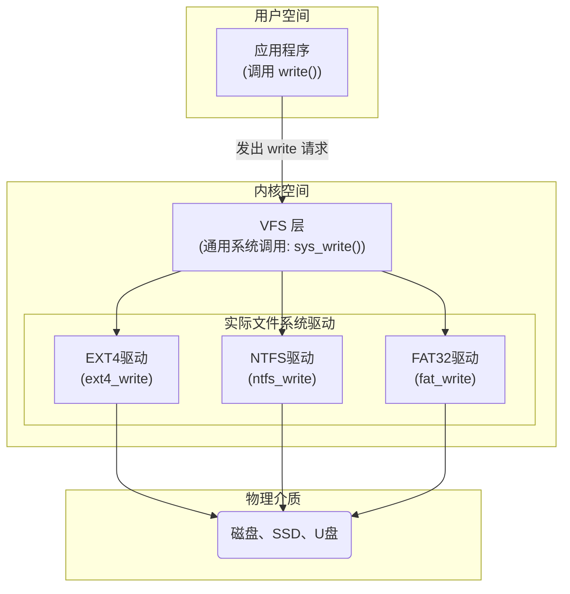
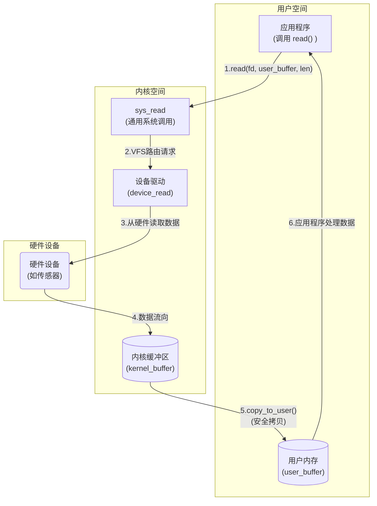
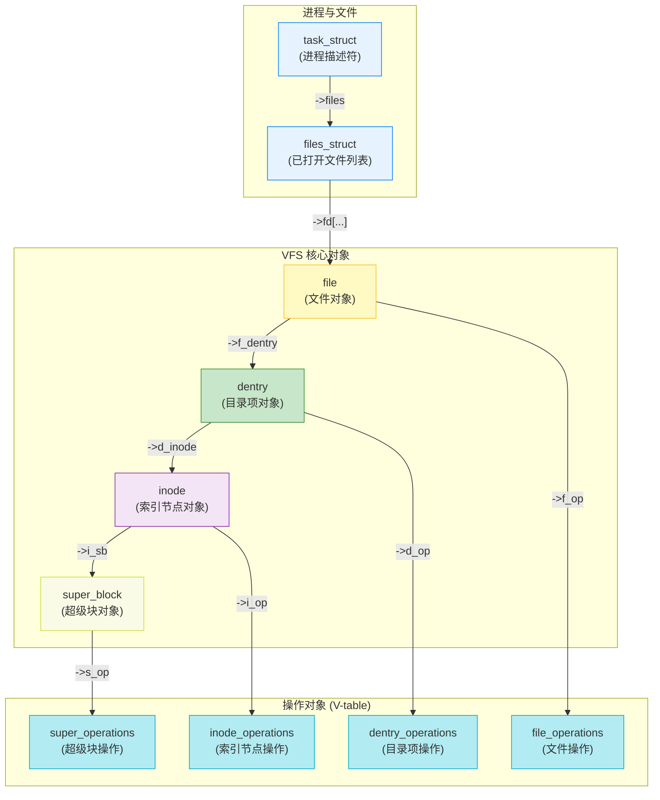
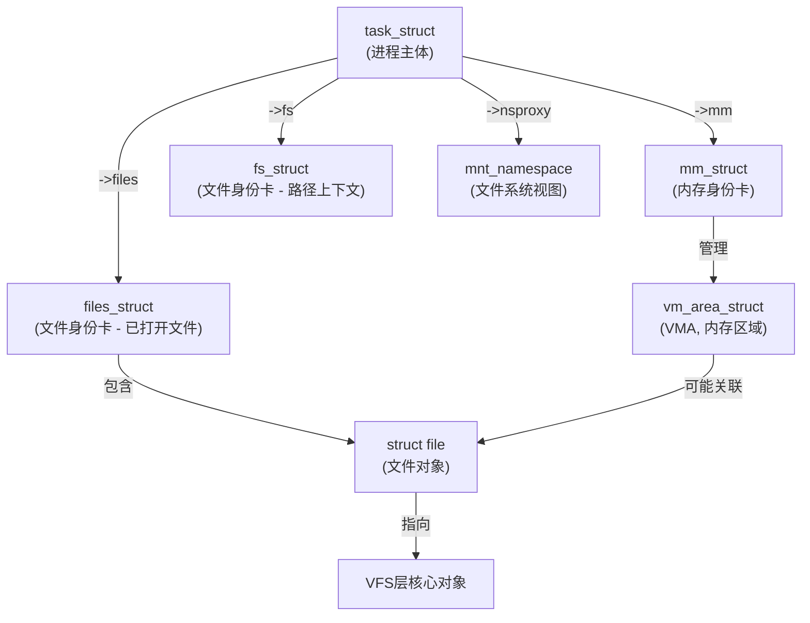

 > [!info] 解决的核心问题是什么? 
 > 让操作系统内核能够以一种**统一且透明**的方式与各种不同类型的文件系统进行交互, 
 > 同时隐藏底层实现的巨大差异-->为用户提供一个一致的文件系统接口。
 
 ==通过引入**虚拟文件系统（VFS）** 作为抽象层，内核为所有文件系统定义了一套**通用的接口和数据结构**，使得应用程序无需关心底层文件系统的具体类型。==


## 关键步骤 (Key Steps):

1. **VFS定义了一套通用接口**: VFS 在内核中定义了一套通用的文件系统操作接口和数据结构（如 `open`, `read`, `write`）。
2. **每个文件系统必须定义自己的实现代码**: 每个实际的文件系统（如 EXT4, NTFS）都必须按照 VFS 的接口定义，提供自己的具体实现代码。
3. **内核统一调用**: 当用户程序调用 `write()` 等系统调用时，内核会调用通用的 `sys_write()` 函数。
4. **将调用函数分发到后端**: `sys_write()` 找到文件对应的 VFS 抽象层，然后调用该抽象层背后由具体文件系统提供的 `write` 方法，最终完成操作。




### 一个实际的例子

**以读取一个传感器数据为例**




**对应的代码**

```c title:应用程序代码 hl:22
// 应用程序代码
#include <stdio.h>
#include <unistd.h>
#include <errno.h>

#define SENSOR_DATA_SIZE 10 // 传感器数据大小

int main() {
    char user_buffer[SENSOR_DATA_SIZE]; // 应用程序的缓冲区
    int fd;
    ssize_t bytes_read;

    // 1. 用户应用程序调用 C 库的 read() 函数
    //    该函数在内部会触发一个系统调用
    fd = open("/dev/sensor0", O_RDONLY);
    if (fd < 0) {
        perror("Failed to open device");
        return 1;
    }

    // 2. 将数据读入用户内存
    bytes_read = read(fd, user_buffer, SENSOR_DATA_SIZE);  //会触发系统调用
    
    if (bytes_read > 0) {
        printf("Read %zd bytes from device: %s\n", bytes_read, user_buffer);
    } else {
        printf("Failed to read from device.\n");
    }

    close(fd);
    return 0;
}
```

```c title:内核层代码 hl:11
// 内核系统调用层 (sys_read 函数简化版)
// 这是一个通用的入口点，所有 read() 系统调用都会先到这里
long sys_read(int fd, char *user_buffer, size_t count) {
    struct file *file_obj;
    // 1. 根据文件描述符fd，找到对应的文件对象（struct file）
    file_obj = find_file_by_fd(fd);

    // 2. VFS 层根据文件类型（这里是字符设备）
    //    找到对应的操作函数集（file_operations）
    //    并调用其 read 方法
    return file_obj->f_op->read(file_obj->f_inode, user_buffer, count, file_obj->f_pos);
}
```


```c title:设备驱动层代码 hl:3,23,8,12
// 设备驱动层 (device_read 函数)
// 这是一个虚构的传感器驱动程序，实现了 read 方法
static ssize_t sensor_read(struct inode *inode, char *user_buffer, size_t count, loff_t *pos) {
    // 3. 内核私有缓冲区，用于临时存放从硬件读取的数据
    static char kernel_buffer[100];
    
    // 4. 从硬件设备读取数据到内核缓冲区
    read_from_sensor_hardware(kernel_buffer, count);  //拷贝到内核缓存

    // 5. 将数据从内核缓冲区安全地拷贝到用户内存
    //    这是最关键的一步，实现了内存隔离和安全检查
    if (copy_to_user(user_buffer, kernel_buffer, count)) {  //内核缓存拷贝到用户内存
        return -EFAULT; // 返回错误码，表示非法地址
    }

    return count;
}

// 6. 驱动程序注册到 VFS
//    驱动程序在初始化时，会向 VFS 注册其操作函数集
//    VFS 会将这个函数集与 /dev/sensor0 设备文件关联起来
struct file_operations sensor_fops = {
    .read = sensor_read,   //注册的read函数
    // ... 其他函数，如 open, write, ioctl ...
};
```


## VFS的具体实现方式

==通过定义一组包含**数据和函数指针**的**结构体**来模拟面向对象的设计模式，从而实现了高度抽象的通用接口和底层具体实现的解耦。==

### 关键步骤 (Key Steps):

1. **VFS定义了四种这样的数据结构体** : VFS 定义了四种主要的通用数据结构（超级块、索引节点、目录项、文件），它们代表了文件系统中的核心概念。
2. **为每种结构体定义 操作函数指针**: 为每种通用对象定义一个包含函数指针的**操作对象**（如 `super_operations`），这相当于面向对象语言中的“接口”或“虚函数表”。
3. **具体的实现是由具体文件系统驱动程序自己实现**: 实际的文件系统（如EXT4、NTFS）在内核中实现时，会**实例化**这些对象，并用自己的具体函数（如`ext4_write`）来填充操作对象中的函数指针。
4. **用户使用的时候, 不需要管内部到底调用哪个函数, 调用抽象出来的函数即可**: 内核在操作文件时，只通过 VFS 的通用对象和操作对象接口进行调用，而不关心背后是哪个具体的文件系统在执行。



#### file对象
**代表什么**：一个进程**打开的文件实例**。
- **作用**：存储进程对该文件的特定操作信息，如当前的读写位置（`f_pos`）、访问权限（`f_mode`）等。
- **比喻**：一个读者**借阅这本书的记录**。每个读者都有自己的借书证和借阅记录，记录了他们看到第几页，以及是否有权限修改。

#### dentry对象
代表什么: **（目录项）**：**文件的名字和路径**
- 比喻: **书名标签 (`dentry`)**：在不同的书架上，你可能会看到同样的一本书，但它可能被放在不同的主题类别下。每个书架上的书名标签（`dentry`）都指向那张唯一的索引卡片。
**路径查找优化**：路径查找是一个非常频繁的操作。`dentry` 作为一个高效的缓存，可以将路径字符串（如 `my_file`）快速地映射到对应的 `inode`，避免了每次都从磁盘读取目录信息。

#### inode对象
**代表什么**：文件系统中的**文件本身**，是唯一的。
- **作用**：存储文件元数据（权限、大小、所有者等）和数据在磁盘上的位置。它不包含进程特有的信息。
- **比喻**：图书馆里**一本独特的书**。无论有多少人借阅，这本书都是同一本

**多重硬链接（Hard Links）**：多个文件名可以指向同一个 `inode`。这允许你在不同的目录中使用不同的名字来引用同一个文件。例如，你可以创建 `/home/user/my_file` 和 `/etc/configs/my_file`，它们都指向同一个 `inode`，因此它们是同一个文件。如果文件名存储在 `inode` 中，这将无法实现。
#### sb对象


# 进程和VFS之间的关系



### clone函数

- **`CLONE_FILES`**: `clone()` 标志，使父子进程共享 `files_struct`。
- **`CLONE_FS`**: `clone()` 标志，使父子进程共享 `fs_struct`。
- **`CLONE_NEWNS`**: `clone()` 标志，使子进程拥有一个独立的 `namespace`。