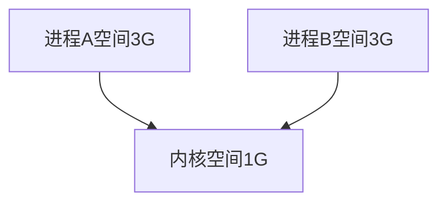
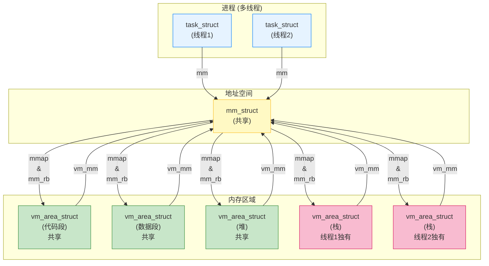
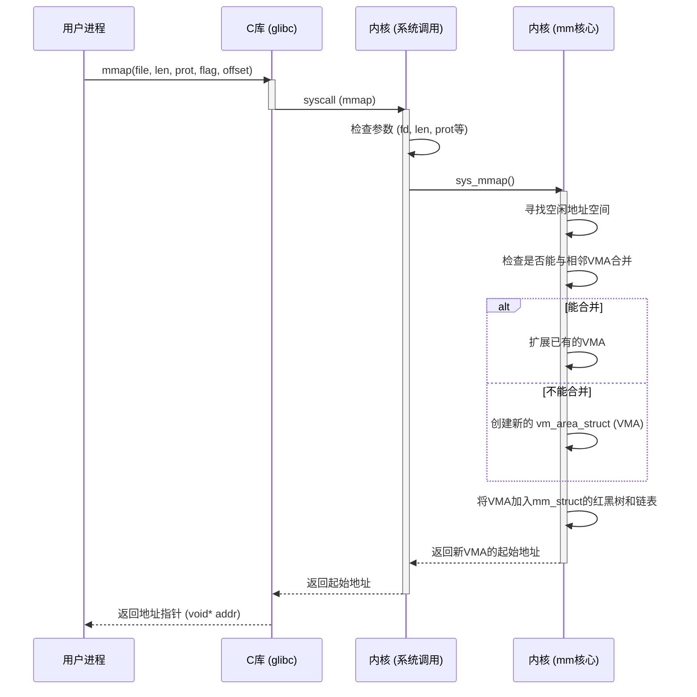
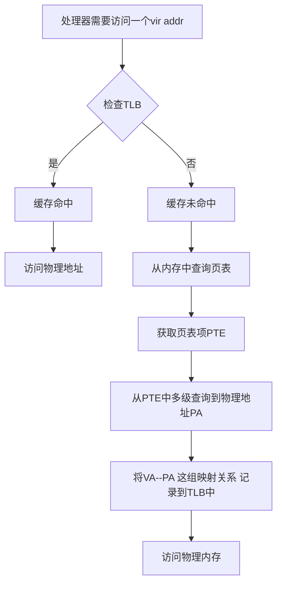

# 地址空间

## 进程空间和内核空间怎么划分

以32为系统为例
- 进程地址空间占用3G, 每个进程都是3G
- 内核空间占用1G  所有进程共用


所以, 进程A和进程B空间上会有重叠

#### 地址怎么分配的呢?
以32位系统为例, linux下:
- 用户进程地址范围是: 从 `0x00000000` 到 `0xbfffffff`
- 内核进程地址范围是: 从 `0xc0000000` 到 `0xffffffff`

<svg width="200" height="450" xmlns="http://www.w3.org/2000/svg">
  <rect x="10" y="10" width="180" height="430" style="fill:white;stroke:black;stroke-width:2"/>
  
  <rect x="15" y="15" width="170" height="107.5" style="fill:#f2b7b7;stroke:#cc0000;stroke-width:1"/>
  <text x="25" y="45" font-family="Arial" font-size="12" fill="black">内核地址空间 (1GB)</text>
  <text x="25" y="65" font-family="Arial" font-size="12" fill="black">0xC0000000 - 0xFFFFFFFF</text>
  
  <rect x="15" y="127.5" width="170" height="302.5" style="fill:#b7d2f2;stroke:#0033cc;stroke-width:1"/>
  <text x="25" y="157.5" font-family="Arial" font-size="12" fill="black">用户地址空间 (3GB)</text>
  <text x="25" y="177.5" font-family="Arial" font-size="12" fill="black">0x00000000 - 0xBFFFFFFF</text>
  
  <text x="100" y="445" font-family="Arial" font-size="14" text-anchor="middle" fill="black">32位Linux地址空间划分</text>
  
</svg>

### 进程页表与地址映射

#### 页表和地址映射

每个进程都有一套**页表**，负责将虚拟地址映射到物理地址。这套页表也分为两部分：
- **用户页表**：负责将用户空间的虚拟地址映射到物理内存。这部分是进程独有的。
- **内核页表**：负责将内核空间的虚拟地址映射到物理内存。这部分是**所有进程都相同的**。
#### 每个进程页表中都有 内核空间的完整映射
当一个进程创建时，内核会为它创建一个新的页表，但会直接**复制或共享**内核空间的映射部分。这意味着，不管哪个用户进程在运行，它的页表都包含了对内核空间的所有正确映射。

### 进程只能访问**有效内存区域**
#linux/进程/段错误
- 每个内存区域也具有相关权限如对相关进程有可 读、可写、可执行属性。
- 如果一个进程访问了不在有效范围中的内存区域,或以不正确的方式访 问了有效地址,那么内核就会终止该进程,并返回“**段错误**”信息。

#### 进程内存区域 详细划分什么样的?

| 段名 (Segment)                     | 属性 (Permissions) | 作用或说明 (Purpose)                                                 | /proc/<pid>/maps 中的名称                                             |
| -------------------------------- | ---------------- | --------------------------------------------------------------- | ----------------------------------------------------------------- |
| **代码段 (Text)**                   | 只读，可执行           | 存放程序的可执行机器指令。多个进程可以共享同一个可执行文件的代码段，以节省内存。                        | `[path to executable]` (例如 `/usr/bin/bash`)                       |
| **数据段 (Data)**                   | 读写               | 存放已初始化的全局变量和静态变量。这部分内容在程序启动时从可执行文件中加载。                          | `[path to executable]`                                            |
| **BSS 段**                        | 读写               | 存放未初始化的全局变量和静态变量。操作系统在程序加载时会将其自动清零。                             | `[path to executable]`                                            |
| **堆 (Heap)**                     | 读写               | 用于**动态内存分配**的区域，由程序员通过 `malloc()` 或 `new` 等函数管理。堆通常从数据段向上增长。    | `[heap]`                                                          |
| **栈 (Stack)**                    | 读写               | 存放函数内的**局部变量**、函数参数和返回地址。栈由编译器自动管理，从高地址向低地址增长。                  | `[stack]`                                                         |
| **共享库 (Shared Libraries)**       | 读写，可执行           | 存放动态链接库（如 `libc.so.6`）的代码和数据。内核将常用的共享库映射到多个进程的地址空间以节省内存。        | `[path to shared library]` (例如 `/lib/x86_64-linux-gnu/libc.so.6`) |
| **内存映射文件 (Memory-mapped Files)** | 可变               | 通过 `mmap()` 系统调用，将磁盘上的文件直接映射到进程的地址空间，用于高效文件I/O或**进程间通信 (IPC)**。 | `[path to mapped file]`                                           |
| **匿名映射 (Anonymous Mapping)**     | 读写               | 不与任何文件关联的内存映射。通常用于 `malloc()` 分配大块内存。                           | `[anon]` 或其他无文件名标记                                                |
| **命令行参数 & 环境变量**                 | 读写               | 存放程序启动时传递的命令行参数（`argv`）和环境变量（`envp`）。                           | `[stack]` 或 `[vvar]`、`[vdso]` 等特殊映射，具体取决于系统                       |

# 内存描述符
## 用内存描述符表示进程地址空间

定义在mm_types.h中
![[技术学习-linux内核-第十五章进程地址空间-1754707032307.png]]

#### 重点成员

| 重点  | 成员变量 (Member)     | 类型                   | 作用或说明 (Purpose)                                                          |
| --- | ----------------- | -------------------- | ------------------------------------------------------------------------ |
|     | **`mm_users`**    | 引用计数                 | 记录**实际使用该地址空间的进程或线程数量**。当多线程共享同一个地址空间时，它的值会大于1。                          |
|     | **`mm_count`**    | 引用计数                 | `mm_struct` 的**主引用计数**。只有当`mm_users` 降为0时，它才会降为0，最终决定 `mm_struct` 是否被释放。 |
| 🌟  | `mmap`            | `vm_area_struct` 链表  | 以**双向链表**形式组织所有的内存区域 (`vm_area_struct`)。它便于**遍历**进程的所有内存区域。              |
| 🌟  | **`mm_rb`**       | `vm_area_struct` 红黑树 | 以**红黑树**形式组织所有的内存区域 (`vm_area_struct`)。它便于**高效地查找**某个特定地址所在的内存区域。        |
|     | **`mmlist`**      | `mm_struct` 双向链表     | 将**所有的 `mm_struct` 结构体**连接成一个全局链表。它的首元素是 `init_mm`。                      |
|     | **`mmlist_lock`** | 锁                    | 用于保护全局 `mmlist` 链表，防止在并发访问时出现数据不一致。                                      |

#### **进程**和**线程**在内存分配差异

> **是否共享地址空间**几乎是进程和Linux 中所谓的线程 间本质上的唯一区别。

>[!info] 进程和线程通过CLONE_VM表示区分
如果父进程希望和其子进程共享地址空间,可以在调用 clone()时,设置 CLONE_VM 标志。 我们把这样的进程称作线程。
>**简单来说**: 使用这个标志, 会让fork的时候, 原本要拷贝新内存的操作, 变成了指向父亲内存空间的操作


当 CLONE_VM 被指定后,内核就不再需要调用 allocate_mm()函数了,而仅仅需要在调用 copy_mm() 函数中**将 mm 域指向其父进程的内存描述符**就可以了. 

**对应的代码**

```c title:kernel/fork.c hl:7,13,18,19
static int copy_mm(unsigned long clone_flags, struct task_struct *tsk)
{
    struct mm_struct *mm, *oldmm;
    ...
    ...
    if (clone_flags & CLONE_VM) {
        mmget(oldmm); //增加内存描述符的引用计数
        mm = oldmm;
        goto good_mm;
    }

    retval = -ENOMEM;
    mm = dup_mm(tsk, current->mm); //如果没有CLONE_VM标志，会执行dup_mm()复制整个内存空间
    if (!mm)
        goto fail_nomem;

good_mm:
    tsk->mm = mm; //最终将内存描述符赋值给新任务
    tsk->active_mm = mm; //最终将内存描述符赋值给新任务
    return 0;
	
	...
}
```

**应用场景**
- 线程创建：使用CLONE_VM，多个线程共享同一内存空间
- 进程创建：不使用CLONE_VM，创建独立的内存空间副本（写时复制)

#### 关于内核线程

`task_struct` 结构表示一个进程, mm指向这个进程的虚拟地址空间也就是mm_struct

但是<mark style="background-color:#bf616a">内核线程mm是空的</mark>

>[!question] **为什么要让内核线程的mm是NULL?**

>一句话: **减少了内存开销和地址空间切换的性能开销**，使得内核线程的运行更加轻量和快速

- **无需维护**：为了避免内核线程为内存描述符和页表浪费内存
- **无需地址空间切换**：在普通进程和内核线程之间进行调度时，如果内核线程有自己的地址空间，那么每次切换都需要更新处理器的==页表基地址寄存器==（如x86上的CR3），这会带来显著的性能开销（因为==TLB缓存==需要刷新）。而借用前一个进程的地址空间，则可以**避免这种昂贵的地址空间切换**。

>[!question] 那内核线程用什么地址空间句柄

一句话: **内核空间使用 前一个线程的 内存地址描述符**

具体怎么做的?
- 内核更新内核线程对应的进程描述符中的 active_mm 域,使其指向前一个进程的内 存描述符

# 进程地址 内存区域划分

>[!info] 细化进程内存内部区域划分
>
采用面向对象的思想. 使用一种结构体来涵盖所有类型的内存区域, 使用的结构体就是vm_area_struct

## 内存划分通用结构体:vm_area_struct

### 成员

![[技术学习-linux内核-第十五章进程地址空间-1754710714144.png|679x411]]

![[技术学习-linux内核-第十五章进程地址空间-1754710741308.png|685x505]]

- `vm_start` 是内存区间的开始地址(它本身在区间内),而`vm_end` 是内存区间的结束地址(它本身在区间外)  内存区域的位置就在[vm_start, vm_end]
- 一个`mm_struct`可以包含多个`vm_area_struct`。
- `vm_area_struct`的归属关系是独一无二的：一个VMA只能属于一个`mm_struct`。


#### 重点字段 vm_flag vm标志

一个 VMA 的类型告诉我们**它代表什么**，而这些标志则告诉内核**它应该如何被管理和对待**。一个 VMA 的类型通常由它创建的方式决定：

##### VMA 类型与标志的关系

这些标志的存在是为了让 VMA 的行为更加灵活和精细，以适应各种复杂的应用场景。
我们可以通过一个表格来理解这种关系：

|VMA 类型|访问权限标志|行为标志|举例|
|---|---|---|---|
|**代码段**|`VM_READ`、`VM_EXEC`|无`VM_WRITE`，可能`VM_SHARED`|多个进程共享 `/bin/bash` 的代码|
|**数据段**|`VM_READ`、`VM_WRITE`|无`VM_EXEC`，可能`VM_SHARED`|共享库的全局变量|
|**堆**|`VM_READ`、`VM_WRITE`|无`VM_EXEC`|动态分配的内存，如 `malloc`|
|**栈**|`VM_READ`、`VM_WRITE`|无`VM_EXEC`|每个线程独立的栈空间|
|**文件映射**|`VM_READ`、`VM_WRITE`|`VM_SHARED` 或私有|两个进程通过 `mmap` 共享文件数据|
|**设备I/O映射**|`VM_READ`、`VM_WRITE`|`VM_IO`、`VM_RESERVED`|设备驱动程序映射硬件寄存器|

##### `VM_SEQ_READ`/`VM_RAND_READ`

- **场景 1**：你正在用 `mmap` 系统调用来映射一个大日志文件，并打算从头到尾读取它。这时，你可以通过 `madvise()` 设置 `VM_SEQ_READ` 标志，让内核进行高效的预读。
- **场景 2**：你正在用 `mmap` 映射一个数据库文件，但应用程序的访问模式是随机查询，跳跃式地访问文件中的数据。这时，你可以设置 `VM_RAND_READ` 标志，告诉内核关闭预读，避免不必要的性能开销

**在用户层面,可以通过madvise函数来控制**
```c title:顺序访问
#include <stdio.h>
#include <stdlib.h>
#include <sys/mman.h>
#include <sys/stat.h>
#include <fcntl.h>

int main() {
    int fd;
    struct stat st;
    void *addr;

    fd = open("large_file.dat", O_RDONLY);
    if (fd == -1) { /* error handling */ }

    fstat(fd, &st);

    addr = mmap(NULL, st.st_size, PROT_READ, MAP_SHARED, fd, 0);
    if (addr == MAP_FAILED) { /* error handling */ }

    // 告诉内核：我将按顺序访问这段内存
    if (madvise(addr, st.st_size, MADV_SEQUENTIAL) == -1) { /* error handling */ }

    // ... 现在开始顺序读取数据 ...

    munmap(addr, st.st_size);
    close(fd);
    return 0;
}
```

```c title:随机访问
#include <sys/mman.h>
// ... (其他头文件和代码同上)

int main() {
    // ... (mmap 部分同上)

    // 告诉内核：我将随机访问这段内存
    if (madvise(addr, st.st_size, MADV_RANDOM) == -1) { /* error handling */ }

    // ... 现在开始随机读取数据 ...

    munmap(addr, st.st_size);
    close(fd);
    return 0;
}
```
#### 重点字段vm_ops  vm操作

**代码位置**
```c title:mm.h
struct vm_operations_struct {
	void (*open)(struct vm_area_struct * area);
	void (*close)(struct vm_area_struct * area);
	int (*split)(struct vm_area_struct * area, unsigned long addr);
	int (*mremap)(struct vm_area_struct * area);
	vm_fault_t (*fault)(struct vm_fault *vmf);
	vm_fault_t (*huge_fault)(struct vm_fault *vmf,
			enum page_entry_size pe_size);
	void (*map_pages)(struct vm_fault *vmf,
			pgoff_t start_pgoff, pgoff_t end_pgoff);
	unsigned long (*pagesize)(struct vm_area_struct * area);
	...
	...
}
```

##### `vm_operations_struct` 函数表总结

| 函数名              | 触发时机                  | 作用和目的                            |
| ---------------- | --------------------- | -------------------------------- |
| `open()`         | VMA 被加入地址空间时          | 增加对 VMA 资源的引用计数，确保资源不被过早释放。      |
| `close()`        | VMA 被从地址空间移除时         | 减少对 VMA 资源的引用计数，并在归零时释放资源。       |
| `fault()`        | **访问的物理页不在内存时（缺页中断）** | 按需加载页面到内存，实现按需分页。                |
| `page_mkwrite()` | 尝试对只读页面写入时            | 实现写时复制（Copy-on-Write），为进程创建可写副本。 |
| `access()`       | 内核函数无法直接访问页面时         | 提供一种备用方式来访问特殊的内存区域，如设备I/O空间。     |
###### 关于fault函数指针
==`fault` 函数指针，就是处理缺页中断的具体实现。==

具体的 `fault` 函数**不完全一样**，它取决于 VMA 的类型。每个 VMA 都指向一个 **`vm_operations_struct`** 结构体
不同的 `vm_operations_struct` 实现，其 `fault` 函数也会有所不同。这是因为不同类型的内存区域在缺页时需要采取不同的行动。
- **文件映射**：当 VMA 映射一个文件时，`vm_operations_struct` 会指向 `file_mmap_ops`。它的 `fault` 函数会负责从磁盘文件读取数据到内存中。
- **匿名映射**：当 VMA 是一个匿名映射（如堆、栈）时，它的 `vm_operations_struct` 通常指向 `anon_vma_ops`。它的 `fault` 函数会负责分配全新的、零初始化的物理页。
- **共享内存**：如果 VMA 是共享内存，`fault` 函数会处理如何将页面共享给其他进程。
- **设备映射**：如果 VMA 映射的是设备 I/O 空间，它的 `fault` 函数会直接将页面映射到硬件地址，而不是从磁盘读取。

## 关于进程和线程的VMA共享问题

- 如果两个独立进程, 映射相同一个文件. 则会有两个不同的VMA. 因为进程的虚拟地址空间vm_mm不同. 但是由于是相同的一个文件, 所以映射的物理地址应该是相同的
- 如果针对两个线程. 除去栈VMA外, 其他的VMA应该是完全相同的

关系如下面两张图所示:

<svg width="800" height="600" xmlns="http://www.w3.org/2000/svg" style="font-family: Arial, sans-serif;">
  
  <text x="400" y="30" font-size="20" text-anchor="middle" font-weight="bold">mm_struct 与 vm_area_struct 的关系</text>

  <text x="200" y="70" font-size="16" text-anchor="middle" font-weight="bold">场景一：两个独立进程映射同一个文件</text>
  <rect x="50" y="80" width="300" height="200" style="fill:#e0f7fa;stroke:#00796b;stroke-width:2"/>
  <text x="200" y="95" font-size="14" text-anchor="middle">进程 A</text>

  <rect x="450" y="80" width="300" height="200" style="fill:#e0f7fa;stroke:#00796b;stroke-width:2"/>
  <text x="600" y="95" font-size="14" text-anchor="middle">进程 B</text>

  <rect x="60" y="110" width="130" height="60" style="fill:#b2ebf2;stroke:#00acc1;stroke-width:1"/>
  <text x="125" y="140" font-size="12" text-anchor="middle" font-weight="bold">mm_struct A</text>
  <text x="125" y="155" font-size="10" text-anchor="middle">mm 指向这里</text>
  <line x1="190" y1="140" x2="60" y2="140" style="stroke:#00796b;stroke-width:1"/>

  <rect x="460" y="110" width="130" height="60" style="fill:#b2ebf2;stroke:#00acc1;stroke-width:1"/>
  <text x="525" y="140" font-size="12" text-anchor="middle" font-weight="bold">mm_struct B</text>
  <text x="525" y="155" font-size="10" text-anchor="middle">mm 指向这里</text>
  <line x1="590" y1="140" x2="460" y2="140" style="stroke:#00796b;stroke-width:1"/>
  
  <rect x="360" y="190" width="80" height="80" style="fill:#ffecb3;stroke:#ffc107;stroke-width:2"/>
  <text x="400" y="210" font-size="12" text-anchor="middle" font-weight="bold">磁盘文件</text>
  
  <rect x="210" y="200" width="130" height="60" style="fill:#c8e6c9;stroke:#388e3c;stroke-width:1"/>
  <text x="275" y="220" font-size="12" text-anchor="middle" font-weight="bold">VMA A</text>
  <text x="275" y="240" font-size="10" text-anchor="middle">vm_mm -> mm_struct A</text>
  <line x1="210" y1="230" x2="190" y2="150" style="stroke:#388e3c;stroke-width:1;marker-end:url(#arrow)"/>
  <line x1="300" y1="230" x2="400" y2="230" style="stroke:#388e3c;stroke-width:1;stroke-dasharray:5,5;"/>
  
  <rect x="610" y="200" width="130" height="60" style="fill:#c8e6c9;stroke:#388e3c;stroke-width:1"/>
  <text x="675" y="220" font-size="12" text-anchor="middle" font-weight="bold">VMA B</text>
  <text x="675" y="240" font-size="10" text-anchor="middle">vm_mm -> mm_struct B</text>
  <line x1="610" y1="230" x2="590" y2="150" style="stroke:#388e3c;stroke-width:1;marker-end:url(#arrow)"/>
  <line x1="590" y1="230" x2="420" y2="230" style="stroke:#388e3c;stroke-width:1;stroke-dasharray:5,5;"/>


  <text x="200" y="320" font-size="16" text-anchor="middle" font-weight="bold">场景二：两个线程共享一个地址空间</text>
  <rect x="50" y="330" width="300" height="200" style="fill:#f3e5f5;stroke:#8e24aa;stroke-width:2"/>
  <text x="200" y="345" font-size="14" text-anchor="middle">进程 (多线程)</text>

  <rect x="60" y="360" width="130" height="50" style="fill:#f8bbd0;stroke:#d81b60;stroke-width:1"/>
  <text x="125" y="385" font-size="12" text-anchor="middle" font-weight="bold">线程 1</text>
  <line x1="125" y1="410" x2="125" y2="435" style="stroke:#d81b60;stroke-width:1;marker-end:url(#arrow)"/>

  <rect x="210" y="360" width="130" height="50" style="fill:#f8bbd0;stroke:#d81b60;stroke-width:1"/>
  <text x="275" y="385" font-size="12" text-anchor="middle" font-weight="bold">线程 2</text>
  <line x1="275" y1="410" x2="275" y2="435" style="stroke:#d81b60;stroke-width:1;marker-end:url(#arrow)"/>

  <rect x="125" y="440" width="150" height="60" style="fill:#e1bee7;stroke:#9c27b0;stroke-width:2"/>
  <text x="200" y="460" font-size="12" text-anchor="middle" font-weight="bold">mm_struct (共享)</text>
  <text x="200" y="480" font-size="10" text-anchor="middle">mm_users = 2</text>
  
  <rect x="450" y="360" width="130" height="60" style="fill:#c8e6c9;stroke:#388e3c;stroke-width:1"/>
  <text x="515" y="380" font-size="12" text-anchor="middle" font-weight="bold">VMA 1</text>
  <text x="515" y="400" font-size="10" text-anchor="middle">vm_mm -> mm_struct</text>
  <line x1="515" y1="420" x2="275" y2="450" style="stroke:#388e3c;stroke-width:1;marker-end:url(#arrow)"/>

  <rect x="610" y="360" width="130" height="60" style="fill:#c8e6c9;stroke:#388e3c;stroke-width:1"/>
  <text x="675" y="380" font-size="12" text-anchor="middle" font-weight="bold">VMA 2</text>
  <text x="675" y="400" font-size="10" text-anchor="middle">vm_mm -> mm_struct</text>
  <line x1="675" y1="420" x2="275" y2="460" style="stroke:#388e3c;stroke-width:1;marker-end:url(#arrow)"/>


  <defs>
    <marker id="arrow" markerWidth="10" markerHeight="10" refX="5" refY="5" orient="auto">
      <path d="M 0 0 L 10 5 L 0 10 z" fill="#000"/>
    </marker>
  </defs>

</svg>




## VMA在vm_mm中的组织方式(rbtree/list)

>Linux 内核同时使用了这两种方法来管理进程的内存区域，以兼顾**遍历和查找**两种不同的需求

**设计思路**：mm_struct（内存描述符）中包含两个独立的成员：`mmap 和 mm_rb`。它们都指向同一批 vm_area_struct（内存区域描述符），但组织方式不同。
- mmap 域：这是一个指向==双向链表==的指针。所有的 `vm_area_struct` 结构体都通过各自的 `vm_next` 字段按地址顺序连接起来。
	优点：按顺序遍历所有内存区域非常快、非常简单。
- mm_rb 域：这是一个指向红黑树根节点的指针。所有的 `vm_area_struct` 结构体都通过各自的 `vm_d` 字段连接到这棵树上。
	优点：查找特定的内存区域非常快。红黑树是一种自平衡的二叉树，查找效率为 O(log n)，比遍历链表（O(n)）快得多。

>[!question] 为什么用两种方式来管理vma?
>**核心思想**：这是一种**“空间换时间”**的优化策略。内核知道，它对内存区域的操作有两种主要类型：
>
> - **遍历操作**：例如，当内核需要检查进程的所有内存区域以处理核心转储（core dump）或 `fork` 进程时，使用链表从头到尾遍历是最简单、最高效的方式。
> - **查找操作**：当内核需要快速找到某个虚拟地址对应的内存区域时（比如在缺页中断时），使用红黑树进行高效搜索是更好的选择。


## proc pmap中查看VMA

>[!question] 我们如何才能很好的观测VMA的使用情况呢?

### 最粗略统计 /proc/`(pid)`/status


`VmRSS` 代表 **Resident Set Size**，即**常驻内存集大小**。

- **含义**: `VmRSS` 报告的是进程当前在**物理内存（RAM）中占用的总内存大小**。这包括了进程的代码、数据、堆、栈等，但不包括已经换出到磁盘的内存，也不包含仅作为虚拟地址空间存在而没有被实际使用的部分。
- **局限性**: `VmRSS` 统计的是**总和**，它==没有区分这部分内存是进程独占的（私有）还是与其他进程共享==的。
	因此，如果一个进程使用了大量的共享库，它的 `VmRSS` 可能会很高，但这部分内存实际上是与系统中的其他进程共享的，不能简单地认为它就是该进程的独立消耗。

### 一般统计pmap
主要优势在于它**分解了内存使用**。它会显示每个内存区域的地址、大小、权限以及它所映射的文件
`pmap` 最重要的功能之一就是它能清楚地区分**私有内存**和**共享内存**。这对于理解进程的真实内存消耗至关重要


### 最细致内存表 /proc/`(pid)`/smaps
`/proc/[pid]/smaps` 是一个伪文件，它==为进程的每一个虚拟内存区域（VMA）提供了一份详细的报告==。
你可以把它看作是 `pmap` 的底层数据源，但包含了更多用于精确内存统计的字段

每个 VMA 区域在 `smaps` 文件中都有一段详细的文本，包含了以下几个关键字段：
- **`Size`**: 该 VMA 的总虚拟内存大小（通常与 `pmap` 中的 KBytes 列相同）。
- **`Rss` (Resident Set Size)**: 该 VMA 实际占用的物理内存大小。这是该区域在 RAM 中驻留的页面总数。
- **`Pss` (Proportional Set Size)**: 这是衡量内存消耗**最客观的指标**。它包含了该 VMA 的独占（私有）内存，并==将共享内存部分按比例分配给所有共享它的进程==。
- **`Shared_Clean`**: 与其他进程共享的、且没有被修改过的物理内存大小。
- **`Shared_Dirty`**: 与其他进程共享的、但被修改过的物理内存大小。
- **`Private_Clean`**: 进程独占的、且没有被修改过的物理内存大小。
- **`Private_Dirty`**: 进程独占的、且被修改过的物理内存大小。

要最准确地统计一个进程的内存消耗，最常用的方法是计算它的 **`Pss`**
```shell title:统计实际进程物理地址消耗
cat /proc/1234/smaps | grep Pss | awk '{s+=$2} END {print s}'
```


### 比较

|指标|来源|特点|用途|
|---|---|---|---|
|**VmRSS**|`/proc/[pid]/status`|快速，但将共享内存重复计算。|快速概览，通常用于 `ps`、`top` 等工具。|
|**pmap**|`/proc/[pid]/smaps`|人类可读的摘要，能区分共享和私有。|快速分析内存映射，查看总私有/共享大小。|
|**smaps**|`/proc/[pid]/smaps`|最详细的逐 VMA 报告，包含 `Pss`。|深入分析内存使用，精确计算真实的内存消耗。|

### 具体例子实践

参考/mem_watch_test

# 操作内存区域

>[!question] 如何根据虚拟地址找到所属的VMA?

## `find_vma()` 根据虚拟地址找所属VMA

匹配过程可以概括为以下步骤：
1. **缓存检查**：首先，函数会检查 `mm_struct` 中的 `mmap_cache`。如果 `addr` 位于缓存的 VMA 区域内，函数会直接返回，这是最快的情况。
2. **红黑树搜索**：如果缓存未命中，函数会从红黑树的根节点开始：
    - 它将 `addr` 与当前 VMA 的地址范围 (`vm_start` 到 `vm_end`) 进行比较。
    - 如果 `addr` **大于或等于**当前 VMA 的结束地址 (`vm_end`)，说明 `addr` 肯定在右子树中，函数就沿**右子节点**继续搜索。
    - 如果 `addr` **小于**当前 VMA 的结束地址 (`vm_end`)，说明 `addr` 可能在当前 VMA 中，也可能在其左子树中。函数会沿**左子节点**继续搜索。
3. **匹配成功**：当搜索到一个 VMA，并且 `addr` 在其地址范围 (`vm_start <= addr < vm_end`) 内时，匹配成功，函数会返回这个 VMA。
此外, 还有find_vma_prep  find_vma_intersection() 函数, 这里不详细看了


# mmap和do_mmap()

>[!question] 我们平时调用mmap函数的时候, 具体内核是如何处理的?

1. 首先mmap作为一个系统调用, 会触发一个软中断, 进入内核态,然后就会调用do_map函数进行内存申请

### do_mmap()

- [?] 这个函数做什么的?
`do_mmap()` 函数的主要任务是**在进程的虚拟地址空间中创建一个新的内存区域（VMA）**，或者**扩展一个已有的内存区域**。

具体来说:
- **创建新的 VMA**：这是最常见的情况。当程序需要一块新的内存时（比如通过 `mmap()` 系统调用），`do_mmap()` 就会创建一个新的 `vm_area_struct` 结构体，并将其添加到进程的地址空间中。
- **合并 VMA**：这是一个重要的优化点。如果新创建的内存区域恰好与一个已存在的 VMA 相邻，并且它们拥有完全相同的权限和属性，内核会**将这两个 VMA 合并成一个**。这样做可以减少 `vm_area_struct` 结构体的数量，从而简化内核的管理工作，提高内存查找和遍历的效率。

```c
unsigned long do_mmap(struct file *file, 
						unsigned long addr, 
						unsigned long len, 
						unsigned long prot, 
						unsigned long flag, 
						unsigned long offset)
```

- **`file`**: 指向要映射的文件。
- **`addr`**: 是一个**建议的**起始地址。内核会从这个地址开始寻找一块足够大的空闲区域来创建 VMA。如果 `addr` 为 `NULL`，内核会自己选择一个合适的地址。
- **`len`**: 要映射的内存区域的长度，以字节为单位。
- **`prot`**: 指定内存区域的**访问权限**（如读、写、执行）。这些权限标志在 `<asm/mman.h>` 头文件中定义，例如 `PROT_READ`、`PROT_WRITE`、`PROT_EXEC` 等。
- **`flag`**: 标志位，用于控制映射的行为，如 `MAP_SHARED`（共享映射）、`MAP_PRIVATE`（私有映射）等。
- **`offset`**: 文件内的偏移量，表示从文件的哪个位置开始映射。

>[!question] 🤔**问答:**当我mmap一个文件的时候, 调用流程是什么样的?



**详细流程解释:**
1. **用户空间库函数调用**
你首先在你的 C 代码中调用 mmap() 函数，传入文件描述符、大小、权限等参数。这个 mmap() 函数通常是由 C 库（如 glibc）提供的封装，它并不直接执行映射操作。
2. **系统调用（System Call）**
C 库中的 mmap() 函数是一个 **包装函数**。它的主要作用是准备好参数，然后触发一个 **系统调用**。这个操作会**从用户空间切换到内核空间**，将控制权交给操作系统。
3. **内核系统调用处理**
在内核中，有一个专门的系统调用处理程序。它会接收到 mmap() 的请求，并根据系统调用号，将请求分发给内核中对应的函数，也就是 sys_mmap()（或其变体）。sys_mmap() 的主要职责是验证用户提供的参数（如权限、文件描述符等）是否合法。
4. **do_mmap() 核心实现**
参数验证通过后，sys_mmap() 会调用真正的核心函数 do_mmap()。这是执行内存映射工作的“大脑”。do_mmap() 会执行以下关键操作：

寻找空闲地址：它会搜索进程的虚拟地址空间，找到一个足够大、符合要求的连续空闲区域来创建新的内存映射。

创建或合并 VMA：它会尝试为这个新的内存区域创建一个 vm_area_struct (VMA)。如果这个新区域正好与一个已存在的 VMA 相邻，并且它们的权限等属性都相同，do_mmap() 会进行优化，将两个 VMA 合并成一个。如果无法合并，它才会创建一个全新的 VMA。

关联文件：它将新创建的 VMA 与你提供的文件描述符所对应的文件结构体关联起来。

5. **更新进程内存描述符**
do_mmap() 最后一步是将新创建的 VMA 添加到进程的内存描述符 mm_struct 中。
它会将 VMA 添加到按地址排序的 mmap 链表中。
它还会将 VMA 插入到 mm_rb 红黑树中。

6. **返回用户空间**
所有工作完成后，do_mmap() 函数返回到 sys_mmap()，sys_mmap() 随后返回到用户空间。这个返回值就是内核选择的、新映射区域的起始虚拟地址。
从用户角度看，这个返回值就是 mmap() 函数的地址指针。

- [!] **注意:** 此时，*文件内容还未真正加载到物理内存*中，但你已经可以使用这个指针来访问文件了。
当你第一次访问某个地址时，会触发**缺页中断（page fault）**，内核会捕获这个中断，并调用 **VMA 关联的 fault 方法**，将文件内容加载到物理内存中。

#### 常用 `do_mmap` 标志总结

| 标志                  | 作用                                                                  | 典型使用场景                                        |
| ------------------- | ------------------------------------------------------------------- | --------------------------------------------- |
| **`MAP_SHARED`**    | 创建一个**共享**映射。对这块内存的修改会同步到文件，且对其他共享同一文件的进程可见。                        | **进程间通信 (IPC)**；将文件内容直接作为内存进行读写，修改立即同步回文件。    |
| **`MAP_PRIVATE`**   | 创建一个**私有**映射。对这块内存的修改只对当前进程可见，且不会同步回文件。利用**写时复制（Copy-on-Write）**机制。 | 只读地访问文件内容，不希望修改影响文件；`fork()` 创建子进程时内存的默认共享方式。 |
| **`MAP_ANONYMOUS`** | 创建一个**匿名**映射，不与任何文件关联。内存内容通常被内核初始化为零。                               | `malloc()` 分配大块内存；实现进程的堆和栈；创建共享内存区域。          |
| **`MAP_FIXED`**     | **强制**将映射创建在指定的 `addr` 地址。如果该地址不可用，`mmap()` 会失败。                    | 嵌入式系统编程中，需要精确控制内存布局；与特定的硬件地址进行映射。             |
| **`MAP_GROWSDOWN`** | 创建一个**向下增长**的内存区域。内核会自动扩展该区域，以满足对低地址的访问需求。                          | **进程的栈**。栈从高地址向低地址增长，这个标志确保了栈的自动扩展。           |
| **`MAP_POPULATE`**  | 告诉内核在创建映射时，就**立即将文件内容预加载**到物理内存中。                                   | **对延迟敏感的应用程序**，希望避免首次访问时的缺页中断开销。              |
| **`MAP_LOCKED`**    | **锁定**映射的页面，防止它们被换出到交换空间（swap）。                                     | **实时系统**；高安全性应用，防止敏感数据被写入磁盘。                  |
#### mmap与mmap2

- [>] **一句话总结: 因为偏移字段长度的原因, 引入了mmap2, 表示页偏移量(偏移的页数)**

- [!] **详细说明:**
- **历史背景**：最早的 `mmap()` 系统调用（由 POSIX 标准定义）使用**字节偏移量（byte offset）**作为最后一个参数。这限制了可以映射的最大文件大小和偏移量，因为 `off_t` 类型在当时可能只有 32 位。
- **`mmap2()` 的出现**：为了解决这个限制，内核引入了 `mmap2()` 这个新的系统调用。它将最后一个参数改为**页面偏移量（page offset）**，而不是字节偏移量。
    - **页面偏移量**：一个页面偏移量等于字节偏移量除以页面的大小（通常是 4KB）。这使得 `mmap2()` 可以使用更小的 `off_t` 类型来表示更大的文件偏移量，从而支持映射更大的文件。
- **现在的实现**：尽管 POSIX 标准仍然保留了原始的 `mmap()` 函数，但现代的 Linux 内核已经不再直接实现它了。
    - C 库中的 `mmap()` 函数会**自动将字节偏移量转换为页面偏移量**，然后调用内核的 `mmap2()` 系统调用来完成工作。

- [?] **最新的linux下又是怎样的?** 
在现代的 Linux 系统中，`mmap()` 和 `mmap2()` 的关系是这样的：
- **在 32 位系统上**：`glibc` 中的 `mmap()` 包装函数会把你的字节偏移量转换成页面偏移量，然后调用内核的 `mmap2()` 系统调用。
- **在 64 位系统上**：由于 64 位系统可以直接处理非常大的字节偏移量，`mmap2()` 就不再需要了。`glibc` 的 `mmap()` 函数会直接调用一个 64 位版本的 `mmap()` 系统调用，该版本能够处理 64 位偏移量，从而实现更大的文件映射。

#### mummap 和 do_mummap

作用: 删除地址区间

`int munmap (void *start, size_t length)`


# 页表

> [!question] 虚拟地址和物理地址之间怎么转换的?

这个转换是通过**查询页表**来完成的。页表就像一个巨大的索引，它告诉处理器某个虚拟地址对应哪一个物理地址。

## 多级页表机制

如果只使用1级页表, 则需要巨大的页表空间来容纳所有的虚拟地址
`1,048,576 个页表项×4 字节/项=4,194,304 字节≈4MB`  即使进程只使用很少一部分内存（比如 1MB），页表本身也必须完整存在，这会造成巨大的内存浪费

### 多级页表的结构图

<svg width="800" height="400" xmlns="http://www.w3.org/2000/svg" style="font-family: Arial, sans-serif;">
  <defs>
    <marker id="arrow" markerWidth="10" markerHeight="10" refX="5" refY="5" orient="auto">
      <path d="M 0 0 L 10 5 L 0 10 z" fill="#000"/>
    </marker>
  </defs>

  <text x="400" y="30" font-size="20" text-anchor="middle" font-weight="bold">虚拟-物理地址查询</text>

  <rect x="50" y="100" width="120" height="60" rx="5" ry="5" style="fill:#e0f7fa;stroke:#00796b;stroke-width:2"/>
  <text x="110" y="135" font-size="12" text-anchor="middle">struct mm_struct</text>
  
  <g transform="translate(200, 70)">
    <rect x="0" y="0" width="100" height="200" rx="5" ry="5" style="fill:#fff3e0;stroke:#ffa000;stroke-width:2"/>
    <text x="50" y="-15" font-size="14" text-anchor="middle" font-weight="bold">PGD</text>
    <line x1="0" y1="20" x2="100" y2="20" style="stroke:#ffa000;stroke-width:1"/>
    <text x="50" y="15" font-size="10" text-anchor="middle">pgd_t</text>
    <line x1="0" y1="40" x2="100" y2="40" style="stroke:#ffa000;stroke-width:1"/>
    <text x="50" y="35" font-size="10" text-anchor="middle">pgd_t</text>
    <line x1="0" y1="60" x2="100" y2="60" style="stroke:#ffa000;stroke-width:1"/>
    <text x="50" y="55" font-size="10" text-anchor="middle">pgd_t</text>
    <line x1="0" y1="80" x2="100" y2="80" style="stroke:#ffa000;stroke-width:1"/>
    <text x="50" y="75" font-size="10" text-anchor="middle">pgd_t</text>
    <line x1="0" y1="100" x2="100" y2="100" style="stroke:#ffa000;stroke-width:1"/>
    <text x="50" y="95" font-size="10" text-anchor="middle">pgd_t</text>
    <line x1="0" y1="120" x2="100" y2="120" style="stroke:#ffa000;stroke-width:1"/>
    <text x="50" y="115" font-size="10" text-anchor="middle">pgd_t</text>
    <line x1="0" y1="140" x2="100" y2="140" style="stroke:#ffa000;stroke-width:1"/>
    <text x="50" y="135" font-size="10" text-anchor="middle">pgd_t</text>
    <line x1="0" y1="160" x2="100" y2="160" style="stroke:#ffa000;stroke-width:1"/>
    <text x="50" y="155" font-size="10" text-anchor="middle">pgd_t</text>
    <line x1="0" y1="180" x2="100" y2="180" style="stroke:#ffa000;stroke-width:1"/>
    <text x="50" y="175" font-size="10" text-anchor="middle">pgd_t</text>
  </g>
  
  <g transform="translate(350, 70)">
    <rect x="0" y="0" width="100" height="200" rx="5" ry="5" style="fill:#fff3e0;stroke:#ffa000;stroke-width:2"/>
    <text x="50" y="-15" font-size="14" text-anchor="middle" font-weight="bold">PMD</text>
    <line x1="0" y1="20" x2="100" y2="20" style="stroke:#ffa000;stroke-width:1"/>
    <text x="50" y="15" font-size="10" text-anchor="middle">pmd_t</text>
    <line x1="0" y1="40" x2="100" y2="40" style="stroke:#ffa000;stroke-width:1"/>
    <text x="50" y="35" font-size="10" text-anchor="middle">pmd_t</text>
    <line x1="0" y1="60" x2="100" y2="60" style="stroke:#ffa000;stroke-width:1"/>
    <text x="50" y="55" font-size="10" text-anchor="middle">pmd_t</text>
    <line x1="0" y1="80" x2="100" y2="80" style="stroke:#ffa000;stroke-width:1"/>
    <text x="50" y="75" font-size="10" text-anchor="middle">pmd_t</text>
    <line x1="0" y1="100" x2="100" y2="100" style="stroke:#ffa000;stroke-width:1"/>
    <text x="50" y="95" font-size="10" text-anchor="middle">pmd_t</text>
    <line x1="0" y1="120" x2="100" y2="120" style="stroke:#ffa000;stroke-width:1"/>
    <text x="50" y="115" font-size="10" text-anchor="middle">pmd_t</text>
    <line x1="0" y1="140" x2="100" y2="140" style="stroke:#ffa000;stroke-width:1"/>
    <text x="50" y="135" font-size="10" text-anchor="middle">pmd_t</text>
    <line x1="0" y1="160" x2="100" y2="160" style="stroke:#ffa000;stroke-width:1"/>
    <text x="50" y="155" font-size="10" text-anchor="middle">pmd_t</text>
    <line x1="0" y1="180" x2="100" y2="180" style="stroke:#ffa000;stroke-width:1"/>
    <text x="50" y="175" font-size="10" text-anchor="middle">pmd_t</text>
  </g>

  <g transform="translate(500, 70)">
    <rect x="0" y="0" width="100" height="200" rx="5" ry="5" style="fill:#fff3e0;stroke:#ffa000;stroke-width:2"/>
    <text x="50" y="-15" font-size="14" text-anchor="middle" font-weight="bold">PTE</text>
    <line x1="0" y1="20" x2="100" y2="20" style="stroke:#ffa000;stroke-width:1"/>
    <text x="50" y="15" font-size="10" text-anchor="middle">pte_t</text>
    <line x1="0" y1="40" x2="100" y2="40" style="stroke:#ffa000;stroke-width:1"/>
    <text x="50" y="35" font-size="10" text-anchor="middle">pte_t</text>
    <line x1="0" y1="60" x2="100" y2="60" style="stroke:#ffa000;stroke-width:1"/>
    <text x="50" y="55" font-size="10" text-anchor="middle">pte_t</text>
    <line x1="0" y1="80" x2="100" y2="80" style="stroke:#ffa000;stroke-width:1"/>
    <text x="50" y="75" font-size="10" text-anchor="middle">pte_t</text>
    <line x1="0" y1="100" x2="100" y2="100" style="stroke:#ffa000;stroke-width:1"/>
    <text x="50" y="95" font-size="10" text-anchor="middle">pte_t</text>
    <line x1="0" y1="120" x2="100" y2="120" style="stroke:#ffa000;stroke-width:1"/>
    <text x="50" y="115" font-size="10" text-anchor="middle">pte_t</text>
    <line x1="0" y1="140" x2="100" y2="140" style="stroke:#ffa000;stroke-width:1"/>
    <text x="50" y="135" font-size="10" text-anchor="middle">pte_t</text>
    <line x1="0" y1="160" x2="100" y2="160" style="stroke:#ffa000;stroke-width:1"/>
    <text x="50" y="155" font-size="10" text-anchor="middle">pte_t</text>
    <line x1="0" y1="180" x2="100" y2="180" style="stroke:#ffa000;stroke-width:1"/>
    <text x="50" y="175" font-size="10" text-anchor="middle">pte_t</text>
  </g>
  
  <rect x="650" y="150" width="120" height="60" rx="5" ry="5" style="fill:#e0e0e0;stroke:#9e9e9e;stroke-width:2"/>
  <text x="710" y="185" font-size="12" text-anchor="middle">页面结构</text>

  <rect x="650" y="70" width="120" height="60" rx="5" ry="5" style="fill:#e0e0e0;stroke:#9e9e9e;stroke-width:2"/>
  <text x="710" y="105" font-size="12" text-anchor="middle">物理页面</text>

  <path d="M 170 130 C 180 130, 190 125, 200 120" fill="transparent" stroke="black" marker-end="url(#arrow)"/>
  <path d="M 300 130 C 310 130, 340 125, 350 120" fill="transparent" stroke="black" marker-end="url(#arrow)"/>
  <path d="M 450 130 C 460 130, 490 125, 500 120" fill="transparent" stroke="black" marker-end="url(#arrow)"/>
  
  <path d="M 600 160 C 625 160, 650 160, 650 160" fill="transparent" stroke="black" marker-end="url(#arrow)"/>
  <path d="M 710 150 C 710 140, 710 130, 710 130" fill="transparent" stroke="black" marker-end="url(#arrow)"/>

</svg>
### 页表的进一步优化

>[!question] 页表查找还是很慢, 还有什么加速方法?
#### 优化方法1:TLB 硬件地址缓存
用TLB缓存最近使用过的VIR_ADDR--PHY_ADDR的映射

**工作原理**

#### 优化方法2: cow写时复制 共享页表

fork的时候, 子进程 并不是立即复制 父进程页表;
而是共享一份页表, 只有当父进程或者子进程试图修改页表项的时候, 才会创建一个副本

