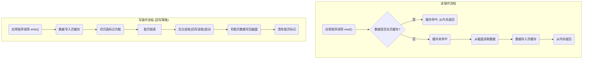
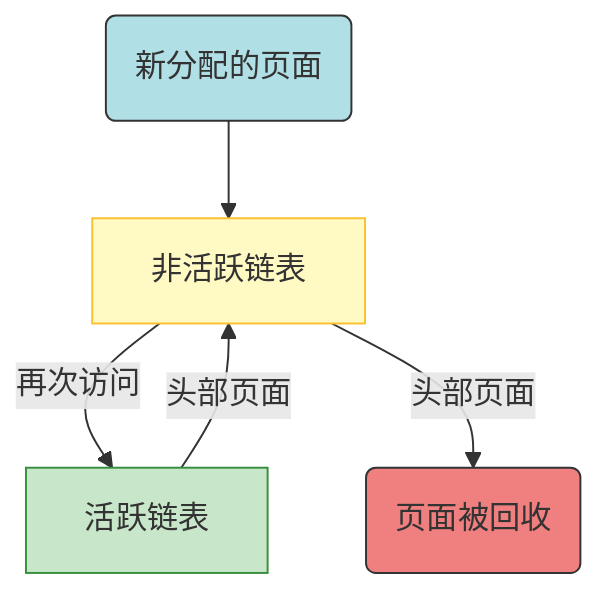
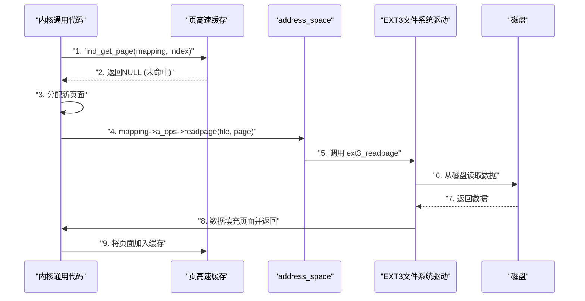
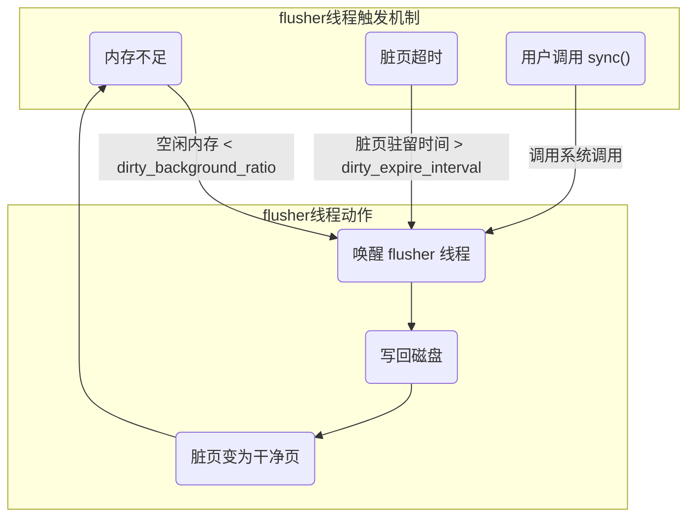

---
完成度: 100
date_read: 2025-08-23T12:23:00
---
#publish


> [!question] 如何解决**磁盘 I/O** 操作速度远慢于**DDR内存访问速度**的性能瓶颈?


# page cache

==通过使用**页高速缓存（Page Cache）将磁盘数据缓存到物理内存中**，
利用**局部性原理**将对磁盘的频繁访问转化为对内存的快速访问，
并采用**回写策略**来优化写操作的性能。==

### 概念

**局部原理 (Temporal Locality)**: 数据一旦被访问，在短期内很有可能再次被访问。
**脏页 (Dirty Page)**: 页高速缓存中已经被修改，但尚未写回磁盘的页面。

>[!info] 注意 page_cache只针对有名称的vma生效, 可以说page_cache是VFS和page之间的一层. 对于匿名内存(栈, 堆, mmap匿名)是没有的. 其实从概念也可以理解, 毕竟匿名的文件都没有,何谈加速和缓存
## 关键步骤

1. **针对读操作, 让进程去page cache中直接读取**: 应用程序发起 `read()` 请求时，内核首先检查页高速缓存。如果命中，直接返回内存数据。如果未命中，则从磁盘读取数据，存入页高速缓存，再返回。
2. **针对写操作, 让进程把数据写到page cache中**: 应用程序发起 `write()` 请求时，内核将数据直接写入页高速缓存中的对应页面，并将该页面标记为“脏”。
3. **page_cache 再慢慢把 脏页 写会 flash**: 一个独立的内核进程会周期性地检查“脏页链表”，并将脏页中的数据写回到磁盘，使其与内存中的数据保持同步。
	> 多个写操作可能会在很短的时间内发生，这些操作都只在内存中进行。内核的回写进程会稍后将这些更新后的数据批量、高效地写回磁盘。


### 流程图



## 如何回收页面?

==Linux 采用一种改进的 **LRU（最近最少使用）算法**，即**双链策略（LRU/2）**，通过将页面分为**活跃**和**非活跃**两个链表，来更精确地预测哪些页面可以被安全地回收，从而提高缓存回收的效率和准确性。==

> **双链策略**
> 内核维护两个链表：**活跃链表**（活跃页面）和**非活跃链表**（可回收页面）。
> 双链策略就像一个餐厅的**两张餐桌**。一张是“**常客桌**”（活跃链表），所有被多次使用的页面都会坐在这里，它们被视为重要顾客，不会被轻易赶走。另一张是“**新客桌**”（非活跃链表），所有刚被使用一次的页面会先坐在这里。如果常客桌太拥挤，最老的常客（头部页面）会被请到新客桌上。如果新客桌上的客人（非活跃页面）长期没人理睬，就会被请离餐厅（回收）。这种机制避免了那些只点了一次菜的客人（一次性访问的页面）挤占常客桌的位置。

**流程图**



# 如何实现page cache?

==Linux 内核引入了 **`address_space` 结构体**作为页高速缓存的核心管理对象, 可以脱离文件系统, 能够缓存任何基于页的对象==
(后面用as代替)

```c title:address_space hl:34,22,29
/**
struct address_space 是一个可被缓存、可被映射对象的内存管理结构体。
@host: 宿主，该对象的拥有者，通常是索引节点（inode）或块设备。
@i_pages: 缓存的页面。
@gfp_mask: 内存分配掩码，分配页面时使用的内存分配标志。
@i_mmap_writable: 可写映射数，表示 VM_SHARED 映射的数量。
@nr_thps: 透明大页数，页高速缓存中的透明大页（THP）数量（仅非共享内存）。
@i_mmap: 私有和共享映射树。
@i_mmap_rwsem: 读写信号量，用于保护 @i_mmap 和 @i_mmap_writable。
@nrpages: 页面总数，受 @i_pages 锁保护的页面条目总数。
@nrexceptional: 特殊条目数，受 @i_pages 锁保护的影子或 DAX 条目数。
@writeback_index: 回写索引，表示回写操作从此位置开始。
@a_ops: 操作方法，指向该对象的操作函数表。
@flags: 标志，错误位和各种标志（AS_*）。
@wb_err: 回写错误码，最近发生的回写错误码。
@private_lock: 私有锁，供 address_space 的宿主使用。
@private_list: 私有链表，供 address_space 的宿主使用。
@private_data: 私有数据，供 address_space 的宿主使用。
 */
struct address_space {
	struct inode		*host;
	struct xarray		i_pages;  //保存的内容是:struct page, 5.x内核使用了`xarray`结构代替`radix_tree_root`
	gfp_t			gfp_mask;
	atomic_t		i_mmap_writable;
#ifdef CONFIG_READ_ONLY_THP_FOR_FS
	/* number of thp, only for non-shmem files */
	atomic_t		nr_thps;
#endif
	struct rb_root_cached	i_mmap;   //保存的内容是vma指针, 方便快速找到谁在用当前as, 结构是带缓存的红黑树
	struct rw_semaphore	i_mmap_rwsem;
	unsigned long		nrpages;
	unsigned long		nrexceptional;
	pgoff_t			writeback_index;
	const struct address_space_operations *a_ops;  //操作函数表
	unsigned long		flags;
	errseq_t		wb_err;
	spinlock_t		private_lock;
	struct list_head	private_list;
	void			*private_data;
} __attribute__((aligned(sizeof(long)))) __randomize_layout;
```

##### a_ops

**每种具体的文件系统**（如 EXT4、NTFS、FAT32 等）的开发者会事先实现好操作接口. 

```c title:address_space_operations
struct address_space_operations {
	int (*writepage)(struct page *page, struct writeback_control *wbc);
	int (*readpage)(struct file *, struct page *);

	/* Write back some dirty pages from this mapping. */
	int (*writepages)(struct address_space *, struct writeback_control *);

	/* Set a page dirty.  Return true if this dirtied it */
	int (*set_page_dirty)(struct page *page);

	/*
	 * Reads in the requested pages. Unlike ->readpage(), this is
	 * PURELY used for read-ahead!.
	 */
	int (*readpages)(struct file *filp, struct address_space *mapping,
			struct list_head *pages, unsigned nr_pages);

	int (*write_begin)(struct file *, struct address_space *mapping,
				loff_t pos, unsigned len, unsigned flags,
				struct page **pagep, void **fsdata);
	int (*write_end)(struct file *, struct address_space *mapping,
				loff_t pos, unsigned len, unsigned copied,
				struct page *page, void *fsdata);

	/* Unfortunately this kludge is needed for FIBMAP. Don't use it */
	sector_t (*bmap)(struct address_space *, sector_t);
	void (*invalidatepage) (struct page *, unsigned int, unsigned int);
	int (*releasepage) (struct page *, gfp_t);
	void (*freepage)(struct page *);
	ssize_t (*direct_IO)(struct kiocb *, struct iov_iter *iter);
	/*
	 * migrate the contents of a page to the specified target. If
	 * migrate_mode is MIGRATE_ASYNC, it must not block.
	 */
	int (*migratepage) (struct address_space *,
			struct page *, struct page *, enum migrate_mode);
	bool (*isolate_page)(struct page *, isolate_mode_t);
	void (*putback_page)(struct page *);
	int (*launder_page) (struct page *);
	int (*is_partially_uptodate) (struct page *, unsigned long,
					unsigned long);
	void (*is_dirty_writeback) (struct page *, bool *, bool *);
	int (*error_remove_page)(struct address_space *, struct page *);

	/* swapfile support */
	int (*swap_activate)(struct swap_info_struct *sis, struct file *file,
				sector_t *span);
	void (*swap_deactivate)(struct file *file);
};
```

### 核心步骤

**关键步骤 (Key Steps)**:

1. **检查数据是否在告诉缓存中**: 内核首先通过 `find_get_page()` 检查数据是否已在页高速缓存中。
2. **缓存未命中, 则从page读取到缓存**：如果缓存未命中，内核会分配一个新的页面，并调用文件系统提供的 **`a_ops->readpage()`** 方法，从磁盘读取数据并填入该页面，然后将页面加入缓存。
3. **内存被修改, 则通过写操作,将数据写回磁盘文件**: 如果页面被修改（`SetPageDirty()`），它会被标记为“脏”，由后台进程择机调用 **`a_ops->writepage()`** 方法将数据写回磁盘。
    
4. **数据中转**: 对于写操作，内核会先将用户数据通过 `filemap_copy_from_user()` 拷贝到内核缓存（页），然后才由 `a_ops->commit_write()` 等方法处理后续操作。




### VFS文件系统和address_space的关系??

#### file对象和as的关系
file表示当前进程打开的文件, 真正的文件是存放在f_i节点, 即inode
不过为了加速访问  file对象中  file->f_mapping指向了真正的页缓存as指针
### inode对象和as的关系
inode表示当前真正的文件, 包含文件的所有信息(除了名称), 它的成元i_mapping也是指向as指针

如果对这几个概念不熟悉, 可以去看看 [[技术学习-linux内核-第13章-虚拟文件系统VFS]]


> [!question] address_space, 既然是文件系统实现的, 那是在什么时候赋值的呢? 

`address_space_operations` 的赋值过程发生在**文件系统被挂载（mount）**的时候。
这就像一个插件注册到主程序的过程。下面是具体的赋值流程：

#### 1. 文件系统注册

在内核启动或文件系统模块加载时，文件系统驱动程序会调用一个函数（如 `register_filesystem()`）来向内核注册自己。在注册时，它会提供一个 `file_system_type` 结构体，这个结构体中包含了文件系统特有的**挂载（`mount`）**函数指针。

#### 2. 挂载文件系统

当用户或系统调用 `mount()` 命令时，内核会执行以下操作：

1. 内核调用文件系统驱动提供的**挂载函数**。
2. 挂载函数会读取磁盘上的超级块信息，并在内存中创建一个 **`struct super_block`** 实例。
3. 在这个 `super_block` 实例中，它会为 `s_op`（`super_operations`）指针赋值，指向驱动程序中已实现的超级块操作函数表。
    

#### 3. 创建 `inode` 和 `address_space`

当文件系统被挂载后，内核就可以开始操作文件了。

1. 当内核需要访问一个文件时，它会从磁盘读取 `inode` 数据，并在内存中创建一个 **`struct inode`** 实例。
2. 在创建 `inode` 实例时，内核会为它分配一个 **`address_space`** 结构体。
3. 最关键的一步是：内核会从 `inode` 的 **`i_op`**（`inode_operations`）函数表中找到一个 `set_aops` 方法（或者在创建时直接赋值）**。 这个方法会为 `inode` 的 `address_space` 结构体中的 `a_ops` 指针赋值，指向文件系统开发者提供的 `address_space_operations`。**
    

#### 总结

`address_space_operations` 的赋值是一个链式反应：

> **文件系统注册** -> **挂载时创建 `super_block`** -> **操作文件时创建 `inode` 和 `address_space`** -> **`address_space->a_ops` 被赋值**。

这个赋值过程确保了**通用内核代码**可以通过一个统一的函数指针（`mapping->a_ops->readpage`），调用到**具体文件系统**的实现代码。


# 脏页 选择什么时机写回 磁盘?

>[!info] Linux 内核通过一组名为 **`flusher` 线程**的后台进程，以**异步**和**策略性**的方式，在**空闲内存不足**、**脏页超时**或**用户主动触发**时，将脏页写回磁盘。


## 核心步骤

1. **内存阈值触发**: 当空闲内存占总内存的比例低于 `dirty_background_ratio` 时，内核唤醒 `flusher` 线程。`flusher` 线程会持续写回脏页，直到空闲内存恢复到阈值之上。
    
2. **定时器触发**: 内核启动一个定时器，每隔 `dirty_expire_interval` 秒唤醒 `flusher` 线程。线程会将所有驻留时间超过该阈值的脏页写回磁盘。
    
3. **用户调用**: 应用程序调用 `sync()` 或 `fsync()` 系统调用，强制内核将所有脏页或特定文件的脏页立即写回磁盘。




#### 观察系统中dirty页面情况

通过`cat /proc/vmstat | grep dirty` 可以观察到

```bash hl:1,4
song@song-com:~/src/learning/linux-kernel-code/linux-5.4.284$ cat /proc/vmstat | grep dirty
nr_dirty 5  //表示当前系统中的脏页数量
nr_dirty_threshold 631095  //硬性的脏页数量上限阈值
nr_dirty_background_threshold 315162 //后台脏页回写的软性阈值  当脏页数量达到这个阈值时，内核会在后台启动回写进程（`flusher` 线程）
```

>[!info] 关于vmstat

#linux/proc/vmstat

`cat /proc/vmstat` 的输出是一个包含了各种键值对的文本文件，每个键都代表了一个特定的统计量。通过分析这些统计量，你可以深入了解系统的内存和 CPU 运行状态。

它主要用于：

- **内存性能分析**: 查看内存的换入换出（`pswpin` / `pswpout`），以及页高速缓存（`pgscand`）的活动，可以帮助你诊断内存瓶颈。
- **脏页监控**: 监控 `dirty`（脏页）和 `writeback`（回写中的页面）相关的统计数据，可以帮助你了解页高速缓存的回写机制是否正常工作。
- **CPU 调度和中断**: 观察 `nr_in`（中断次数）和 `nr_cs`（上下文切换次数）等数据，可以帮助你评估系统的 CPU 负载和调度效率。

==常见的 vmstat 统计项==

以下是一些你可能会在 `cat /proc/vmstat` 中看到的常见统计项：

|统计项|含义|
|---|---|
|`nr_free_pages`|空闲的物理页面数。|
|`nr_inactive_anon`|不活跃匿名内存页面数。|
|`nr_active_file`|活跃文件缓存页面数。|
|`nr_dirty`|脏页数（需要写回磁盘）。|
|`nr_writeback`|正在被写回磁盘的页面数。|
|`pgscand_kswapd`|`kswapd` 进程扫描的页面数。|
|`pswpin` / `pswpout`|换入/换出的页面总数。|
|`pgpgin` / `pgpgout`|从磁盘读取/写入的页面总数。|
|`nr_forks`|`fork` 系统调用的总次数。|
|`nr_context_switches`|上下文切换的总次数。|
