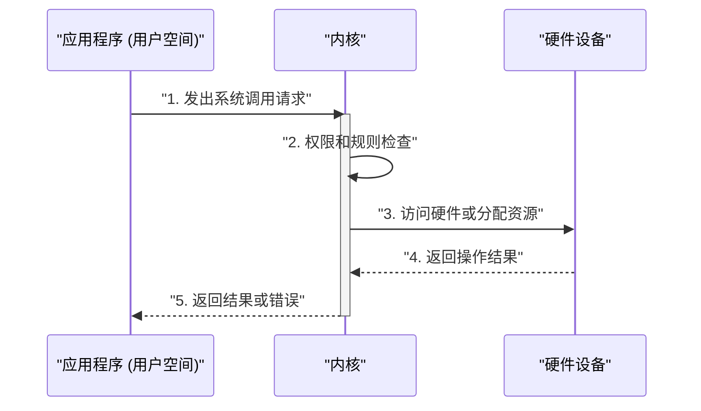
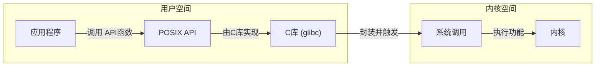
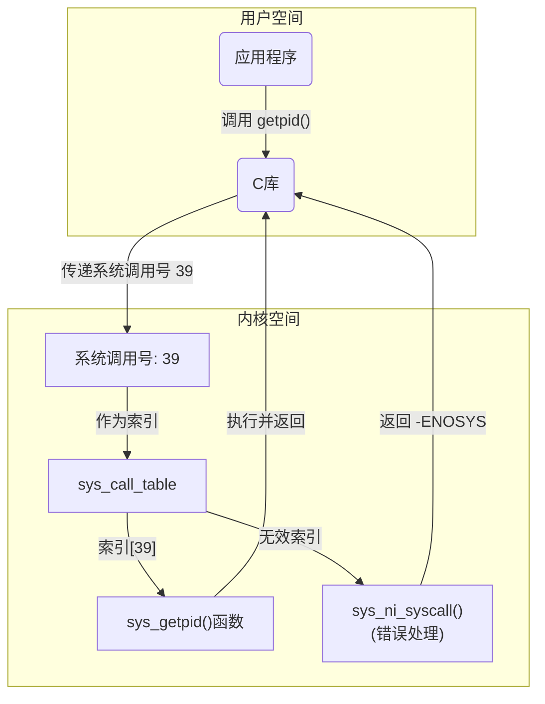
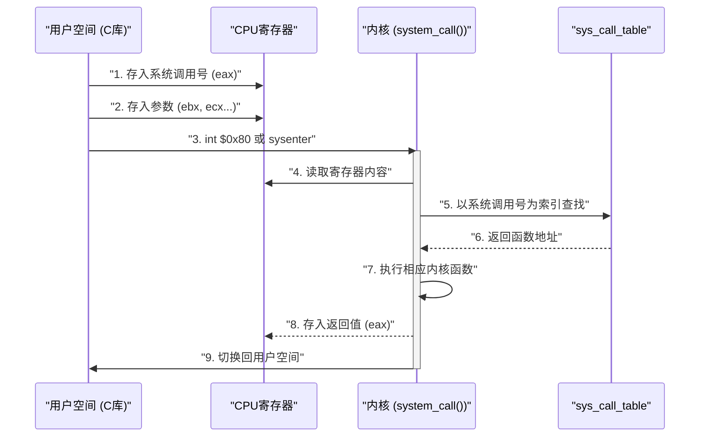

---
tags:
  - linux
是否发表: "1"
publish: true
---

---
# 与内核通信

> [!question] ❓如何在多任务和虚拟内存操作系统中，安全、稳定地让用户应用程序访问底层硬件和系统资源，同时防止其进行非法操作??

## 核心思路 (Main Idea)


通过引入**系统调用**作为用户进程与内核之间唯一的`合法中间层`，来抽象硬件、保障系统安全和实现虚拟化。

**核心比喻 (Core Analogy)**: 
系统调用就像一个**政府办事大厅**。

- 用户（应用程序）不能直接进入政府大楼（内核）和控制具体部门（硬件），而必须通过办事大厅的窗口（系统调用）提交申请（请求）。
- 大厅的工作人员（内核）会审查你的申请（权限），然后帮你处理，从而确保整个政府系统（操作系统）的安全和有序运行。



# 用户层API

 > [!question] 如何在操作系统中，为应用程序提供一套稳定的、跨平台的编程接口，同时又允许底层内核实现有差异和灵活性，避免程序员直接与复杂且不稳定的系统调用打交?
 
 
## 核心思路

> 通过引入**API**（应用编程接口）作为中间层，将**系统调用**的底层细节对程序员隐藏起来，从而实现应用程序的**可移植性**和内核的**灵活性**。

 **核心比喻 (Core Analogy)**: 
 API 就像一个**汽车的驾驶舱**。司机（程序员）只需要学习如何使用方向盘、油门和刹车（API）这些标准接口，就能驾驶任何汽车。而不需要关心引擎盖下面是汽油、柴油还是电力引擎（不同操作系统的内核实现和系统调用），这些底层细节都已经被驾驶舱（API）封装起来了。

### 关键概念
- **系统调用 (System Call)**: 内核提供的底层函数，是应用程序与内核交互的真正入口。
- **POSIX**: 一套用于 Unix-like 操作系统的可移植标准，定义了许多常用 API
- **C 库 (C Library)**: 实现了包括 POSIX API 在内的大部分标准 API，封装了底层系统调用




# 系统调用

## 系统调用号

>[!question] 用户态和内核态是完全隔离的. 用户态进程不能直接调用内核函数, 需要通过系统调用进行翻译. 怎么可以保证这个翻译很快呢?

### 核心思路

> 通过为每个系统调用分配一个**独一无二的系统调用号**，并使用一个**系统调用表**来将这个号码与内核中的实际函数关联起来，从而提供一个稳定、可索引的系统调用接口。

**关键步骤 (Key Steps)**:

1. **分配号码**: 在内核编译时，每个系统调用函数（如 `sys_getpid()`）都会被分配一个独一无二的系统调用号。
2. **构建索引**: 所有系统调用函数指针都被组织在一个名为 `sys_call_table` 的数组（表）中，数组的索引就是系统调用号。
3. **用户调用**: 用户进程通过 C 库发起系统调用时，会把系统调用号传递给内核，而不是函数名。
4. **内核查找**: 内核接收到系统调用号后，将其作为 `sys_call_table` 的索引，直接找到对应的函数指针并执行。

#### 例子
**以getpid为例子**:


### 关于调用号
> [!question] 为什么要使用调用号, 而不是直接用调用函数名称呢?

**性能开销大:**
如果使用函数名，内核在收到请求时，需要通过一个复杂的**哈希表或字符串查找**来将函数名映射到对应的内核函数地址。这比通过数字索引直接访问数组（`sys_call_table`）要慢得多。而通过数字索引直接查找是 **O(1)** 时间复杂度的，非常快。

**安全性问题**:
用户空间可以直接引用内核函数名，这可能为**安全漏洞**创造机会

**兼容性与稳定性**
- **编译兼容性**: 应用程序是在编译时链接的。如果使用函数名，任何一个系统调用函数的名称变更都可能导致之前编译好的程序无法运行。
- **版本兼容性**: 在不同版本的内核中，一个系统调用的具体实现可能会改变，但只要它的系统调用号保持不变，所有使用它的旧程序都能继续正常工作。


# 系统调用处理程序

>[!question] 用户空间如何安全高效地切换到内核态? 并且向内核传递调用号和参数呢? 

## 核心思路

> 通过软中断或者专用指令触发异常, 让系统从用户态-->内核态.
> 使用寄存器传递系统调用号和参数
> 使用查表方式, 找到内核函数

### 关键步骤

- **准备参数**: 在用户空间，应用程序将*系统调用号*和*所有参数*放入指定的`CPU寄存器`中。
- **触发陷入**: 应用程序执行一个特殊的指令（如 `int $0x80`），触发一个**软中断**，使CPU从用户态切换到内核态。
- **内核处理**: 内核的异常处理程序（**`system_call()`**）开始执行，它从**寄存器中读取**系统调用号和参数。
- **查表执行**: 内核将系统调用号作为索引，在 `sys_call_table` 中查找并调用相应的内核函数。
- **返回结果**: 内核执行完系统调用后，将**返回值**放入一个**寄存器**（如 `eax`），然后切换回用户态，恢复应用程序的执行。

#### 例子
**准备参数**:
- 用户程序的 C 库准备参数：文件描述符、缓冲区地址、写入长度。
- `write()` 的系统调用号被放入 **`eax`** 寄存器。
- 前五个参数（文件描述符、缓冲区、长度）分别被放入 **`ebx`、`ecx`、`edx`** 寄存器中。
**触发陷入**:
- C 库执行 `int $0x80` 指令。软中断
**内核处理**:    
- 内核的 `system_call()` 函数被调用，它从 `eax` 中读取系统调用号，从 `ebx`、`ecx`、`edx` 中读取参数。
**查表执行**:   
- `system_call()` 查找 `sys_call_table` 并调用 `sys_write()` 函数。
- `sys_write()` 执行文件写入操作，并返回写入的字节数。
**返回结果**:    
- 内核将返回值放入 **`eax`** 寄存器，然后返回到用户态。

### 相关概念
**软中断/异常**: 一种由软件触发的特殊事件，用于中断当前程序执行流，并切换到内核态。
**`int $0x80`**: x86 系统上用于触发软中断的指令，通常用于系统调用。

**核心的两个概念**
- **`system_call()`**: 内核中的系统调用处理程序，是所有系统调用的统一入口。
- **`sys_call_table`**: 存储所有系统调用函数指针的数组，用于快速查找和执行。

> [!info] 既然是软中断? 是不是先走的软中断处理程序, 进入中断处理任务中, 然后在这个任务中再调用的system_call
> **不完全对**
> 
因为:中断向量表第 128 号中断的处理函数就是 `system_call()`（在较新的内核中是 `entry_SYSCALL_64`）。

### 流程图(重要)



### 相关源码

```c title:entry_32.S汇编代码
ENTRY(entry_SYSCALL_64)
	UNWIND_HINT_EMPTY
	/*
	 * Interrupts are off on entry.
	 * We do not frame this tiny irq-off block with TRACE_IRQS_OFF/ON,
	 * it is too small to ever cause noticeable irq latency.
	 */

	swapgs
	/* tss.sp2 is scratch space. */
	movq	%rsp, PER_CPU_VAR(cpu_tss_rw + TSS_sp2)
	SWITCH_TO_KERNEL_CR3 scratch_reg=%rsp
	movq	PER_CPU_VAR(cpu_current_top_of_stack), %rsp

	/* Construct struct pt_regs on stack */
	pushq	$__USER_DS				/* pt_regs->ss */
	pushq	PER_CPU_VAR(cpu_tss_rw + TSS_sp2)	/* pt_regs->sp */
	pushq	%r11					/* pt_regs->flags */
	pushq	$__USER_CS				/* pt_regs->cs */
	pushq	%rcx					/* pt_regs->ip */
```

# 如何设计系统调用接口

>[!question]  如何设计一个新的linux系统调用接口, 可以让接口有很好的**向后兼容性** 很好的**扩展性**?

## 核心思路

==**提供机制而非策略**==

- 每个系统调用 只有**一个** 明确用途
- 通过**标志参数**来应对功能拓展

#### 例子
**一个 明确用途**
-  创建一个独立的 `chown()` 系统调用，专门用于更改所有者。
-  创建一个独立的 `chmod()` 系统调用，专门用于更改权限。
**标志参数用于扩展**        
- 如果将来需要添加一个选项，比如“递归地更改权限”，可以在 `chmod()` 中添加一个**标志参数**（例如 `CHMOD_RECURSIVE`），而不是创建新的 `chmod_recursive()` 系统调用。    
- **`open()` 系统调用就是最佳实践**: 它的 `flags` 参数（如 `O_RDONLY`、`O_CREAT`、`O_EXCL`）正是通过标志来提供丰富功能，同时保持了系统调用接口的简洁和稳定。

## 参数保护

>[!question] 当系统调用调用的时候, 如何保证传入的参数合法,安全, 防止恶意的调用内核流程造成破坏?

### 核心思路

==严格的**参数验证**和**权限检查**==

**系统调用**通过**参数验证**、**数据拷贝**和**权限检查**来保障安全。
- **`copy_from_user`** 和 **`copy_to_user`** 负责在**用户空间**和**内核空间**之间安全地移动数据，它们内部会进行指针的合法性检查。
- **`capable()`** 函数则用于检查进程是否拥有执行操作所需的**权能**，从而完成最后的权限验证。
当不符合系统调用的参数检查的时候, 会返回-EFAULT错误, 这个错误相当于一个校验错误, 不会引起sigsegv段错误

#### 例子
```c
#include <stdio.h>
#include <unistd.h>

int main() {
    // 这是一个非法地址，它不属于进程的任何有效内存区域。
    char *illegal_ptr = (char *)0x12345678;

    // 尝试直接访问这个非法地址，比如向它写入一个字符。
    // 这行代码执行时，CPU会尝试将 'H' 写入地址 0x12345678。
    // 内存管理单元（MMU）会发现这个地址没有对应的页表映射，
    // 于是会触发一个硬件异常，导致操作系统向进程发送 SIGSEGV 信号。
    //*illegal_ptr = 'H';

    // 如果程序没有在上一行崩溃，那么它会尝试调用 write()。write()失败后会返回-1，并设置errno为EFAULT
    write(1, illegal_ptr, 10);

    return 0;
}
```

>[!warning]  **避免不必要地新增系统调用**
>尽管创建系统调用相对容易，但由于其带来的维护成本、接口固化和兼容性等问题，开发者应如何避免不必要地新增系统调用，并选择更合适、更灵活的替代方案。
>
>不应轻易创建新的系统调用，而应优先考虑使用**已有的、通用的内核接口**（如设备节点、文件系统接口或 `ioctl()`），以保持系统调用接口的简洁性和稳定性。


