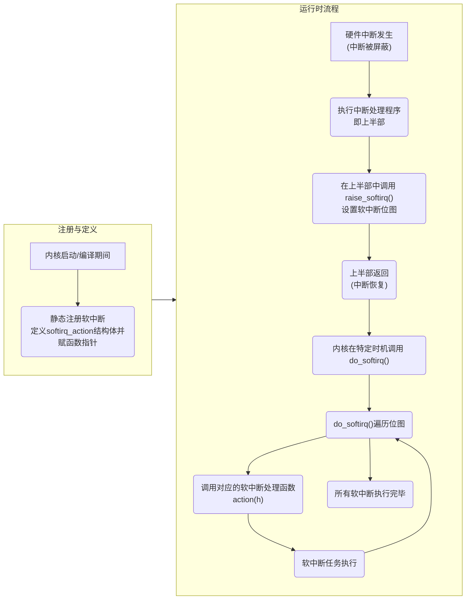
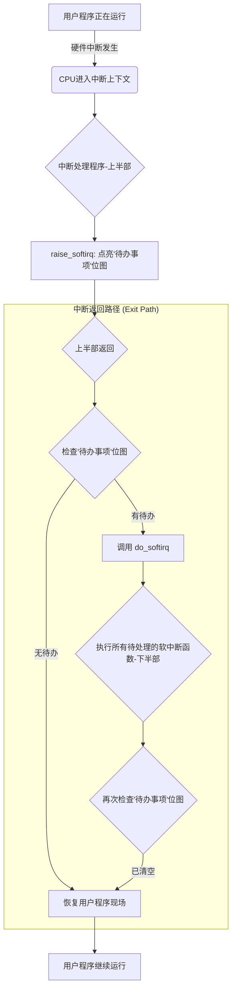
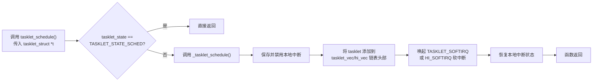
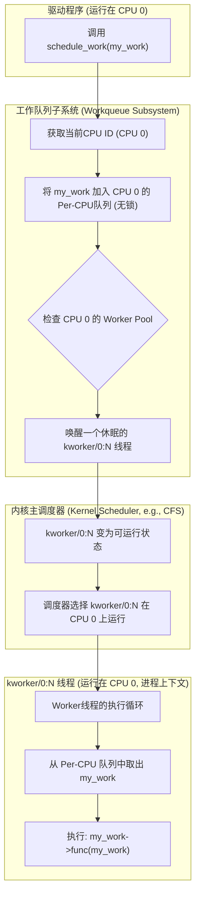

>[!info] **将中断处理工作一分为二**：将快速、紧急、必须在中断被屏蔽时完成的工作放在“上半部”，而将耗时、非紧急的工作推迟到中断恢复后，在“下半部”异步执行。

### 特点

- 可以多cpu并行
- 不能sleep
- 只允许静态创建

## 关键步骤 (Key Steps)

1. **中断上半部触发**：当硬件中断发生时，执行快速、必须立即完成的中断处理程序。
2. **禁用中断**：在执行上半部的过程中，为了避免干扰，会暂时禁用部分或所有中断。
    
3. **调度下半部**：上半部完成后，它会将剩余的、耗时的工作标记为“待办”，并提交给下半部机制。
4. **恢复中断**：上半部迅速退出，系统重新允许响应中断。

5. **下半部执行**：在系统不再繁忙，并且中断已恢复的情况下，下半部机制开始执行之前被标记的待办工作。


## 重点概念

- **上半部 (Top Half)**：中断处理程序中，在中断被屏蔽时执行的、必须快速完成的部分。
- **下半部 (Bottom Half)**：中断处理程序中，被推迟到中断恢复后异步执行的、可以耗时较长的部分。
### 下半部概念

- **软中断 (Softirqs)**：一组静态定义的下半部接口，性能高，**允许在所有处理器上并行**执行相同类型的任务，主要用于网络等对性能要求极高的场景。
    
- **Tasklet**：一种基于**软中断**实现的更灵活的下半部机制。它比软中断易用，但相同类型的 tasklet **不能在不同的处理器上同时执行**，因此**在性能和易用性之间取得了平衡**。
    
- **工作队列 (Workqueue)**：一种**在进程上下文中执行**下半部任务的机制，它将任务排队，由**内核工作线程**来执行。

# 软中断



> [!question] 内核在特定时机? 是什么时机?
> **在中断返回的时候会调用**
> 上半部在中断上下文中完成，
> 下半部（特指软中断和Tasklet）是在中断上下文“结束”之后，返回到用户空间“之前”的那个“间隙”里完成的。
> 进一步来说: **下半部（软中断和Tasklet）在执行时，是完全可以被新的中断打断的**。




## 软中断的注册与定义

软中断是 **静态分配** 的, 其定义过程是**编译时**在 `softirq_vec` 数组中分配一个槽位。

| 函数声明                                                     | 功能说明                                           |
| -------------------------------------------------------- | ---------------------------------------------- |
| `static struct softirq_action softirq_vec[NR_SOFTIRQS];` | 这是一个静态数组，用于存放所有软中断的描述符。注册过程即是在编译时给这个数组的某个元素赋值。 |
```c
struct softirq_action {
	void (*action) (struct softirq_action *);
};

static struct softirq_action softirq_vec[NR_SOFTIRQS];
```

### **详细步骤与数据流:**

1. 内核在编译时定义一个名为 `softirq_vec` 的静态数组，最大容量为32。
2. 开发者为某个特定的中断类型（例如网络接收）定义一个**软中断处理函数**。
3. 在内核初始化或编译时，该处理函数被赋值给 `softirq_vec` 数组中相应索引的 `action` 字段
4. 此时，该软中断就已经注册并准备好，等待被触发。

> [!info] 软中断是 **静态分配** 的，不能在运行时动态注册或注销。

### 例子

```c
// 伪代码: 在内核中静态定义一个软中断
enum {
    HI_SOFTIRQ=0,
    TIMER_SOFTIRQ,
    NET_TX_SOFTIRQ,
    NET_RX_SOFTIRQ,
    ...
};

// 为 NET_RX_SOFTIRQ 静态定义一个处理函数
void net_rx_softirq_action(struct softirq_action *h) {
    // 处理网络接收数据包
    // ...
}

// 在编译时将函数绑定到 softirq_vec 数组的 NET_RX_SOFTIRQ 位置
// (这个过程通常由宏或特殊的编译流程完成，原文未展示具体代码)
softirq_vec[NET_RX_SOFTIRQ].action = net_rx_softirq_action;
```

## 软中断的触发与执行

在中断上半部完成后，将相应的软中断标记为“**待处理**”，并最终在合适的时机执行它。

### **详细步骤与数据流:**

1. **触发 (Raising):** 中断处理程序（上半部）在返回之前，调用 `raise_softirq()` 等函数，将一个或多个位图中的位设置为1，**表示相应的软中断需要被执行**。
    
2. **检查:** 内核在从==中断处理程序返回==时，或在 `ksoftirqd` 内核线程中，或在其他特定代码路径中，**会检查是否有待处理的软中断**。
    
3. **执行 (Execution):** 如果有待处理的软中断，内核会调用 `do_softirq()` 函数。
    
4. **遍历:** `do_softirq()` 获取待处理软中断的==位图== `pending`，然后循环遍历这个位图。
    
5. **调用:** 对于位图中每一位为1的软中断，它会调用 `softirq_vec` 数组中对应索引的 `action` 函数，并传入指向该结构体的指针。
    
6. **完成:** 循环==直到 pending位图为0==，所有待处理的软中断都已执行完毕。

>[!info] 软中断执行要点
>- **软中断不会被另一个软中断抢占**，但可以被硬件中断抢占。
>- **相同类型的软中断** 可以在不同的处理器上 **同时执行**，这使得软中断非常适合高并发场景。
>- 软中断的执行时机是在中断处理程序返回之后，或者在 `ksoftirqd` 内核线程中。


# TASKLET

**最常用、最简单的下半部实现方式**

>[!info] tasklet 是建立在软中断之上的更易用的封装. 
通过封装软中断（`HI_SOFTIRQ` 和 `TASKLET_SOFTIRQ`），解决了直接使用软中断时接口复杂、需要开发者手动处理并发同步的问题，使得大多数不需要高并发处理的延迟任务能够被安全、高效地执行。


## 核心数据结构

```c
struct tasklet_struct {
    struct tasklet_struct *next;
    unsigned long state;
    atomic_t count;
    void (*func) (unsigned long);
    unsigned long data;
};
```

| 重点级别   | 字段名     | 作用说明                                                                     |
| ------ | ------- | ------------------------------------------------------------------------ |
| **核心** | `func`  | tasklet 的处理函数，即实际要执行的推迟任务。                                               |
| **核心** | `data`  | 传递给 tasklet 处理函数的唯一参数。                                                   |
| **重点** | `state` | tasklet 的状态，用于标记是否已被调度（`TASKLET_STATE_SCHED`）或正在运行（`TASKLET_STATE_RUN`）。 |
| **重点** | `count` | tasklet 的引用计数器，用于禁用/激活 tasklet。当值为0时 tasklet 可执行。                        |
| 普通     | `next`  | 指向下一个 tasklet 的指针，用于将多个 tasklet 组织成链表。                                   |
### 特点
- 优先级比软中断低
- 不能多CPU并行
- 不能sleep
- 允许动态创建

## tasklet怎么用?-使用调度接口

>[!info] tasklet_schedule()
将一个 tasklet 标记为“待处理”，并将其添加到 per-CPU 的 tasklet 链表中，同时触发相应的软中断，为后续执行做准备。

### 例子
#### 使用的具体例子

```c title:使用tasklet来进行下半部例子
// 伪代码: 在中断处理程序中调度 tasklet
#include <linux/interrupt.h>
#include <linux/tasklet.h>

// 假设 my_tasklet 已经被 DECLARE_TASKLET 宏静态创建
extern struct tasklet_struct my_tasklet;

irqreturn_t my_irq_handler(int irq, void *dev_id) {
    // ... 中断上半部快速处理 ...
    
    // 调度 my_tasklet，使其在中断返回后执行
    tasklet_schedule(&my_tasklet);//<-----------------调度接口
    
    return IRQ_HANDLED;
}
```

### schedule的详细流程

- 1. **检查状态:** `tasklet_schedule()` 函数首先检查 tasklet 的 `state` 字段是否已设置为 `TASKLET_STATE_SCHED`。如果已设置，说明 tasklet 已经位于调度队列中，避免重复调度，直接返回。

> [!question] 为什么要检查stat状态?
> **为了防止重复调度:** 
> **场景**: 如果没有这个标志, 就会发生下面的调度问题:
> 1. 一个Tasklet `T`，当前处于空闲状态，不在任何CPU的待办列表里。
> 2. **时刻 1**: CPU 0上发生了一个中断。中断处理程序调用`tasklet_schedule(&T)`。
>     - CPU 0检查自己的待办列表，发现`T`不在里面，于是它把`T`加入了**CPU 0的待办列表**。 
> 3. **时刻 2 (极其关键)**: 在CPU 0上的软中断（那个“办事员”）**还没来得及**从待办列表里取出并**执行**`T`的时候，CPU 1上也发生了一个中断。
> 4. CPU 1上的中断处理程序，也调用了`tasklet_schedule(&T)`。
> CPU 1检查**它自己的**待办列表，发现`T`也不在里面（因为`T`在CPU 0的列表里，不在CPU 1的），于是它也把`T`加入了**CPU 1的待办列表**。

- 2.1 **禁用中断:** 为了保证操作的原子性，函数会保存当前中断状态并禁止本地中断。
    
- 2.2 **入队:** 将 tasklet 结构体添加到当前 CPU 的 `tasklet_vec` 或 `tasklet_hi_vec` 链表的头部。`tasklet_struct` 的 `next` 字段用于链接链表中的下一个元素。    
- 2.3 **触发软中断:** 唤起 `TASKLET_SOFTIRQ` 或 `HI_SOFTIRQ` 软中断，这会通知内核在合适的时机（通常是中断返回时）执行软中断处理。
    
- 2.4 **恢复中断:** 恢复本地中断到调度前的状态。



**涉及的API:**

|函数声明|功能说明|
|---|---|
|`tasklet_schedule(struct tasklet_struct *t)`|调度一个普通优先级的 tasklet。|
|`tasklet_hi_schedule(struct tasklet_struct *t)`|调度一个高优先级的 tasklet。|
|`_tasklet_schedule()`|内部函数，执行具体的调度逻辑。|

## 创建和编写tasklet

> [!question] 如何创建和编写tasklet, 以及如何正确的调度

### 创建tasklet

- **静态创建：** 使用宏 `DECLARE_TASKLET` 或 `DECLARE_TASKLET_DISABLED` 在编译时直接定义并初始化一个 `tasklet_struct` 结构体。宏会自动将处理函数 `func` 和参数 `data` 赋值给结构体成员，并根据选择的宏设置引用计数器 (`count`)。
    
- **动态创建：** 开发者首先需要手动分配一个 `tasklet_struct` 结构体的内存，然后调用 `tasklet_init()` 函数，该函数会负责初始化 `next`、`state`、`count`、`func` 和 `data` 等字段。

```c
// 伪代码: 静态创建 tasklet
// DECLARE_TASKLET 宏会创建名为 my_static_tasklet 的 tasklet_struct 结构体
DECLARE_TASKLET(my_static_tasklet, my_tasklet_handler, my_dev_data);

// 伪代码: 动态创建 tasklet
struct tasklet_struct *my_dynamic_tasklet;
my_dynamic_tasklet = kmalloc(sizeof(struct tasklet_struct), GFP_KERNEL);
if (my_dynamic_tasklet) {
    tasklet_init(my_dynamic_tasklet, my_tasklet_handler, my_dev_data);
}
```

**涉及的API:**

|函数声明|功能说明|
|---|---|
|`DECLARE_TASKLET(name, func, data)`|静态创建一个已激活的 tasklet。|
|`DECLARE_TASKLET_DISABLED(name, func, data)`|静态创建一个已禁用的 tasklet。|
|`tasklet_init(t, func, data)`|动态初始化一个 tasklet。|

### 调度

将一个 tasklet 标记为“待处理”以供执行，

**调度 (`tasklet_schedule`)：** 检查 tasklet 是否已被调度。如果没有，将其 `state` 标志设置为 `TASKLET_STATE_SCHED`，并将其添加到当前 CPU 的 `tasklet_vec` 链表，最后触发相应的软中断。

### 禁用
- **禁用 (`tasklet_disable`)：** 原子地增加 tasklet 的 `count` 引用计数器。如果 tasklet 正在其他 CPU 上执行，该函数会等待其完成，直到引用计数器不为0。
- **激活 (`tasklet_enable`)：** 原子地减少 tasklet 的 `count` 引用计数器。当计数器减到0时，tasklet 重新变为可执行状态。

>[!question] disable 和 tasklet_enable 是用来干嘛的?
>**tasklet可能用了某个共享变量, 其他也用了这个变量的代码在编程的时候, 为了同步安全, 需要先禁用tasklet,防止出同步问题**
如果你有一个全局变量或数据结构，它既被 tasklet 使用，又被你的其他代码（比如一个设备控制函数）使用.你就需要确保在操作数据时不会有并发冲突。你可以先调用 `tasklet_disable()`，这会保证 tasklet 不会运行。等你操作完数据后，再调用 `tasklet_enable()` 来恢复它的运行。


### ksoftirqd


# 工作队列

### 特点
- **允许sleeep**: 对于可能涉及到休眠的操作(比如锁), 工作队列是唯一的选择: 比如U盘
- 拥有独立的线程, **工作者线程**(内核线程)

## 架构-CMWQ(Concurrency-managed workqueues)

- **Per-CPU线程池**: CMWQ为**每一个CPU核心**，都维护了一个**独立的线程池**
- 它是一个==**弹性的线程池**==。它会实时监控工作队列的负载。
	- 当队列里没有工作时，工作者线程会自动销毁或进入休眠，不占用资源。
	- 当大量的工作涌入，导致当前的工作者线程忙不过来时，CMWQ会**动态地、按需地创建新的工作者线程**来“增援”，直到队列压力缓解。

### 对象
```

```

## 工作队列流程



# 相关概念
## 可重入/不可重入
简单来说: 可重入就是多线程访问安全的函数, 不可重入是多线程访问不安全

## 线程池

> [!question] 什么是线程池?
> 通过“资源复用”来降低“任务执行开销”的设计模式
### 好处

**带来的好处**:

- **零创建开销**: 当新任务到来时，系统**完全没有**创建新线程的开销，只需要把它放进队列，立刻就会有一个**已经待命**的线程去处理它。
- **资源可控**: 无论一瞬间涌入100个任务还是10000个任务，系统中的活动线程数量永远都是可控的（比如，就是那10个）。这保证了系统不会因为任务过载而崩溃。
- **解耦**: 任务的**“提交者”**和任务的**“执行者”**被完全分离开来。提交者只需要把任务扔进队列就可以继续干别的事了，而无需关心它何时、被哪个线程执行。

### 流程

- **预先创建一组线程 (The Pool)**: 餐厅（系统）在开业时，就先**雇佣并培训好**了一支固定规模的骑手团队（比如，10名骑手）。这些骑手就是**工作者线程（Worker Threads）**，他们创建好之后，就不会被销毁，而是一直待命。这就是“**资源复用**”。
- **一个任务队列 (The Queue)**: 餐厅有一个**订单中心**，所有新来的外卖订单（需要异步执行的任务），都被放进这个订单队列里。
- **工作循环**: 每个骑手（工作者线程）的人生就是一个简单的循环：
    - 去订单中心**看有没有新订单**。
    - 如果有，就**取一个**订单去执行（送外卖）。
    - 如果没有，就在门口**睡觉等待**，直到有新订单进来唤醒他。