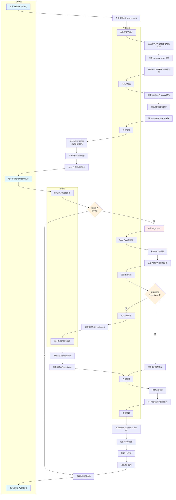

> [!question] 如果我需要mmap一个文件, 然后再读取这个文件内容, 涉及的底层流程是怎样的?
> 

# Linux内核内存管理架构

![[读取文件核心流程图08262010.svg]]

# 流程图

# 核心代码调用流程
![[文件读取核心代码调用流程20250826.svg|257x1035]]

# 详细代码调用流程图

![[详细代码调用流程20250826.svg]]

