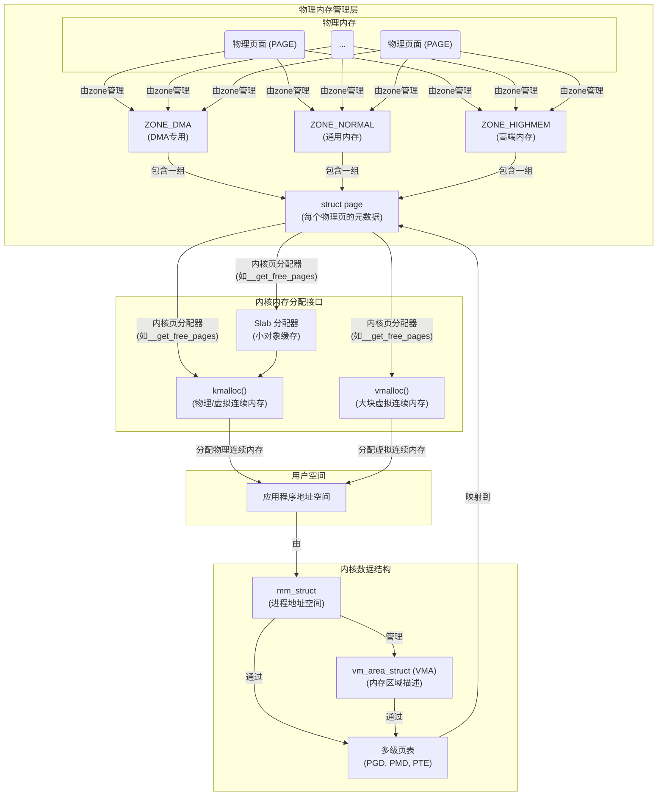
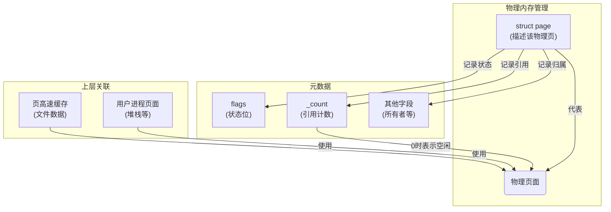
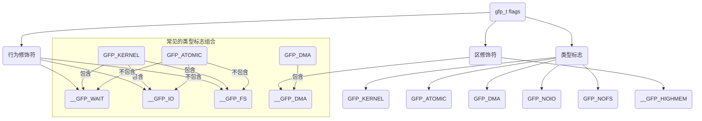
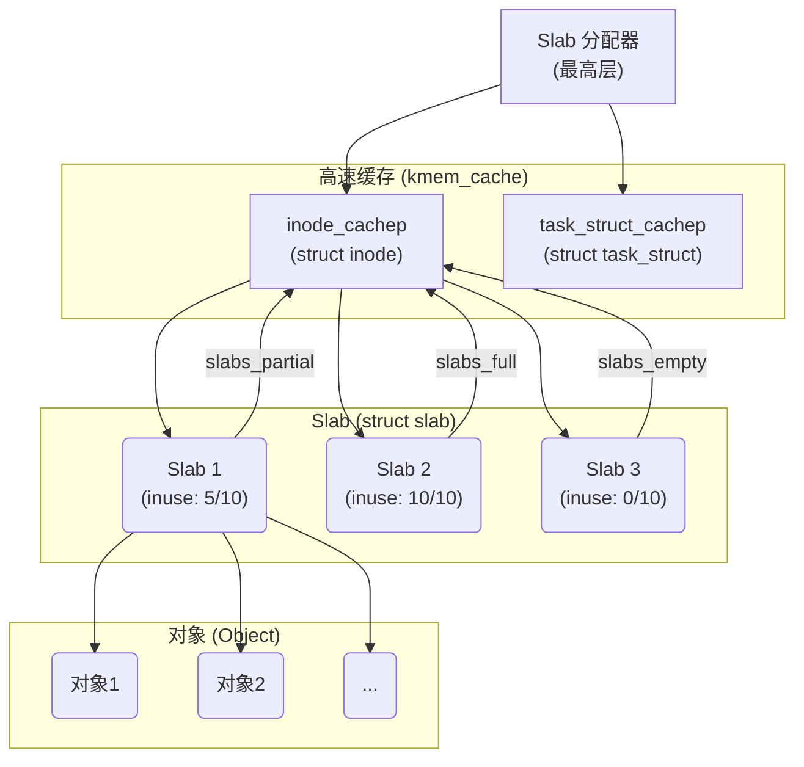
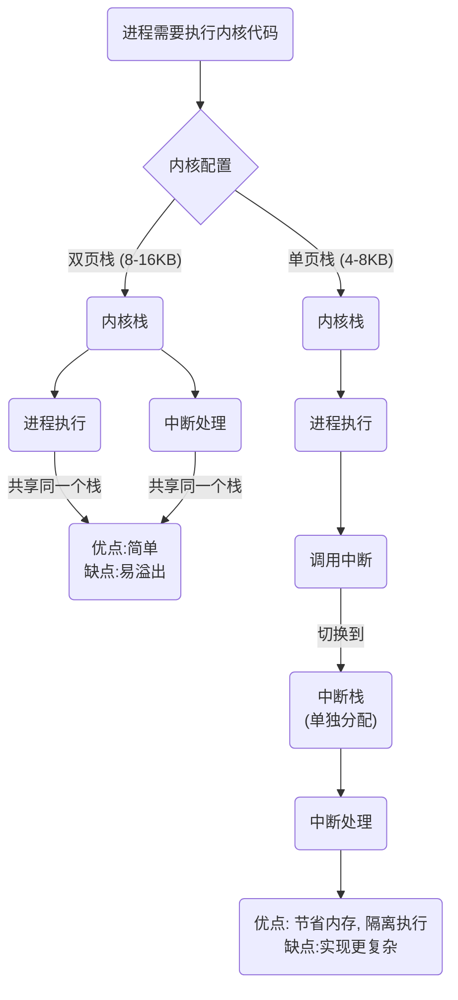
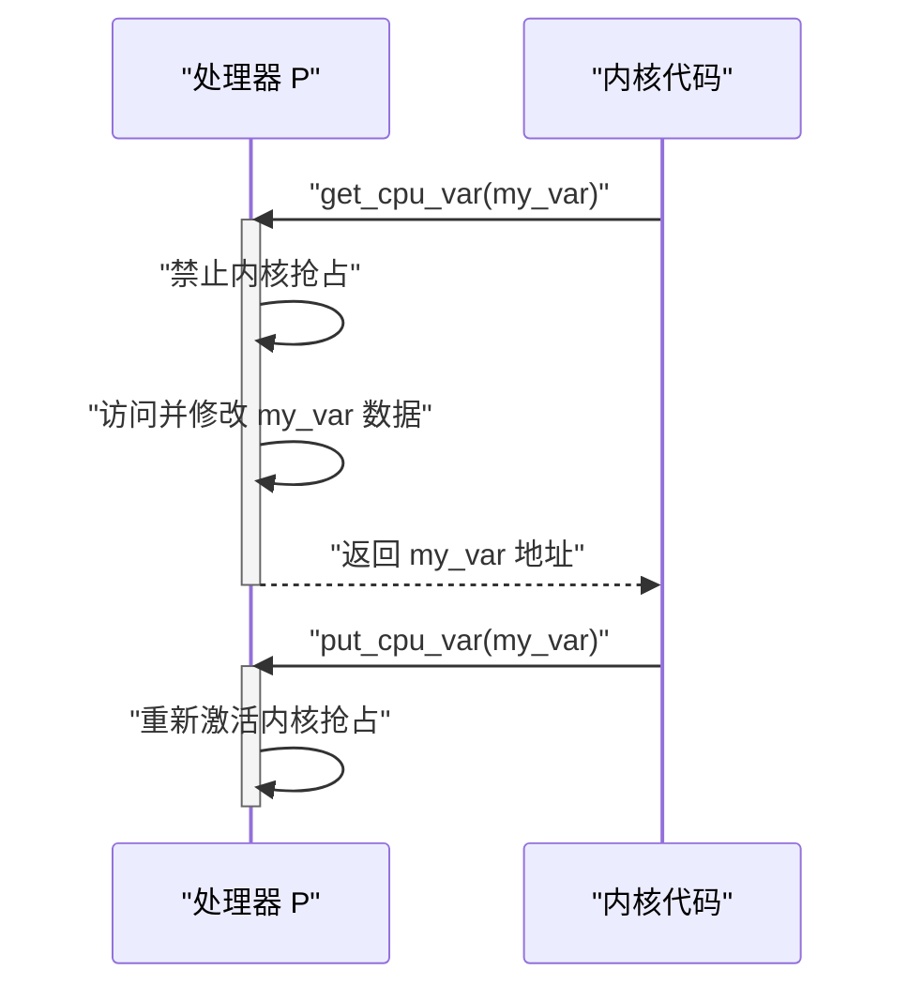

> [!question] 如何高效管理**物理内存**呢?  确保内存资源正确分配和回收?

- **页**和**区**是**物理内存的组织方式**，
- **Slab**、**`kmalloc()`** 和 **`vmalloc()`** 是建立在这个组织之上，用于**内核内存**分配和管理内存的工具。
- **页表** 是进程地址空间VFS的内容


# 页

- [b] Linux 内核通过为系统中的**每个物理页**分配一个对应的 **`struct page`** 结构体，来描述和管理该页面的所有元数据（如状态、引用计数、所有者），从而实现对物理内存的精细化管理。

```c title:mm_types.h/page{...} hl:2,18
struct page {
	unsigned long flags;		/*是否干净、是否正在使用*/ /* Atomic flags, some possibly updated asynchronously */  
	/*
	 * Five words (20/40 bytes) are available in this union.
	 * WARNING: bit 0 of the first word is used for PageTail(). That
	 * means the other users of this union MUST NOT use the bit to
	 * avoid collision and false-positive PageTail().
	 */
	union {
		struct {	/* Page cache and anonymous pages */
			/**
			 * @lru: Pageout list, eg. active_list protected by
			 * pgdat->lru_lock.  Sometimes used as a generic list
			 * by the page owner.
			 */
			struct list_head lru;
			/* See page-flags.h for PAGE_MAPPING_FLAGS */
			struct address_space *mapping; /*页面的所有者*/
			pgoff_t index;		/* Our offset within mapping. */
			/**
			 * @private: Mapping-private opaque data.
			 * Usually used for buffer_heads if PagePrivate.
			 * Used for swp_entry_t if PageSwapCache.
			 * Indicates order in the buddy system if PageBuddy.
			 */
			unsigned long private;
		};
		struct {	/* page_pool used by netstack */
			/**
			 * @dma_addr: might require a 64-bit value on
			 * 32-bit architectures.
			 */
			unsigned long dma_addr[2];
		};
		struct {	/* slab, slob and slub */
			union {
				struct list_head slab_list;
				struct {	/* Partial pages */
					struct page *next;
#ifdef CONFIG_64BIT
					int pages;	/* Nr of pages left */
					int pobjects;	/* Approximate count */
#else
					short int pages;
					short int pobjects;
#endif
				};
			};
			struct kmem_cache *slab_cache; /* not slob */
			/* Double-word boundary */
			void *freelist;		/* first free object */
			union {
				void *s_mem;	/* slab: first object */
				unsigned long counters;		/* SLUB */
				struct {			/* SLUB */
					unsigned inuse:16;
					unsigned objects:15;
					unsigned frozen:1;
				};
			};
		};
		struct {	/* Tail pages of compound page */
			unsigned long compound_head;	/* Bit zero is set */

			/* First tail page only */
			unsigned char compound_dtor;
			unsigned char compound_order;
			atomic_t compound_mapcount;
		};
		struct {	/* Second tail page of compound page */
			unsigned long _compound_pad_1;	/* compound_head */
			unsigned long _compound_pad_2;
			/* For both global and memcg */
			struct list_head deferred_list;
		};
		struct {	/* Page table pages */
			unsigned long _pt_pad_1;	/* compound_head */
			pgtable_t pmd_huge_pte; /* protected by page->ptl */
			unsigned long _pt_pad_2;	/* mapping */
			union {
				struct mm_struct *pt_mm; /* x86 pgds only */
				atomic_t pt_frag_refcount; /* powerpc */
			};
#if ALLOC_SPLIT_PTLOCKS
			spinlock_t *ptl;
#else
			spinlock_t ptl;
#endif
		};
		struct {	/* ZONE_DEVICE pages */
			/** @pgmap: Points to the hosting device page map. */
			struct dev_pagemap *pgmap;
			void *zone_device_data;
			/*
			 * ZONE_DEVICE private pages are counted as being
			 * mapped so the next 3 words hold the mapping, index,
			 * and private fields from the source anonymous or
			 * page cache page while the page is migrated to device
			 * private memory.
			 * ZONE_DEVICE MEMORY_DEVICE_FS_DAX pages also
			 * use the mapping, index, and private fields when
			 * pmem backed DAX files are mapped.
			 */
		};

		/** @rcu_head: You can use this to free a page by RCU. */
		struct rcu_head rcu_head;
	};

	union {		/* This union is 4 bytes in size. */
		/*
		 * If the page can be mapped to userspace, encodes the number
		 * of times this page is referenced by a page table.
		 */
		atomic_t _mapcount;

		/*
		 * If the page is neither PageSlab nor mappable to userspace,
		 * the value stored here may help determine what this page
		 * is used for.  See page-flags.h for a list of page types
		 * which are currently stored here.
		 */
		unsigned int page_type;

		unsigned int active;		/* SLAB */
		int units;			/* SLOB */
	};

	/* Usage count. *DO NOT USE DIRECTLY*. See page_ref.h */
	atomic_t _refcount;

#ifdef CONFIG_MEMCG
	struct mem_cgroup *mem_cgroup;
#endif

	/*
	 * On machines where all RAM is mapped into kernel address space,
	 * we can simply calculate the virtual address. On machines with
	 * highmem some memory is mapped into kernel virtual memory
	 * dynamically, so we need a place to store that address.
	 * Note that this field could be 16 bits on x86 ... ;)
	 *
	 * Architectures with slow multiplication can define
	 * WANT_PAGE_VIRTUAL in asm/page.h
	 */
#if defined(WANT_PAGE_VIRTUAL)
	void *virtual;			/* Kernel virtual address (NULL if
					   not kmapped, ie. highmem) */
#endif /* WANT_PAGE_VIRTUAL */

#ifdef LAST_CPUPID_NOT_IN_PAGE_FLAGS
	int _last_cpupid;
#endif
} _struct_page_alignment;
```


## 关键步骤

- **为每个物理页面, 分配一个结构体**: 物理内存管理的基本单位，通常大小为 4KB
- **记录了元数据信息**: 物理页的**状态**（脏、锁定）、**引用计数**（被多少个对象引用）和**所有者信息**（属于哪个进程、页缓存等）
- **按需管理**: 内核通过检查这些结构体中的字段，来决定是否可以分配一个页面

### 结构图



### 页管理方法总结

| 序号    | 方法原型                                                                 | 作用                                                       | 注意事项                                              |
| ----- | -------------------------------------------------------------------- | -------------------------------------------------------- | ------------------------------------------------- |
| **1** | `struct page *alloc_pages(gfp_t gfp_mask, unsigned int order)`       | 分配 2order 个**连续物理页**，返回指向第一个页的 `struct page` 指针。         | 需使用 `page_address()` 将 `struct page` 转换为逻辑地址。     |
| **2** | `unsigned long __get_free_pages(gfp_t gfp_mask, unsigned int order)` | 作用与 `alloc_pages()` 相同，但**直接返回**第一个页的逻辑地址。               | 适用于不需要 `struct page` 结构体的场景。                      |
| **3** | `struct page *alloc_page(gfp_t gfp_mask)`                            | `alloc_pages()` 的简化版本，专门用于分配**一个物理页**（`order` 为 0）。      | 同样返回 `struct page` 指针，需转换成逻辑地址。                   |
| **4** | `unsigned long get_free_page(gfp_t gfp_mask)`                        | `__get_free_pages()` 的简化版本，专门用于分配**一个物理页**（`order` 为 0）。 | 直接返回逻辑地址，使用最便捷。                                   |
| **5** | `unsigned long get_zeroed_page(unsigned int gfp_mask)`               | 类似于 `get_free_pages()`，但会**将分配到的页内容全部清零**。               | 当页用于用户空间时非常有用，避免泄露敏感数据。                           |
| **6** | `void __free_pages(struct page *page, unsigned int order)`           | 释放由 `alloc_pages()` 分配的**一组连续页**。                        | **必须**传入正确的 `struct page` 和 `order` 值，否则可能导致系统崩溃。 |
| **7** | `void free_pages(unsigned long addr, unsigned int order)`            | 释放由 `__get_free_pages()` 分配的**一组连续页**。                   | **必须**传入正确的起始地址和 `order` 值。                       |
| **8** | `void free_page(unsigned long addr)`                                 | 释放由 `get_free_page()` 或 `get_zeroed_page()` 分配的**单个页**。  | 必须传入正确的页的逻辑地址。                                    |

# 区

## 概念解释

> [!question] 什么是区?
内核对**物理内存页**进行的逻辑分组，用于管理具有**相似特性的内存**

- **DMA (Direct Memory Access)**: 一种硬件机制，允许设备不通过 CPU 直接访问内存。
- **高端内存 (High Memory)**: 那些不能永久映射到内核地址空间的物理内存。
- **低端内存 (Low Memory)**: 能够永久映射到内核地址空间的物理内存。

### 关联内核代码
**`struct zone`**: 内核用来描述和管理每个区的结构体。

```c title:zone hl:5,105,77

struct zone {
	/* Read-mostly fields */

	/* zone watermarks, access with *_wmark_pages(zone) macros */
	unsigned long _watermark[NR_WMARK];   /*该区最小值, 最低,最高水位值*/
	unsigned long watermark_boost;

	unsigned long nr_reserved_highatomic;

	/*
	 * We don't know if the memory that we're going to allocate will be
	 * freeable or/and it will be released eventually, so to avoid totally
	 * wasting several GB of ram we must reserve some of the lower zone
	 * memory (otherwise we risk to run OOM on the lower zones despite
	 * there being tons of freeable ram on the higher zones).  This array is
	 * recalculated at runtime if the sysctl_lowmem_reserve_ratio sysctl
	 * changes.
	 */
	long lowmem_reserve[MAX_NR_ZONES];

#ifdef CONFIG_NUMA
	int node;
#endif
	struct pglist_data	*zone_pgdat;
	struct per_cpu_pageset __percpu *pageset;

#ifndef CONFIG_SPARSEMEM
	/*
	 * Flags for a pageblock_nr_pages block. See pageblock-flags.h.
	 * In SPARSEMEM, this map is stored in struct mem_section
	 */
	unsigned long		*pageblock_flags;
#endif /* CONFIG_SPARSEMEM */

	/* zone_start_pfn == zone_start_paddr >> PAGE_SHIFT */
	unsigned long		zone_start_pfn;

	/*
	 * spanned_pages is the total pages spanned by the zone, including
	 * holes, which is calculated as:
	 * 	spanned_pages = zone_end_pfn - zone_start_pfn;
	 *
	 * present_pages is physical pages existing within the zone, which
	 * is calculated as:
	 *	present_pages = spanned_pages - absent_pages(pages in holes);
	 *
	 * managed_pages is present pages managed by the buddy system, which
	 * is calculated as (reserved_pages includes pages allocated by the
	 * bootmem allocator):
	 *	managed_pages = present_pages - reserved_pages;
	 *
	 * So present_pages may be used by memory hotplug or memory power
	 * management logic to figure out unmanaged pages by checking
	 * (present_pages - managed_pages). And managed_pages should be used
	 * by page allocator and vm scanner to calculate all kinds of watermarks
	 * and thresholds.
	 *
	 * Locking rules:
	 *
	 * zone_start_pfn and spanned_pages are protected by span_seqlock.
	 * It is a seqlock because it has to be read outside of zone->lock,
	 * and it is done in the main allocator path.  But, it is written
	 * quite infrequently.
	 *
	 * The span_seq lock is declared along with zone->lock because it is
	 * frequently read in proximity to zone->lock.  It's good to
	 * give them a chance of being in the same cacheline.
	 *
	 * Write access to present_pages at runtime should be protected by
	 * mem_hotplug_begin/end(). Any reader who can't tolerant drift of
	 * present_pages should get_online_mems() to get a stable value.
	 */
	atomic_long_t		managed_pages;
	unsigned long		spanned_pages;
	unsigned long		present_pages;

	const char		*name;  /* zone名称 */

#ifdef CONFIG_MEMORY_ISOLATION
	/*
	 * Number of isolated pageblock. It is used to solve incorrect
	 * freepage counting problem due to racy retrieving migratetype
	 * of pageblock. Protected by zone->lock.
	 */
	unsigned long		nr_isolate_pageblock;
#endif

#ifdef CONFIG_MEMORY_HOTPLUG
	/* see spanned/present_pages for more description */
	seqlock_t		span_seqlock;
#endif

	int initialized;

	/* Write-intensive fields used from the page allocator */
	ZONE_PADDING(_pad1_)

	/* free areas of different sizes */
	struct free_area	free_area[MAX_ORDER];

	/* zone flags, see below */
	unsigned long		flags;

	/* Primarily protects free_area */
	spinlock_t		lock;  /* 自旋锁, 防止并发访问*/

	/* Write-intensive fields used by compaction and vmstats. */
	ZONE_PADDING(_pad2_)

	/*
	 * When free pages are below this point, additional steps are taken
	 * when reading the number of free pages to avoid per-cpu counter
	 * drift allowing watermarks to be breached
	 */
	unsigned long percpu_drift_mark;

#if defined CONFIG_COMPACTION || defined CONFIG_CMA
	/* pfn where compaction free scanner should start */
	unsigned long		compact_cached_free_pfn;
	/* pfn where async and sync compaction migration scanner should start */
	unsigned long		compact_cached_migrate_pfn[2];
	unsigned long		compact_init_migrate_pfn;
	unsigned long		compact_init_free_pfn;
#endif

#ifdef CONFIG_COMPACTION
	/*
	 * On compaction failure, 1<<compact_defer_shift compactions
	 * are skipped before trying again. The number attempted since
	 * last failure is tracked with compact_considered.
	 */
	unsigned int		compact_considered;
	unsigned int		compact_defer_shift;
	int			compact_order_failed;
#endif

#if defined CONFIG_COMPACTION || defined CONFIG_CMA
	/* Set to true when the PG_migrate_skip bits should be cleared */
	bool			compact_blockskip_flush;
#endif

	bool			contiguous;

	ZONE_PADDING(_pad3_)
	/* Zone statistics */
	atomic_long_t		vm_stat[NR_VM_ZONE_STAT_ITEMS];
	atomic_long_t		vm_numa_stat[NR_VM_NUMA_STAT_ITEMS];
} ____cacheline_internodealigned_in_smp;

enum pgdat_flags {
	PGDAT_CONGESTED,		/* pgdat has many dirty pages backed by
					 * a congested BDI
					 */
	PGDAT_DIRTY,			/* reclaim scanning has recently found
					 * many dirty file pages at the tail
					 * of the LRU.
					 */
	PGDAT_WRITEBACK,		/* reclaim scanning has recently found
					 * many pages under writeback
					 */
	PGDAT_RECLAIM_LOCKED,		/* prevents concurrent reclaim */
};

enum zone_flags {
	ZONE_BOOSTED_WATERMARK,		/* zone recently boosted watermarks.
					 * Cleared when kswapd is woken.
					 */
};
```


#### **实际设备观测**

```bash title:/proc/zoneinfo
song@song-com:/proc$ cat zoneinfo | grep zone
Node 0, zone      DMA
      nr_zone_inactive_anon 0
      nr_zone_active_anon 0
      nr_zone_inactive_file 0
      nr_zone_active_file 0
      nr_zone_unevictable 0
      nr_zone_write_pending 0
Node 0, zone    DMA32
      nr_zone_inactive_anon 2
      nr_zone_active_anon 26419
      nr_zone_inactive_file 128806
      nr_zone_active_file 186435
      nr_zone_unevictable 0
      nr_zone_write_pending 0
Node 0, zone   Normal
      nr_zone_inactive_anon 35404
      nr_zone_active_anon 294176
      nr_zone_inactive_file 1463289
      nr_zone_active_file 1446674
      nr_zone_unevictable 0
      nr_zone_write_pending 12
Node 0, zone  Movable
Node 0, zone   Device
```


# kmalloc

> [!question] 如何以**字节为单位**高效的分配内存

通过**kmalloc()** 函数提供一个简单的**字节级内存分配接口**，并使用**gfp_t标志** 来精细地控制内存分配的行为（是否可睡眠、是否可I/O）和来源（从哪个内存区分配）。

## 使用步骤

**关键步骤 (Key Steps)**:

1. **请求分配**: 内核代码调用 `kmalloc(size, flags)`，指定所需的字节数和分配行为。
2. **解析标志**: 内核的内存分配器解析 `flags` 参数，判断该请求是可睡眠、原子性、是否允许I/O等。
3. **选择内存区**: 分配器根据 `flags` 中的区修饰符（如 `GFP_DMA`），决定从哪个内存区（`ZONE_DMA` 或 `ZONE_NORMAL`）开始寻找空闲页。
4. **分配并返回**: 分配器在指定的内存区中找到足够大小的**连续物理页**，然后将其地址返回给调用者。

### 核心比喻 (Core Analogy): 
`kmalloc()` 就像一个**智能的仓储机器人**。你只需要告诉它你需要多少货物（`size`）以及你的**订单类型**（`flags`）。订单类型会告诉机器人：

1. **行为修饰符**: 你可以等待（`GFP_KERNEL`），还是必须立即返回（`GFP_ATOMIC`）。
2. **区修饰符**: 货物必须从哪个特定的货架（`ZONE_DMA`）上取。
3. **类型标志**: 这是一个预设好的组合，比如“紧急订单”，机器人知道这意味着它必须立即去取货，并且不进行任何等待。




# vmalloc

> [!question]  kmalloc要求物理内存连续, 但是如果物理内存上没有大块连续内存, 该怎么办?
> 

通过 **vmalloc()** 函数，内核可以==分配到物理地址上不连续的内存页==，然后通过修改页表将这些页映射到虚拟地址空间中的一个连续区域，从而满足软件对逻辑连续性的需求，并提升大块内存分配的成功率。


### 关键步骤 (Key Steps):

1. **请求分配**: 调用 `vmalloc(size)`，指定所需的总大小。
2. **分配物理页**: 内核寻找并分配多个物理上不连续的内存页。
3. **修改页表**: 内核为这些物理页在虚拟地址空间中寻找一块连续的区域。然后，它为每一个物理页创建一个新的**页表项 (PTE)**，将分散的物理地址映射到虚拟地址上那个连续的区域。
4. **返回地址**: 函数返回这个逻辑上连续的虚拟地址，供内核代码使用。

### 关键概念

- **`vmalloc()`**: 内核中以字节为单位分配**虚拟地址连续、物理地址不连续**的内存的函数。
- **`kmalloc()`**: 与 `vmalloc()` 相对，它分配**物理和虚拟地址都连续**的内存。
- **TLB 抖动 (TLB Thrashing)**: 由于 `vmalloc()` 会创建大量新的页表项，可能导致频繁地刷新 TLB，从而降低性能。
- **页表**: 操作系统用于将虚拟地址映射到物理地址的数据结构。`vmalloc()` 的核心工作就是修改页表。

- 这是一个**对比关系**，展示了 `kmalloc()` 和 `vmalloc()` 的主要差异和优缺点。

|特性|**kmalloc()**|**vmalloc()**|
|---|---|---|
|**物理地址**|**连续**|**不连续**|
|**虚拟地址**|**连续**|**连续**|
|**性能**|**高**（页表映射简单，无TLB抖动）|**低**（需要单独创建页表项，易产生TLB抖动）|
|**用途**|通用内核分配；需要**物理连续性**的硬件驱动。|**大块内存分配**；动态加载内核模块；不需要物理连续性的软件缓冲区。|
|**分配成功率**|**较低**（在内存碎片化时）|**较高**（可以利用分散的空闲页）|


# slab

==**加速小型数据结构体管理的方法**==

> [!question] 在内核中，如何高效地为**频繁分配和释放**的**小型数据结构**（对象）管理内存，以解决频繁分配导致的内存碎片化，以及因反复申请和释放而带来的性能开销?

Linux 内核通过**Slab 分配器**，为每种数据结构类型创建专门的**缓存（Cache）**，并以**Slab**为单位管理这些缓存，从而实现了内存的**高效缓存、分配和回收**，同时减少了内存碎片。

### 核心的步骤

**关键步骤 (Key Steps)**:

1. **创建缓存**: 内核为每种频繁使用的数据结构（如`struct inode`）创建一个专门的**高速缓存（`kmem_cache`）**。
2. **管理Slab**: 每个高速缓存由一个或多个**Slab**（由一个或多个物理页组成）构成，Slab 内部包含多个对象实例。
3. **分配**: 当需要一个新对象时，分配器首先从**部分满**的Slab中取一个空闲对象。如果找不到，就从**空Slab**中取。
4. **回收**: 当对象不再使用时，它被标记为空闲并放回其所在的Slab，而非立即释放内存。只有在内存极度紧缺或缓存被销毁时，Slab 的内存才会被释放。




### SLAB和kmalloc的关系

>[!info] Slab 分配器是 `kmalloc()` 实现高效内存分配的基石

`kmalloc()` 与 Slab 分配器关联的秘密：
1. **内核预先创建通用的 Slab 缓存**：在内核启动时，Slab 分配器会创建一系列**通用目的的缓存**，其名称通常是 `kmalloc-32`、`kmalloc-64`、`kmalloc-128` 等。
2. **`kmalloc()` 成为前端接口**：当你在代码中调用 `kmalloc(50, GFP_KERNEL)` 时，`kmalloc()` 函数并不会直接去底层找页。它会找到最接近且不小于 50 字节的 Slab 缓存（也就是 `kmalloc-64`），然后**从那个缓存中快速取出一个已分配好的对象**并返回。
3. **Slab 分配器作为后端引擎**：只有当 `kmalloc-64` 这个 Slab 缓存里所有的对象都被用光时，Slab 分配器才会介入。它会调用底层的页分配器（如 `__get_free_pages`）来获取新的物理页，然后将这些页切分成 64 字节的小块，填充到 `kmalloc-64` 这个缓存里。


<svg viewBox="0 0 800 600" xmlns="http://www.w3.org/2000/svg">
  <!-- 背景 -->
  <rect width="800" height="600" fill="#f8f9fa"/>
  
  <!-- 标题 -->
  <text x="400" y="30" text-anchor="middle" font-size="20" font-weight="bold" fill="#2c3e50">
    kmalloc() 与 Slab 分配器关联机制
  </text>
  
  <!-- 用户调用层 -->
  <rect x="50" y="60" width="700" height="60" fill="#e3f2fd" stroke="#1976d2" stroke-width="2" rx="5"/>
  <text x="400" y="85" text-anchor="middle" font-size="14" font-weight="bold" fill="#1976d2">
    内核申请内存代码调用层
  </text>
  <text x="400" y="105" text-anchor="middle" font-size="12" fill="#1976d2">
    kmalloc(50, GFP_KERNEL) - 请求50字节内存
  </text>
  
  <!-- 箭头1 -->
  <path d="M 400 120 L 400 140" stroke="#2c3e50" stroke-width="2" marker-end="url(#arrowhead)"/>
  
  <!-- kmalloc前端接口层 -->
  <rect x="50" y="150" width="700" height="80" fill="#fff3e0" stroke="#f57c00" stroke-width="2" rx="5"/>
  <text x="400" y="175" text-anchor="middle" font-size="14" font-weight="bold" fill="#f57c00">
    kmalloc() 前端接口
  </text>
  <text x="400" y="195" text-anchor="middle" font-size="12" fill="#f57c00">
    找到最接近的Slab缓存：50字节 → kmalloc-64
  </text>
  <text x="400" y="215" text-anchor="middle" font-size="12" fill="#f57c00">
    从 kmalloc-64 缓存中获取预分配对象
  </text>
  
  <!-- 箭头2 -->
  <path d="M 400 230 L 400 250" stroke="#2c3e50" stroke-width="2" marker-end="url(#arrowhead)"/>
  
  <!-- Slab缓存池层 -->
  <rect x="50" y="260" width="700" height="140" fill="#e8f5e8" stroke="#388e3c" stroke-width="2" rx="5"/>
  <text x="400" y="285" text-anchor="middle" font-size="14" font-weight="bold" fill="#388e3c">
    Slab 缓存池（预创建的通用缓存）
  </text>
  
  <!-- 各种大小的缓存 -->
  <rect x="80" y="300" width="100" height="80" fill="#c8e6c9" stroke="#4caf50" stroke-width="1" rx="3"/>
  <text x="130" y="320" text-anchor="middle" font-size="11" font-weight="bold" fill="#2e7d32">kmalloc-32</text>
  <text x="130" y="335" text-anchor="middle" font-size="9" fill="#2e7d32">32字节对象</text>
  <circle cx="115" cy="350" r="8" fill="#4caf50"/>
  <circle cx="130" cy="350" r="8" fill="#4caf50"/>
  <circle cx="145" cy="350" r="8" fill="#4caf50"/>
  <circle cx="115" cy="365" r="8" fill="#4caf50"/>
  <circle cx="130" cy="365" r="8" fill="#4caf50"/>
  <circle cx="145" cy="365" r="8" fill="#4caf50"/>
  
  <rect x="220" y="300" width="100" height="80" fill="#ffecb3" stroke="#ffc107" stroke-width="2" rx="3"/>
  <text x="270" y="320" text-anchor="middle" font-size="11" font-weight="bold" fill="#f57c00">kmalloc-64</text>
  <text x="270" y="335" text-anchor="middle" font-size="9" fill="#f57c00">64字节对象</text>
  <text x="270" y="350" text-anchor="middle" font-size="9" fill="#d32f2f">← 目标缓存</text>
  <circle cx="255" cy="365" r="8" fill="#ffc107"/>
  <circle cx="270" cy="365" r="8" fill="#ffc107"/>
  <circle cx="285" cy="365" r="8" fill="#ffc107"/>
  
  <rect x="360" y="300" width="100" height="80" fill="#c8e6c9" stroke="#4caf50" stroke-width="1" rx="3"/>
  <text x="410" y="320" text-anchor="middle" font-size="11" font-weight="bold" fill="#2e7d32">kmalloc-128</text>
  <text x="410" y="335" text-anchor="middle" font-size="9" fill="#2e7d32">128字节对象</text>
  <circle cx="395" cy="350" r="8" fill="#4caf50"/>
  <circle cx="410" cy="350" r="8" fill="#4caf50"/>
  <circle cx="425" cy="350" r="8" fill="#4caf50"/>
  <circle cx="395" cy="365" r="8" fill="#4caf50"/>
  <circle cx="410" cy="365" r="8" fill="#4caf50"/>
  <circle cx="425" cy="365" r="8" fill="#4caf50"/>
  
  <rect x="500" y="300" width="100" height="80" fill="#c8e6c9" stroke="#4caf50" stroke-width="1" rx="3"/>
  <text x="550" y="320" text-anchor="middle" font-size="11" font-weight="bold" fill="#2e7d32">kmalloc-256</text>
  <text x="550" y="335" text-anchor="middle" font-size="9" fill="#2e7d32">256字节对象</text>
  <circle cx="535" cy="350" r="8" fill="#4caf50"/>
  <circle cx="550" cy="350" r="8" fill="#4caf50"/>
  <circle cx="565" cy="350" r="8" fill="#4caf50"/>
  <circle cx="535" cy="365" r="8" fill="#4caf50"/>
  <circle cx="550" cy="365" r="8" fill="#4caf50"/>
  <circle cx="565" cy="365" r="8" fill="#4caf50"/>
  
  <text x="650" y="340" text-anchor="middle" font-size="11" fill="#2e7d32">...</text>
  
  <!-- 缓存耗尽情况箭头 -->
  <path d="M 270 380 L 270 420" stroke="#d32f2f" stroke-width="2" marker-end="url(#arrowhead-red)" stroke-dasharray="5,5"/>
  <text x="320" y="405" font-size="10" fill="#d32f2f">缓存对象耗尽时</text>
  
  <!-- Slab分配器后端层 -->
  <rect x="50" y="430" width="700" height="100" fill="#ffebee" stroke="#d32f2f" stroke-width="2" rx="5"/>
  <text x="400" y="455" text-anchor="middle" font-size="14" font-weight="bold" fill="#d32f2f">
    Slab 分配器后端引擎
  </text>
  <text x="400" y="475" text-anchor="middle" font-size="12" fill="#d32f2f">
    调用 __get_free_pages() 获取新的物理页
  </text>
  <text x="400" y="495" text-anchor="middle" font-size="12" fill="#d32f2f">
    将页切分成64字节块，填充到 kmalloc-64 缓存
  </text>
  <text x="400" y="515" text-anchor="middle" font-size="12" fill="#d32f2f">
    返回新分配的对象给上层
  </text>
  
  <!-- 箭头3 -->
  <path d="M 400 530 L 400 550" stroke="#2c3e50" stroke-width="2" marker-end="url(#arrowhead)"/>
  
  <!-- 底层页分配器 -->
  <rect x="50" y="560" width="700" height="30" fill="#f3e5f5" stroke="#7b1fa2" stroke-width="2" rx="5"/>
  <text x="400" y="580" text-anchor="middle" font-size="12" font-weight="bold" fill="#7b1fa2">
    底层页分配器 (__get_free_pages, buddy system)
  </text>
  
  <!-- 流程说明 -->
  <g transform="translate(580, 150)">
    <rect width="180" height="200" fill="#ffffff" stroke="#666" stroke-width="1" rx="5"/>
    <text x="90" y="20" text-anchor="middle" font-size="12" font-weight="bold" fill="#333">工作流程</text>
    
    <circle cx="20" cy="40" r="8" fill="#1976d2"/>
    <text x="35" y="45" font-size="10" fill="#333">1. 用户调用kmalloc(50)</text>
    
    <circle cx="20" cy="60" r="8" fill="#f57c00"/>
    <text x="35" y="65" font-size="10" fill="#333">2. 选择kmalloc-64缓存</text>
    
    <circle cx="20" cy="80" r="8" fill="#388e3c"/>
    <text x="35" y="85" font-size="10" fill="#333">3. 从缓存快速返回对象</text>
    
    <circle cx="20" cy="110" r="8" fill="#d32f2f"/>
    <text x="35" y="115" font-size="10" fill="#333">4. 如果缓存空了：</text>
    <text x="35" y="130" font-size="9" fill="#333">• Slab分配器介入</text>
    <text x="35" y="145" font-size="9" fill="#333">• 获取新物理页</text>
    <text x="35" y="160" font-size="9" fill="#333">• 切分成64字节块</text>
    <text x="35" y="175" font-size="9" fill="#333">• 填充缓存池</text>
  </g>
  
  <!-- 箭头定义 -->
  <defs>
    <marker id="arrowhead" markerWidth="10" markerHeight="7" refX="9" refY="3.5" orient="auto">
      <polygon points="0 0, 10 3.5, 0 7" fill="#2c3e50"/>
    </marker>
    <marker id="arrowhead-red" markerWidth="10" markerHeight="7" refX="9" refY="3.5" orient="auto">
      <polygon points="0 0, 10 3.5, 0 7" fill="#d32f2f"/>
    </marker>
  </defs>
  
  <!-- 性能优势说明 -->
  <g transform="translate(50, 150)">
    <rect width="150" height="80" fill="#e1f5fe" stroke="#0277bd" stroke-width="1" rx="3"/>
    <text x="75" y="20" text-anchor="middle" font-size="11" font-weight="bold" fill="#0277bd">性能优势</text>
    <text x="75" y="35" text-anchor="middle" font-size="9" fill="#0277bd">• 预分配避免频繁</text>
    <text x="75" y="48" text-anchor="middle" font-size="9" fill="#0277bd">页分配开销</text>
    <text x="75" y="61" text-anchor="middle" font-size="9" fill="#0277bd">• 对象复用减少碎片</text>
    <text x="75" y="74" text-anchor="middle" font-size="9" fill="#0277bd">• 快速分配和释放</text>
  </g>
</svg>


### SLAB接口使用


#### 1. 缓存管理接口

##### `kmem_cache_create()`

```c
struct kmem_cache *kmem_cache_create(
    const char *name,           // 缓存名称
    size_t size,               // 对象大小
    size_t align,              // 对齐要求
    unsigned long flags,       // 创建标志
    void (*ctor)(void *)       // 构造函数（可选）
);
```
**使用场景：**
- 为特定数据结构创建专用缓存
- 需要频繁分配/释放相同大小对象时

##### `kmem_cache_destroy()`

```c
void kmem_cache_destroy(struct kmem_cache *s);
```
**使用场景：**
- 模块卸载时清理缓存
- 系统关闭时资源回收

#### 2. 对象分配接口

#### `kmem_cache_alloc()`

```c
void *kmem_cache_alloc(struct kmem_cache *cachep, gfp_t flags);
```

**使用场景：**
- 从专用缓存分配对象
- 性能敏感的频繁分配场景

#### `kmem_cache_free()`

```c
void kmem_cache_free(struct kmem_cache *cachep, void *objp);
```

**使用场景：**
- 释放对象回缓存池
- 配合kmem_cache_alloc()使用

### 📊 接口使用选择指南

|场景|推荐接口|原因|
|---|---|---|
|大量相同结构体|kmem_cache_create/alloc|专用缓存，性能最佳|
|临时变长缓冲区|kmalloc/kfree|通用缓存，使用简单|
|中断上下文分配|kmalloc(..., GFP_ATOMIC)|不能睡眠的原子分配|
|DMA缓冲区|kmalloc(..., GFP_DMA)|DMA兼容的内存区域|
|大块内存(>8KB)|__get_free_pages()|直接页分配更高效|

# 内核栈内存

> [!question] 内核栈的空间怎么分配? 

- 通过为每个进程分配**小而固定的内核栈**来节省内存
- 引入**中断栈**来隔离 中断处理程序 与 进程的执行上下文 
- 内核编程中应避免在栈上进行大型静态分配，而优先使用动态内存分配。

- [!] **内核栈**和**中断栈**的内存都是直接通过**底层的页分配器**来分配的，而不会走 `kmalloc()` 或 `vmalloc()` 接口。



现代 64 位 Linux 内核普遍选择了**两页栈**作为默认配置


# per-cpu

> [!question] 
> 在对称多处理器（SMP）系统中，如何高效且安全地管理和访问**每个 CPU 独享的数据**，从而避免因数据共享而导致的**缓存抖动**和**锁竞争**，并简化内核编程?


## 核心思路

> [!info] Linux 内核引入了 **`percpu` 接口**，为每个处理器创建一份独立的数据副本，并通过**编译器、硬件缓存对齐和自动禁止抢占**等机制，实现了无锁、高性能的数据访问。

**`percpu`**: Linux 内核中用于管理每个 CPU 独享数据的接口。

>[!question] per-cpu内存什么时候分配的? 
内存也是直接用页分配器来分配的
`per-cpu` 变量是在**内核启动的早期**就被静态定义和分配的
`kmalloc()` 这样依赖 Slab 缓存的复杂分配器还未完全初始化

**实现方法**
**`percpu`** 接口是 **`get_cpu_var()`** 和 **`put_cpu_var()`** 这两个宏的集合。
这两个宏通过**自动禁止和激活内核抢占**来确保对**每个 CPU 数据**的无锁安全访问

**流程图**


### 比较

**场景**: 内核需要统计每个 CPU 上发生的上下文切换次数。

- **不使用 `percpu`**: 需要一个全局变量和一个自旋锁。每个 CPU 每次上下文切换时，都必须先获取锁，然后增加变量，最后释放锁。这会导致严重的**锁竞争**和**缓存抖动**。
    
- **使用 `percpu`**:
    1. 在内核代码中定义一个 `DEFINE_PER_CPU(unsigned long, ctx_switches);`。
    2. 在上下文切换的代码路径中，调用 `get_cpu_var(ctx_switches)++;`。
    3. 再调用 `put_cpu_var(ctx_switches);`。
    4. 这个过程无需任何锁，数据独享，消除了锁竞争和缓存抖动，极大地提高了性能。

#### 例子

```c hl:9,10
#include <linux/percpu.h>
#include <linux/kernel.h>
#include <linux/module.h>

DEFINE_PER_CPU(int, my_counter);

static int __init percpu_test_init(void) {
    int cpu;
    get_cpu_var(my_counter)++;
    put_cpu_var(my_counter);

    // 遍历所有 CPU 的数据
    for_each_possible_cpu(cpu) {
        printk(KERN_INFO "CPU %d's counter: %d\n", cpu, per_cpu(my_counter, cpu));
    }
    return 0;
}

static void __exit percpu_test_exit(void) {
    printk(KERN_INFO "Module unloaded\n");
}

module_init(percpu_test_init);
module_exit(percpu_test_exit);
MODULE_LICENSE("GPL");
```
