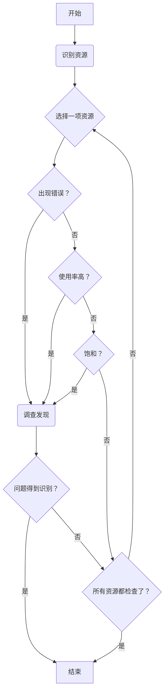
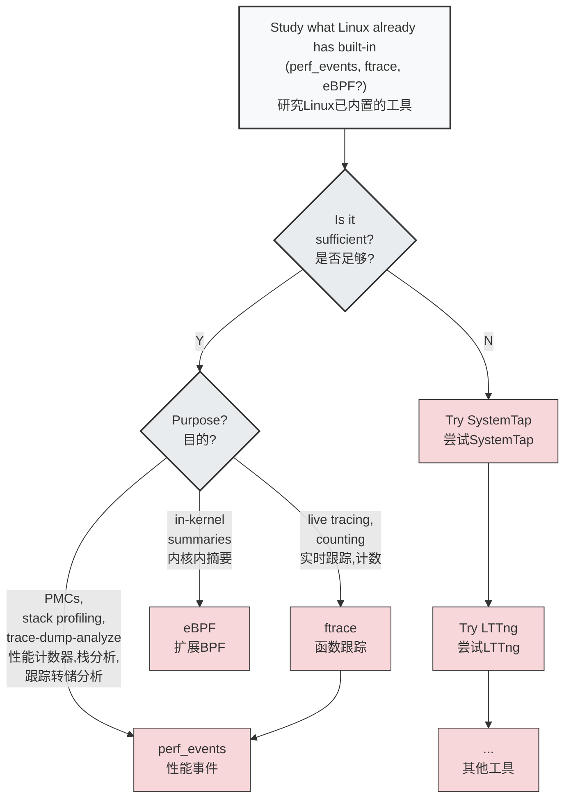

# 课程笔记

## 性能问题前提

看到一个问题, 需要先量化问题, 能准确的描述问1题的指标和情况. 
或者你有一套完整方案可以检查系统所有状态信息, 排除你的问题

## 解决问题的误区

**路灯法**
人们经常使用的是 自己最熟悉的工具去排查问题, 而不是最适合的. 
**醉汉法**
随机调整参数, 直到问题消失
**甩锅法**
把问题甩到其他模块或者部门, 可能是xxx的问题


## 正确的解决linux性能问题的方法

### 问题陈述法
>[!info] 一个简单的清单, 就可以在最初解决很多问题


- 你为什么觉得有性能问题呢? 
- 这个系统之前运行正常吗? 
- 最近修改了什么?  软件, 硬件?
- ...

### 工作负载 特征归纳
通过**工作负载特征归纳**，系统性地分析施加到系统上的负载的来源、原因和特性，从而识别并解决因负载而非系统自身缺陷引起的性能瓶颈。


### UES法
首先拿到一个你的**系统架构图**, 然后检查每个组件的 负载(使用率), 饱和度  错误情况
> 目的是发现一些你原本应该监控到, 但是实际没有监控到的地方

负载: 在规定的时间间隔内，资源用于服务工作的时间百分比
饱和度: 资源不能再服务更多额外工作的程度，通常有等待队列。




#### 建立一张系统状态检查清单

![[2-技术学习-linux性能调优视频课程-BrendanGregg-1755782283047.png]]![[2-技术学习-linux性能调优视频课程-BrendanGregg-1755782296726.png]]

## off-cpu问题

如果能记录到为什么离开cpu, 或者离开cpu后也能监控到. 就能解决off-cpu的问题

<svg viewBox="0 0 800 600" xmlns="http://www.w3.org/2000/svg">
  <!-- 标题 -->
  <text x="400" y="40" text-anchor="middle" font-size="28" font-weight="bold" fill="#333">Off-CPU 分析</text>
  
  <!-- Runnable 状态 -->
  <ellipse cx="120" cy="280" rx="80" ry="40" fill="#E8F4FD" stroke="#1976D2" stroke-width="2"/>
  <text x="120" y="275" text-anchor="middle" font-size="14" font-weight="bold" fill="#1976D2">可运行</text>
  <text x="120" y="290" text-anchor="middle" font-size="12" fill="#1976D2">Runnable</text>
  
  <!-- Executing 状态 -->
  <ellipse cx="400" cy="280" rx="80" ry="40" fill="#FFE8E8" stroke="#D32F2F" stroke-width="2"/>
  <text x="400" y="275" text-anchor="middle" font-size="14" font-weight="bold" fill="#D32F2F">执行中</text>
  <text x="400" y="290" text-anchor="middle" font-size="12" fill="#D32F2F">Executing</text>
  
  <!-- Sleep 状态 -->
  <ellipse cx="120" cy="400" rx="60" ry="35" fill="#F3E5F5" stroke="#7B1FA2" stroke-width="2"/>
  <text x="120" y="395" text-anchor="middle" font-size="14" font-weight="bold" fill="#7B1FA2">休眠</text>
  <text x="120" y="408" text-anchor="middle" font-size="12" fill="#7B1FA2">Sleep</text>
  
  <!-- Lock 状态 -->
  <ellipse cx="120" cy="480" rx="60" ry="35" fill="#F3E5F5" stroke="#7B1FA2" stroke-width="2"/>
  <text x="120" y="475" text-anchor="middle" font-size="14" font-weight="bold" fill="#7B1FA2">锁等待</text>
  <text x="120" y="488" text-anchor="middle" font-size="12" fill="#7B1FA2">Lock</text>
  
  <!-- Idle 状态 -->
  <ellipse cx="120" cy="560" rx="60" ry="35" fill="#F3E5F5" stroke="#7B1FA2" stroke-width="2"/>
  <text x="120" y="555" text-anchor="middle" font-size="14" font-weight="bold" fill="#7B1FA2">空闲</text>
  <text x="120" y="568" text-anchor="middle" font-size="12" fill="#7B1FA2">Idle</text>
  
  <!-- Anon Paging 状态 -->
  <ellipse cx="650" cy="200" rx="70" ry="35" fill="#E8F5E8" stroke="#388E3C" stroke-width="2"/>
  <text x="650" y="195" text-anchor="middle" font-size="14" font-weight="bold" fill="#388E3C">匿名分页</text>
  <text x="650" y="208" text-anchor="middle" font-size="12" fill="#388E3C">Anon. Paging</text>
  
  <!-- 箭头：Runnable -> Executing -->
  <defs>
    <marker id="arrowhead" markerWidth="10" markerHeight="7" refX="9" refY="3.5" orient="auto">
      <polygon points="0 0, 10 3.5, 0 7" fill="#666"/>
    </marker>
  </defs>
  
  <path d="M 200 280 L 320 280" stroke="#666" stroke-width="2" fill="none" marker-end="url(#arrowhead)"/>
  <text x="260" y="270" text-anchor="middle" font-size="12" fill="#666">调度 / schedule</text>
  
  <!-- 箭头：Executing -> Runnable (抢占) -->
  <path d="M 350 260 Q 260 200 170 260" stroke="#666" stroke-width="2" fill="none" marker-end="url(#arrowhead)"/>
  <text x="260" y="190" text-anchor="middle" font-size="11" fill="#666">抢占或时间片到期</text>
  <text x="260" y="205" text-anchor="middle" font-size="10" fill="#666">preempted or time quantum expired</text>
  
  <!-- 箭头：Sleep -> Runnable -->
  <path d="M 160 380 L 160 320" stroke="#666" stroke-width="2" fill="none" marker-end="url(#arrowhead)"/>
  <text x="190" y="350" font-size="12" fill="#666">唤醒 / wakeup</text>
  
  <!-- 箭头：Executing -> Sleep -->
  <path d="M 350 310 Q 250 350 180 400" stroke="#666" stroke-width="2" fill="none" marker-end="url(#arrowhead)"/>
  <text x="280" y="360" font-size="12" fill="#666">I/O等待 / I/O wait</text>
  
  <!-- 箭头：Lock -> Runnable -->
  <path d="M 150 460 L 150 320" stroke="#666" stroke-width="2" fill="none" marker-end="url(#arrowhead)"/>
  <text x="180" y="390" font-size="12" fill="#666">获取 / acquire</text>
  
  <!-- 箭头：Executing -> Lock -->
  <path d="M 350 320 Q 250 400 180 480" stroke="#666" stroke-width="2" fill="none" marker-end="url(#arrowhead)"/>
  <text x="280" y="410" font-size="12" fill="#666">阻塞 / block</text>
  
  <!-- 箭头：Idle -> Runnable -->
  <path d="M 140 540 L 140 320" stroke="#666" stroke-width="2" fill="none" marker-end="url(#arrowhead)"/>
  <text x="170" y="430" font-size="12" fill="#666">工作到达</text>
  <text x="170" y="445" font-size="10" fill="#666">work arrives</text>
  
  <!-- 箭头：Executing -> Idle -->
  <path d="M 350 320 Q 240 440 180 560" stroke="#666" stroke-width="2" fill="none" marker-end="url(#arrowhead)"/>
  <text x="280" y="460" font-size="12" fill="#666">等待工作</text>
  <text x="280" y="475" font-size="10" fill="#666">wait for work</text>
  
  <!-- 箭头：Executing -> Anon Paging -->
  <path d="M 470 260 L 580 220" stroke="#666" stroke-width="2" fill="none" marker-end="url(#arrowhead)"/>
  <text x="530" y="230" font-size="12" fill="#666">匿名页错误</text>
  <text x="530" y="245" font-size="10" fill="#666">anon. major page fault</text>
  
  <!-- 箭头：Anon Paging -> Executing -->
  <path d="M 580 220 L 470 260" stroke="#666" stroke-width="2" fill="none" marker-end="url(#arrowhead)"/>
  <text x="540" y="270" font-size="12" fill="#666">页面载入 / page in</text>
  
  <!-- 分类标注 -->
  <rect x="500" y="320" width="250" height="80" fill="#FFF8E1" stroke="#FFA000" stroke-width="2" rx="5"/>
  <text x="625" y="340" text-anchor="middle" font-size="14" font-weight="bold" fill="#F57C00">CPU占用分析</text>
  <text x="625" y="355" text-anchor="middle" font-size="12" fill="#F57C00">On-CPU Profiling</text>
  <text x="625" y="375" text-anchor="middle" font-size="14" font-weight="bold" fill="#E65100">非CPU占用分析</text>
  <text x="625" y="390" text-anchor="middle" font-size="12" fill="#E65100">Off-CPU Profiling (其他所有状态)</text>
  
  <!-- 连接线指向不同状态 -->
  <path d="M 500 340 L 450 280" stroke="#FFA000" stroke-width="1" stroke-dasharray="5,5"/>
  <path d="M 500 375 L 180 400" stroke="#E65100" stroke-width="1" stroke-dasharray="5,5"/>
  <path d="M 500 375 L 180 480" stroke="#E65100" stroke-width="1" stroke-dasharray="5,5"/>
  <path d="M 500 375 L 180 560" stroke="#E65100" stroke-width="1" stroke-dasharray="5,5"/>
  <path d="M 570 350 L 650 235" stroke="#E65100" stroke-width="1" stroke-dasharray="5,5"/>
</svg>

## cpu剖析法

获取到cpu剖析结果

当你遇到无法确认当前开启什么功能这种问题的时候, 可以使用cpu的统计结果, 例如火焰图, 就可以确认当前哪些功能开启了. 即使cpu用的很少, 也可以统计到. 

可以用于确认, 整个软件中, 真正重要的部分

可以有效的适用于  **缩小范围法**

## RTFM方法

重要的是, **阅读源码+做一些小实验**, 可以很快的帮助你理解源码

---
# 性能工具

## 命令行工具

对于内核而言, 主要是`/proc/和/sys`这两个地方

## 性能工具类型

![[2-技术学习-linux性能调优视频课程-BrendanGregg-1755826013465.png|774x624]]

## 观测工具
### uptime
用于看cpu负载的
所谓cpu负载就是看当前有几个进程在运行, 统计一段时间的平均负载
linux计算负载的时候, 加上了不可打断的中断操作: 我估计是因为这个时候cpu也相当于被占用吧. 
```shell
root@song-com:/home/song/src/learning/perf# uptime
 09:33:58 up 2 days, 13:19,  1 user,  load average: 0.09, 0.09, 0.16  //uptime可以看5min 10min 15min的平均负载, 了解状态-->时间之间关系
```

### top/htop
给出了整个系统的概览信息
```shell
top - 09:35:49 up 2 days, 13:21,  1 user,  load average: 0.04, 0.08, 0.15
任务: 278 total,   1 running, 277 sleeping,   0 stopped,   0 zombie
%Cpu(s):  3.1 us,  1.5 sy,  0.0 ni, 93.8 id,  0.0 wa,  0.0 hi,  1.5 si,  0.0 st
MiB Mem :  15742.3 total,   7276.0 free,   2200.6 used,   6265.7 buff/cache
MiB Swap:   2048.0 total,   2048.0 free,      0.0 used.  13195.4 avail Mem 

 进程号 USER      PR  NI    VIRT    RES    SHR    %CPU  %MEM     TIME+ COMMAND                                                      
 307238 root      20   0       0      0      0 I   6.2   0.0   0:00.16 kworker/1:1-events                                        
 313997 root      20   0   15344   4184   3432 R   6.2   0.0   0:00.01 top                                                       
      1 root      20   0  169848  13068   8200 S   0.0   0.1   0:06.09 systemd                                                   
      2 root      20   0       0      0      0 S   0.0   0.0   0:00.06 kthreadd                                                  
      3 root       0 -20       0      0      0 I   0.0   0.0   0:00.00 rcu_gp                                                    
      4 root       0 -20       0      0      0 I   0.0   0.0   0:00.00 rcu_par_gp                                                
      6 root       0 -20       0      0      0 I   0.0   0.0   0:00.00 kworker/0:0H-kblockd                                      
      8 root       0 -20       0      0      0 I   0.0   0.0   0:00.00 mm_percpu_wq                                              
      9 root      20   0       0      0      0 S   0.0   0.0   0:01.94 ksoftirqd/0                                               
     10 root      20   0       0      0      0 I   0.0   0.0   1:45.49 rcu_sched                                                 
     11 root      rt   0       0      0      0 S   0.0   0.0   0:01.30 migration/0                                               
     12 root     -51   0       0      0      0 S   0.0   0.0   0:00.00 idle_inject/0                                             
     14 root      20   0       0      0      0 S   0.0   0.0   0:00.00 cpuhp/0                                                   
     15 root      20   0       0      0      0 S   0.0   0.0   0:00.00 cpuhp/1                                                   
     16 root     -51   0       0      0      0 S   0.0   0.0   0:00.00 idle_inject/1                                             
     17 root      rt   0       0      0      0 S   0.0   0.0   0:01.40 migration/1                                                  
```

top在更新屏幕的时候, 才会采样, 针对一些很短时间的进程, 可能捕捉不到. 
这样就可能存在一种情况: 你的负载很高. 但是top统计的cpu使用率很低

这个是htop, 给出了更加丰富的选项
![[2-技术学习-linux性能调优视频课程-BrendanGregg-1755826849108.png|805x508]]


## ps

ps -ef f 可以显示进程关系

```shell title:ps
root@song-com:/home/song/src/learning/perf# ps -ef  f
UID          PID    PPID  C STIME TTY      STAT   TIME CMD
root           2       0  0 8月19 ?       S      0:00 [kthreadd]
root           3       2  0 8月19 ?       I<     0:00  \_ [rcu_gp]
root           4       2  0 8月19 ?       I<     0:00  \_ [rcu_par_gp]
root           6       2  0 8月19 ?       I<     0:00  \_ [kworker/0:0H-kblockd]
root           8       2  0 8月19 ?       I<     0:00  \_ [mm_percpu_wq]
root           9       2  0 8月19 ?       S      0:01  \_ [ksoftirqd/0]
root          10       2  0 8月19 ?       I      1:45  \_ [rcu_sched]
root          11       2  0 8月19 ?       S      0:01  \_ [migration/0]
root          12       2  0 8月19 ?       S      0:00  \_ [idle_inject/0]
root          14       2  0 8月19 ?       S      0:00  \_ [cpuhp/0]
root          15       2  0 8月19 ?       S      0:00  \_ [cpuhp/1]
root          16       2  0 8月19 ?       S      0:00  \_ [idle_inject/1]
root          17       2  0 8月19 ?       S      0:01  \_ [migration/1]
root          18       2  0 8月19 ?       S      0:01  \_ [ksoftirqd/1]
root          20       2  0 8月19 ?       I<     0:00  \_ [kworker/1:0H-kblockd]
root          21       2  0 8月19 ?       S      0:00  \_ [cpuhp/2]
root          22       2  0 8月19 ?       S      0:00  \_ [idle_inject/2]
root          23       2  0 8月19 ?       S      0:01  \_ [migration/2]
root          24       2  0 8月19 ?       S      0:01  \_ [ksoftirqd/2]
root          26       2  0 8月19 ?       I<     0:00  \_ [kworker/2:0H-kblockd]
root          27       2  0 8月19 ?       S      0:00  \_ [cpuhp/3]
root          28       2  0 8月19 ?       S      0:00  \_ [idle_inject/3]
root          29       2  0 8月19 ?       S      0:01  \_ [migration/3]
root          30       2  0 8月19 ?       S      0:01  \_ [ksoftirqd/3]
root          32       2  0 8月19 ?       I<     0:00  \_ [kworker/3:0H-kblockd]
root          33       2  0 8月19 ?       S      0:00  \_ [kdevtmpfs]
root          34       2  0 8月19 ?       I<     0:00  \_ [netns]
root          35       2  0 8月19 ?       S      0:00  \_ [rcu_tasks_kthre]
root          36       2  0 8月19 ?       S      0:00  \_ [kauditd]
root          37       2  0 8月19 ?       S      0:00  \_ [khungtaskd]
root          38       2  0 8月19 ?       S      0:00  \_ [oom_reaper]
root          39       2  0 8月19 ?       I<     0:00  \_ [writeback]
root          40       2  0 8月19 ?       S      0:00  \_ [kcompactd0]
root          41       2  0 8月19 ?       SN     0:00  \_ [ksmd]
root          42       2  0 8月19 ?       SN     0:00  \_ [khugepaged]
root          89       2  0 8月19 ?       I<     0:00  \_ [kintegrityd]
root          90       2  0 8月19 ?       I<     0:00  \_ [kblockd]
root          91       2  0 8月19 ?       I<     0:00  \_ [blkcg_punt_bio]
root          92       2  0 8月19 ?       I<     0:00  \_ [tpm_dev_wq]
root          93       2  0 8月19 ?       I<     0:00  \_ [ata_sff]
root          94       2  0 8月19 ?       I<     0:00  \_ [md]
root          95       2  0 8月19 ?       I<     0:00  \_ [edac-poller]
root          96       2  0 8月19 ?       I<     0:00  \_ [devfreq_wq]
root          98       2  0 8月19 ?       S      0:00  \_ [watchdogd]
root         102       2  0 8月19 ?       S      0:00  \_ [kswapd0]
root         103       2  0 8月19 ?       S      0:00  \_ [ecryptfs-kthrea]
root         105       2  0 8月19 ?       I<     0:00  \_ [kthrotld]
root         106       2  0 8月19 ?       S      0:00  \_ [irq/122-aerdrv]
root         107       2  0 8月19 ?       S      0:00  \_ [irq/123-aerdrv]
root         108       2  0 8月19 ?       S      0:00  \_ [irq/124-aerdrv]
root         109       2  0 8月19 ?       S      0:00  \_ [irq/125-aerdrv]
root         110       2  0 8月19 ?       I<     0:00  \_ [acpi_thermal_pm]
root         111       2  0 8月19 ?       I<     0:00  \_ [vfio-irqfd-clea]
root         113       2  0 8月19 ?       I<     0:00  \_ [ipv6_addrconf]
root         122       2  0 8月19 ?       I<     0:00  \_ [kstrp]
root         387       2  0 8月19 ?       S<     0:00  \_ [loop13]
root         396       2  0 8月19 ?       S<     0:00  \_ [loop14]
root         402       2  0 8月19 ?       I<     0:00  \_ [cfg80211]
root         417       2  0 8月19 ?       S      0:00  \_ [irq/135-iwlwifi]
root         419       2  0 8月19 ?       I<     0:00  \_ [kworker/u9:2-hci0]
root         423       2  0 8月19 ?       S<     0:00  \_ [loop15]
root         424       2  0 8月19 ?       I<     0:00  \_ [cryptd]
root         444       2  0 8月19 ?       S<     0:00  \_ [loop16]
root         482       2  0 8月19 ?       S<     0:00  \_ [loop17]
root         495       2  0 8月19 ?       S<     0:00  \_ [loop18]
root         515       2  0 8月19 ?       S<     0:00  \_ [loop19]
root         545       2  0 8月19 ?       S<     0:00  \_ [loop20]
root         548       2  0 8月19 ?       S<     0:00  \_ [loop21]
root         550       2  0 8月19 ?       S<     0:00  \_ [loop22]
root         553       2  0 8月19 ?       S<     0:00  \_ [loop24]
root         554       2  0 8月19 ?       S<     0:00  \_ [loop25]
root         555       2  0 8月19 ?       S<     0:00  \_ [loop26]
root         556       2  0 8月19 ?       S<     0:00  \_ [loop27]
root         557       2  0 8月19 ?       S<     0:00  \_ [loop28]
root         558       2  0 8月19 ?       S<     0:00  \_ [loop29]
root         941       2  0 8月19 ?       S      0:00  \_ bpfilter_umh
root        1663       2  0 8月19 ?       S<     0:00  \_ [krfcommd]
root       48450       2  0 8月21 ?       S<     0:00  \_ [loop30]
root      301945       2  0 04:50 ?        S<     0:00  \_ [loop23]
root      302085       2  0 05:33 ?        I      0:00  \_ [kworker/2:1-mm_percpu_wq]
root      302129       2  0 05:48 ?        I      0:00  \_ [kworker/3:0-mm_percpu_wq]
root      302835       2  0 06:22 ?        I      0:00  \_ [kworker/3:2-cgroup_destroy]
root      303298       2  0 08:10 ?        I      0:00  \_ [kworker/0:0-events]
root      303376       2  0 08:38 ?        I      0:00  \_ [kworker/0:1-events]
root      303397       2  0 08:38 ?        I      0:00  \_ [kworker/2:2]
root      303401       2  0 08:51 ?        I      0:00  \_ [kworker/u8:0-events_unbound]
root      307238       2  0 09:06 ?        I      0:00  \_ [kworker/1:1-events]
root      309181       2  0 09:15 ?        I      0:00  \_ [kworker/u8:1-events_power_efficient]
root      312874       2  0 09:31 ?        I      0:00  \_ [kworker/1:2]
root      314614       2  0 09:38 ?        I      0:00  \_ [kworker/0:2-events]
root      314631       2  0 09:38 ?        I      0:00  \_ [kworker/0:3]
root      315031       2  0 09:39 ?        I      0:00  \_ [kworker/u8:2-events_unbound]
root           1       0  0 8月19 ?       Ss     0:06 /sbin/init splash
root         260       1  0 8月19 ?       S<s    0:01 /lib/systemd/systemd-journald
root         300       1  0 8月19 ?       Ss     0:05 /lib/systemd/systemd-udevd
systemd+     570       1  0 8月19 ?       Ss     0:04 /lib/systemd/systemd-resolved
systemd+     571       1  0 8月19 ?       Ssl    0:00 /lib/systemd/systemd-timesyncd
root         627       1  0 8月19 ?       Ssl    0:05 /usr/lib/accountsservice/accounts-daemon
root         628       1  0 8月19 ?       Ss     0:00 /usr/sbin/acpid
avahi        631       1  0 8月19 ?       Ss     0:07 avahi-daemon: running [song-com.local]
avahi        679     631  0 8月19 ?       S      0:00  \_ avahi-daemon: chroot helper
root         632       1  0 8月19 ?       Ss     0:00 /usr/lib/bluetooth/bluetoothd
root         633       1  0 8月19 ?       Ss     0:00 /usr/sbin/cron -f
message+     636       1  0 8月19 ?       Ss     0:07 /usr/bin/dbus-daemon --system --address=systemd: --nofork --nopidfile --syste
root         637       1  0 8月19 ?       Ssl    0:42 /usr/sbin/NetworkManager --no-daemon
root         645       1  0 8月19 ?       Ssl    0:15 /usr/sbin/irqbalance --foreground
root         646       1  0 8月19 ?       Ss     0:00 /usr/bin/python3 /usr/bin/networkd-dispatcher --run-startup-triggers
root         649       1  0 8月19 ?       Ssl    0:07 /usr/lib/policykit-1/polkitd --no-debug
syslog       653       1  0 8月19 ?       Ssl    0:00 /usr/sbin/rsyslogd -n -iNONE
root         659       1  0 8月19 ?       Ssl    0:00 /usr/libexec/switcheroo-control
root         663       1  0 8月19 ?       Ss     0:00 /lib/systemd/systemd-logind
root         667       1  0 8月19 ?       Ssl    0:00 /usr/lib/udisks2/udisksd
root         668       1  0 8月19 ?       Ss     0:01 /sbin/wpa_supplicant -u -s -O /run/wpa_supplicant
root         713       1  0 8月19 ?       Ssl    0:00 /usr/sbin/ModemManager
root         738       1  0 8月19 ?       Ssl    3:40 /usr/bin/containerd
root         761       1  0 8月19 ?       Ss     0:00 sshd: /usr/sbin/sshd -D [listener] 0 of 10-100 startups
root      303417     761  0 08:54 ?        Ss     0:00  \_ sshd: song [priv]
song      303511  303417  0 08:54 ?        S      0:01      \_ sshd: song@notty
song      303512  303511  0 08:54 ?        Ss     0:00          \_ bash
song      303599  303512  0 08:54 ?        Sl     0:00              \_ /home/song/.cursor-server/bin/af58d92614edb1f72bdd756615d131b
song      303631  303512  0 08:54 ?        S      0:00              \_ sh /home/song/.cursor-server/bin/af58d92614edb1f72bdd756615d1
song      303637  303631  0 08:54 ?        Sl     0:09              |   \_ /home/song/.cursor-server/bin/af58d92614edb1f72bdd756615d
song      303679  303637  0 08:54 ?        Sl     0:06              |       \_ /home/song/.cursor-server/bin/af58d92614edb1f72bdd756
song      303827  303679  0 08:54 pts/2    Ss     0:00              |       |   \_ /bin/bash --init-file /home/song/.cursor-server/b
root      304163  303827  0 08:54 pts/2    S      0:00              |       |   |   \_ su
root      304192  304163  0 08:54 pts/2    S      0:00              |       |   |       \_ bash
root      317610  304192  0 09:41 pts/2    R+     0:00              |       |   |           \_ ps -ef f
song      316576  303679  0 09:40 pts/1    Ss+    0:00              |       |   \_ /bin/bash --init-file /home/song/.cursor-server/b
song      303706  303637  0 08:54 ?        Sl     0:00              |       \_ /home/song/.cursor-server/bin/af58d92614edb1f72bdd756
song      303788  303637  6 08:54 ?        Sl     3:01              |       \_ /home/song/.cursor-server/bin/af58d92614edb1f72bdd756
song      303966  303788  0 08:54 ?        Sl     0:00              |           \_ /home/song/.cursor-server/bin/af58d92614edb1f72bd
song      316318  303788  0 09:39 ?        S      0:00              |           \_ git fetch
song      316319  316318  0 09:39 ?        S      0:00              |           |   \_ /usr/lib/git-core/git-remote-https origin htt
song      316488  303788  0 09:39 ?        Sl     0:00              |           \_ /home/song/.cursor-server/bin/af58d92614edb1f72bd
song      316494  303788  0 09:39 ?        Sl     0:00              |           \_ /home/song/.cursor-server/bin/af58d92614edb1f72bd
song      317591  303512  0 09:41 ?        S      0:00              \_ sleep 10
root         776       1  0 8月19 ?       Ssl    0:00 /usr/bin/python3 /usr/share/unattended-upgrades/unattended-upgrade-
```


## vmstat

可以在一行显示系统中重要的一些信息

```shell
root@song-com:/home/song/src/learning/perf# vmstat -Sm 1
procs -----------memory---------- ---swap-- -----io---- -system-- ------cpu-----
 r  b     交换 空闲   缓冲 缓存     si   so    bi    bo   in   cs us sy id wa st
 2  0      0   7518    407   6185    0    0     6     4   24   34  9  1 90  0  0
 3  2      0   7517    407   6185    0    0     0     8 2594 9228 23  6 70  1  0
 1  0      0   7515    407   6185    0    0     0     4 2557 5850 23  7 70  0  0
 0  0      0   7514    407   6185    0    0     0     0 2634 9662 25  8 67  0  0
 2  0      0   7515    407   6185    0    0     0     0 2641 6126 23  7 70  0  0
 0  0      0   7515    407   6185    0    0     0     0 2533 9134 24  7 70  0  0
 2  0      0   7516    407   6185    0    0     0    44 2597 6223 26  6 68  0  0
 1  0      0   7515    407   6185    0    0     0     0 2611 9267 26  7 68  0  0
```

==比较重点的几个: ==
- r表示队列长度, 表示cpu正在执行和等待执行的任务
- 内存的指标: 交换, 空闲, 缓冲, 缓存
	- swap 指的是虚拟内存中，被操作系统**从物理内存换出到磁盘**上的内存量。
	- free 指的是**完全没有被使用**的物理内存量
	- buff 指的是被内核用来作为**文件系统缓冲**的内存量, 侧重于写入
	- cache 的是被内核用来作为**文件页缓存**的内存量, 侧重于读取
		- 当 **`buff` 值持续增加**时，可能意味着系统有大量的**文件系统元数据**（如目录、索引节点）写入活动。
		- 当 **`cache` 值持续增加**时，可能意味着系统正在频繁地**读取和访问文件**。
- us:用户事件:表示 CPU **在用户空间**（User Space）执行的时间百分比。,  sy:系统事件: 表示 CPU **在内核空间**（Kernel Space）执行的时间百分比

## iostat

**块io的状态信息**

查看每秒读取/写入的次数, 数据量, 工作负载
可以查看当前写入是否已经超过磁盘负载了. 
[[linux性能工具-iostat]]
```shell title:iostat
root@song-com:/home/song# iostat -xmdz 1
Linux 5.4.0-216-generic (song-com)      2025年08月22日  _x86_64_        (4 CPU)
#比较重要的列      **       **                      **                  **      **                       **                                                                **       ** 
Device            r/s     rMB/s   rrqm/s  %rrqm r_await rareq-sz     w/s     wMB/s    wrqm/s  %wrqm w_await   wareq-sz   d/s     dMB/s   drqm/s  %drqm d_await dareq-sz  aqu-sz  %util
loop0            0.00      0.00     0.00   0.00    0.09     7.73    0.00      0.00     0.00   0.00    0.00     0.00    0.00      0.00     0.00   0.00    0.00     0.00    0.00   0.00
loop1            0.00      0.00     0.00   0.00    0.11     7.17    0.00      0.00     0.00   0.00    0.00     0.00    0.00      0.00     0.00   0.00    0.00     0.00    0.00   0.00
loop10           0.00      0.00     0.00   0.00    0.06     3.17    0.00      0.00     0.00   0.00    0.00     0.00    0.00      0.00     0.00   0.00    0.00     0.00    0.00   0.00
loop11           0.00      0.00     0.00   0.00    0.16    16.94    0.00      0.00     0.00   0.00    0.00     0.00    0.00      0.00     0.00   0.00    0.00     0.00    0.00   0.00
loop12           0.00      0.00     0.00   0.00    0.16    18.84    0.00      0.00     0.00   0.00    0.00     0.00    0.00      0.00     0.00   0.00    0.00     0.00    0.00   0.00
loop13           0.00      0.00     0.00   0.00    0.17    18.00    0.00      0.00     0.00   0.00    0.00     0.00    0.00      0.00     0.00   0.00    0.00     0.00    0.00   0.00
loop14           0.00      0.00     0.00   0.00    0.14    18.40    0.00      0.00     0.00   0.00    0.00     0.00    0.00      0.00     0.00   0.00    0.00     0.00    0.00   0.00
loop15           0.00      0.00     0.00   0.00    0.08     3.25    0.00      0.00     0.00   0.00    0.00     0.00    0.00      0.00     0.00   0.00    0.00     0.00    0.00   0.00
loop16           0.00      0.00     0.00   0.00    0.35    16.84    0.00      0.00     0.00   0.00    0.00     0.00    0.00      0.00     0.00   0.00    0.00     0.00    0.00   0.00
loop17           0.00      0.00     0.00   0.00    0.10     3.02    0.00      0.00     0.00   0.00    0.00     0.00    0.00      0.00     0.00   0.00    0.00     0.00    0.00   0.00
loop18           0.00      0.00     0.00   0.00    0.15    14.99    0.00      0.00     0.00   0.00    0.00     0.00    0.00      0.00     0.00   0.00    0.00     0.00    0.00   0.00
loop19           0.00      0.00     0.00   0.00    0.16    17.67    0.00      0.00     0.00   0.00    0.00     0.00    0.00      0.00     0.00   0.00    0.00     0.00    0.00   0.00
loop2            0.00      0.00     0.00   0.00    0.13    17.67    0.00      0.00     0.00   0.00    0.00     0.00    0.00      0.00     0.00   0.00    0.00     0.00    0.00   0.00
loop20           0.00      0.00     0.00   0.00    0.07     2.98    0.00      0.00     0.00   0.00    0.00     0.00    0.00      0.00     0.00   0.00    0.00     0.00    0.00   0.00
loop21           0.00      0.00     0.00   0.00    0.14    18.68    0.00      0.00     0.00   0.00    0.00     0.00    0.00      0.00     0.00   0.00    0.00     0.00    0.00   0.00
loop22           0.00      0.00     0.00   0.00    0.04     3.04    0.00      0.00     0.00   0.00    0.00     0.00    0.00      0.00     0.00   0.00    0.00     0.00    0.00   0.00
loop23           0.00      0.00     0.00   0.00    0.04    13.24    0.00      0.00     0.00   0.00    0.00     0.00    0.00      0.00     0.00   0.00    0.00     0.00    0.00   0.00
loop24           0.00      0.00     0.00   0.00    0.09     2.57    0.00      0.00     0.00   0.00    0.00     0.00    0.00      0.00     0.00   0.00    0.00     0.00    0.00   0.00
loop25           0.00      0.00     0.00   0.00    0.20     2.80    0.00      0.00     0.00   0.00    0.00     0.00    0.00      0.00     0.00   0.00    0.00     0.00    0.00   0.003
```


### mpstat

==多处理器负载均衡==,  top也可以看

```C
root@song-com:/home/song/src/learning/perf# mpstat -P ALL 1
Linux 5.4.0-216-generic (song-com)      2025年08月22日  _x86_64_        (4 CPU)

10时52分06秒  CPU    %usr   %nice    %sys %iowait    %irq   %soft  %steal  %guest  %gnice   %idle
10时52分07秒  all   21.20    0.00    0.00    0.00    0.00    6.27    0.00    0.00    0.00   72.53
10时52分07秒    0    3.31    0.00    0.00    0.00    0.00   19.01    0.00    0.00    0.00   77.69
10时52分07秒    1   24.49    0.00    0.00    0.00    0.00    1.02    0.00    0.00    0.00   74.49
10时52分07秒    2   40.82    0.00    0.00    0.00    0.00    1.02    0.00    0.00    0.00   58.16
10时52分07秒    3   20.41    0.00    0.00    0.00    0.00    1.02    0.00    0.00    0.00   78.57

10时52分07秒  CPU    %usr   %nice    %sys %iowait    %irq   %soft  %steal  %guest  %gnice   %idle
10时52分08秒  all   25.24    0.00    1.94    0.97    0.00    4.61    0.00    0.00    0.00   67.23
10时52分08秒    0   23.36    0.00    1.87    1.87    0.00    9.35    0.00    0.00    0.00   63.55
10时52分08秒    1   37.11    0.00    1.03    0.00    0.00    0.00    0.00    0.00    0.00   61.86
10时52分08秒    2   22.22    0.00    2.78    1.85    0.00    7.41    0.00    0.00    0.00   65.74
10时52分08秒    3   19.00    0.00    2.00    0.00    0.00    1.00    0.00    0.00    0.00   78.00
```

### free命令

```shell
root@song-com:/home/song/src/learning/perf# free -m
              总计         已用        空闲      共享    缓冲/缓存    可用
内存：       15742        2306        7133          12        6302       13089
交换：        2047           0        2047
```


### 总结: 基础版本**观测**工具

![[2-技术学习-linux性能调优视频课程-BrendanGregg-1755831837036.png|685x402]]


### strace

strace底层是ptrace, 会让系统性能降低非常多, 侵入性非常大   
但是strace在特定情况下, 可以很快的帮你定位当前线程正在干嘛

比如一个线程占用CPU很高. 看到主要是内核态的占用, 这个时候, 可以使用strace去绑定到上面去
但是strace由于占用时间很高, 所以可以考虑只让它输出一部分

`strace -tp 'pgrep xxx' 2>&1 | head -100`  只读取前100行


### tcpdump
捕捉网络数据包, 在高性能环境中使用tcpdump越来越难
生成的dump文件过大. 

### nicstat
没做过多介绍

### pidstat
查看cpu情况
```shell title:"pidstat -t 1"
11时18分35秒   UID      TGID       TID    %usr %system  %guest   %wait    %CPU   CPU  Command
11时18分36秒  1000    303511         -    0.00    2.00    0.00    0.00    2.00     3  sshd
11时18分36秒  1000         -    303511    0.00    2.00    0.00    0.00    2.00     3  |__sshd
11时18分36秒  1000    303637         -    3.00    0.00    0.00    0.00    3.00     3  node
11时18分36秒  1000         -    303637    2.00    0.00    0.00    0.00    2.00     3  |__node
11时18分36秒  1000         -    303643    1.00    0.00    0.00    0.00    1.00     2  |__node
11时18分36秒  1000         -    303650    0.00    1.00    0.00    0.00    1.00     3  |__node
11时18分36秒  1000    303679         -    2.00    0.00    0.00    0.00    2.00     2  node
11时18分36秒  1000         -    303679    2.00    0.00    0.00    0.00    2.00     2  |__node
11时18分36秒  1000    303788         -    2.00    2.00    0.00    0.00    4.00     2  node
11时18分36秒  1000         -    303788    2.00    1.00    0.00    0.00    3.00     2  |__node
11时18分36秒     0    345642         -    0.00    1.00    0.00    0.00    1.00     2  kworker/u8:0-events_unbound
11时18分36秒     0    346168         -    1.00    2.00    0.00    0.00    3.00     1  pidstat
11时18分36秒     0         -    346168    1.00    2.00    0.00    0.00    3.00     1  |__pidstat
11时18分36秒  1000    346605         -   91.00    0.00    0.00    0.00   91.00     3  multithreaded_w
11时18分36秒  1000         -    346606   50.00    0.00    0.00    0.00   50.00     0  |__MIXED-Worker-0

11时18分36秒  1000         -    346607   41.00    0.00    0.00    0.00   41.00     3  |__MIXED-Worker-1
```

查看块IO情况  重要的是`kB_rd/s` 和 `kB_wd/s`
```shell title:"pidstat -d 1"
11时20分28秒   UID       PID   kB_rd/s   kB_wr/s kB_ccwr/s iodelay  Command
11时20分29秒     0       221      0.00      0.00      0.00       2  jbd2/nvme0n1p2-

11时20分29秒   UID       PID   kB_rd/s   kB_wr/s kB_ccwr/s iodelay  Command

11时20分30秒   UID       PID   kB_rd/s   kB_wr/s kB_ccwr/s iodelay  Command

11时20分31秒   UID       PID   kB_rd/s   kB_wr/s kB_ccwr/s iodelay  Command

11时20分32秒   UID       PID   kB_rd/s   kB_wr/s kB_ccwr/s iodelay  Command

11时20分33秒   UID       PID   kB_rd/s   kB_wr/s kB_ccwr/s iodelay  Command
11时20分34秒     0       221      0.00      0.00      0.00       3  jbd2/nvme0n1p2-
```


### lsof
网络工具  用于查看一些tcp连接啥的


### sar
活动报告工具,全能工具

**例子: 网络方面**
```shell
root@song-com:/home/song/src/learning/perf# sar -n TCP,ETCP,DEV 1
Linux 5.4.0-216-generic (song-com)      2025年08月22日  _x86_64_        (4 CPU)

11时24分27秒     IFACE   rxpck/s   txpck/s    rxkB/s    txkB/s   rxcmp/s   txcmp/s  rxmcst/s   %ifutil
11时24分28秒    wlp2s0      0.00      0.00      0.00      0.00      0.00      0.00      0.00      0.00
11时24分28秒   docker0      0.00      0.00      0.00      0.00      0.00      0.00      0.00      0.00
11时24分28秒    enp1s0      0.00      0.00      0.00      0.00      0.00      0.00      0.00      0.00
11时24分28秒    enp4s0      9.00      6.00      0.83      0.77      0.00      0.00      0.00      0.00
11时24分28秒        lo     16.00     16.00      1.23      1.23      0.00      0.00      0.00      0.00

11时24分27秒  active/s passive/s    iseg/s    oseg/s
11时24分28秒      0.00      0.00     25.00     22.00

11时24分27秒  atmptf/s  estres/s retrans/s isegerr/s   orsts/s
11时24分28秒      0.00      0.00      0.00      0.00      0.00

11时24分28秒     IFACE   rxpck/s   txpck/s    rxkB/s    txkB/s   rxcmp/s   txcmp/s  rxmcst/s   %ifutil
11时24分29秒    wlp2s0      0.00      0.00      0.00      0.00      0.00      0.00      0.00      0.00
11时24分29秒   docker0      0.00      0.00      0.00      0.00      0.00      0.00      0.00      0.00
11时24分29秒    enp1s0      0.00      0.00      0.00      0.00      0.00      0.00      0.00      0.00
11时24分29秒    enp4s0      8.00      5.00      1.01      0.74      0.00      0.00      0.00      0.00
11时24分29秒        lo     14.00     14.00      1.40      1.40      0.00      0.00      0.00      0.00

11时24分28秒  active/s passive/s    iseg/s    oseg/s
11时24分29秒      0.00      0.00     20.00     19.00

11时24分28秒  atmptf/s  estres/s retrans/s isegerr/s   orsts/s
11时24分29秒      0.00      0.00      0.00      0.00      0.00

11时24分29秒     IFACE   rxpck/s   txpck/s    rxkB/s    txkB/s   rxcmp/s   txcmp/s  rxmcst/s   %ifutil
11时24分30秒    wlp2s0      0.00      0.00      0.00      0.00      0.00      0.00      0.00      0.00
11时24分30秒   docker0      0.00      0.00      0.00      0.00      0.00      0.00      0.00      0.00
11时24分30秒    enp1s0      0.00      0.00      0.00      0.00      0.00      0.00      0.00      0.00
11时24分30秒    enp4s0     29.00     24.00      3.07      2.81      0.00      0.00      0.00      0.00
11时24分30秒        lo     62.00     62.00      4.68      4.68      0.00      0.00      0.00      0.00

11时24分29秒  active/s passive/s    iseg/s    oseg/s
11时24分30秒      0.00      0.00     90.00     86.00

11时24分29秒  atmptf/s  estres/s retrans/s isegerr/s   orsts/s
11时24分30秒      0.00      0.00      0.00      0.00      0.00

11时24分30秒     IFACE   rxpck/s   txpck/s    rxkB/s    txkB/s   rxcmp/s   txcmp/s  rxmcst/s   %ifutil
11时24分31秒    wlp2s0      0.00      0.00      0.00      0.00      0.00      0.00      0.00      0.00
11时24分31秒   docker0      0.00      0.00      0.00      0.00      0.00      0.00      0.00      0.00
11时24分31秒    enp1s0      0.00      0.00      0.00      0.00      0.00      0.00      0.00      0.00
11时24分31秒    enp4s0      5.00      4.00      0.53      0.52      0.00      0.00      0.00      0.00
11时24分31秒        lo     10.00     10.00      0.85      0.85      0.00      0.00      0.00      0.00

11时24分30秒  active/s passive/s    iseg/s    oseg/s
11时24分31秒      0.00      0.00     14.00     14.00

11时24分30秒  atmptf/s  estres/s retrans/s isegerr/s   orsts/s
11时24分31秒      0.00      0.00      0.00      0.00      0.00
^C


平均时间:     IFACE   rxpck/s   txpck/s    rxkB/s    txkB/s   rxcmp/s   txcmp/s  rxmcst/s   %ifutil
平均时间:    wlp2s0      0.00      0.00      0.00      0.00      0.00      0.00      0.00      0.00
平均时间:   docker0      0.00      0.00      0.00      0.00      0.00      0.00      0.00      0.00
平均时间:    enp1s0      0.00      0.00      0.00      0.00      0.00      0.00      0.00      0.00
平均时间:    enp4s0     12.75      9.75      1.36      1.21      0.00      0.00      0.00      0.00
平均时间:        lo     25.50     25.50      2.04      2.04      0.00      0.00      0.00      0.00

平均时间:  active/s passive/s    iseg/s    oseg/s
平均时间:      0.00      0.00     37.25     35.25

平均时间:  atmptf/s  estres/s retrans/s isegerr/s   orsts/s
平均时间:      0.00      0.00      0.00      0.00      0.00
```

#### sar的应用

![[2-技术学习-linux性能调优视频课程-BrendanGregg-1755833216256.png|596x351]]


### 中级观测工具总结

![[2-技术学习-linux性能调优视频课程-BrendanGregg-1755833979881.png|649x383]]

需要建立一张你自己的工具图

![[2-技术学习-linux性能调优视频课程-BrendanGregg-1755833373851.png|650x393]]


## ss

ss可以提供很多的套接字信息, 可以查看缓冲区大小等等
提供的信息比netstat更加丰富


### slabtop
内核的slab分配 内存问题
比较重点的两个字段是 `CACHE SIZE` 和 `NAME`

```c
 Active / Total Objects (% used)    : 1696530 / 1749151 (97.0%)
 Active / Total Slabs (% used)      : 54640 / 54640 (100.0%)
 Active / Total Caches (% used)     : 106 / 152 (69.7%)
 Active / Total Size (% used)       : 457330.11K / 473447.33K (96.6%)
 Minimum / Average / Maximum Object : 0.01K / 0.27K / 16.75K

  OBJS ACTIVE  USE OBJ SIZE  SLABS OBJ/SLAB CACHE SIZE NAME                   
395616 387733  98%    0.10K  10144       39     40576K buffer_head
279552 266908  95%    0.19K  13312       21     53248K dentry
142129 138147  97%    1.07K   4901       29    156832K ext4_inode_cache
137670 136035  98%    0.13K   4589       30     18356K kernfs_node_cache
111180 111180 100%    0.04K   1090      102      4360K ext4_extent_status
 77560  73792  95%    0.57K   2770       28     44320K radix_tree_node
 65208  64502  98%    0.20K   3432       19     13728K vm_area_struct
 63744  63198  99%    0.03K    498      128      1992K kmalloc-32
 58944  56701  96%    0.06K    921       64      3684K anon_vma_chain
 44746  43730  97%    0.59K   1721       26     27536K inode_cache
 40640  40406  99%    0.06K    635       64      2540K kmalloc-64
 35295  34665  98%    0.10K    905       39      3620K anon_vma
 28144  25955  92%    0.25K   1759       16      7036K filp
 23640  22202  93%    0.66K    985       24     15760K proc_inode_cache
 18688  18688 100%    0.02K     73      256       292K kmalloc-16
 16960  14002  82%    0.06K    265       64      1060K kmalloc-rcl-64
 15744  10791  68%    0.06K    246       64       984K vmap_area
 14848  14848 100%    0.01K     29      512       116K kmalloc-8
 13430  13430 100%    0.02K     79      170       316K lsm_file_cache
 13328  13328 100%    0.07K    238       56       952K Acpi-Operand
 13175  13175 100%    0.05K    155       85       620K ftrace_event_field
```


### pcstat
可以按照文件, 显示 page cache的驻留情况

![[2-技术学习-linux性能调优视频课程-BrendanGregg-1755834344249.png]]


### perf_event
集成到了linux源码中, 后面介绍

### tiptop
可以显示ipc的情况
需要设备开启 pmc性能监控计数器(是现代 CPU 芯片内部集成的一组特殊的硬件寄存器)

## 汇总: 观测工具
打印一张

![[2-技术学习-linux性能调优视频课程-BrendanGregg-1755835125231.png|843x632]]


## 基准测试工具类

 相当于评测程序3D mark啥的一样, 用来评估整个系统的性能参数, 不过它不只是硬件性能, 还涉及到软件系统性能
评估后, 你就可以**知道整个系统的上限是多少了. 比如带宽上限, CPU上限, 以及一些更加详细的性能参数**

另外, 可以模拟下你的程序的状态, 方便迁移平台的时候做评估
- 在平台-A 分析并量化现有负载 (Characterize the Workload)
- 创建模拟负载的基准测试脚本 (Create Benchmark Profile)
- 在两个平台上运行相同的基准测试 (Benchmark Both Platforms)
- 对比结果，做出决策 (Compare and Decide)


imbench, fio,  pchar, 

![[2-技术学习-linux性能调优视频课程-BrendanGregg-1755842834603.png|784x588]]

## 调优工具


## 静态调优

帮助你了解系统状态

---
# 性能分析

![[2-技术学习-linux性能调优视频课程-BrendanGregg-1755844743128.png|509x235]]

## perf_events

#### perf event可以观测到的事件如下:

![[2-技术学习-linux性能调优视频课程-BrendanGregg-1755846462813.png|920x644]]
### 使用perf命令

[[linux性能工具-profiling-perf]]

```c title:perf的使用
root@song-com:/home/song/src/learning/perf# perf record -F 99 -a -g -- sleep 10
root@song-com:/home/song/src/learning/perf# perf report -n --stdio

# Children      Self       Samples  Command          Shared Object            Symbol                    >
# ........  ........  ............  ...............  .......................  ..........................>
#
    18.60%    18.52%           440  MIXED-Worker-0\  libm-2.31.so             [.] sincosf32x
            |          
            |--2.94%--0xbc68f5017bb926aa
            |          sincosf32x
            |          
            |--2.74%--0x3c786c6b36175f5b
            |          sincosf32x
            |          
            |--0.70%--0
            |          sincosf32x
            |          
            |--0.70%--sincosf32x
            |          
            |--0.69%--0xbfe12b9af7d765a5
            |          sincosf32x
            |          
            |--0.68%--0x3fefa8d2a028cf7b
            |          sincosf32x
            |          
            |--0.64%--0x3fed18f6ead1b446
            |          sincosf32x
            |          
            |--0.61%--0xbfd1e1f18ab0a2c0
            |          sincosf32x
            |          
            |--0.60%--0x3fefb30e327c5e45
            |          sincosf32x
            |          
            |--0.59%--0x3fda6026360c2f91
            |          sincosf32x
            |          
            |--0.58%--0x3fe4cf2871cec2e8
            |          sincosf32x
            |          
            |--0.56%--0xbfeeaf81f5e09933
            |          sincosf32x
            |          
             --0.53%--0x3feaed548f090cee
                       sincosf32x

    12.07%    11.88%           342  MIXED-Worker-1\  multithreaded_workload   [.] memory_intensive_compu>
            |          
             --12.00%--memory_intensive_computation

    10.56%    10.43%           250  MIXED-Worker-0\  multithreaded_workload   [.] memory_intensive_compu>
            |          
             --10.52%--memory_intensive_computation

    10.13%    10.05%           287  MIXED-Worker-1\  libm-2.31.so             [.] sincosf32x
            |          
             --3.49%--0x56475311f710
                       sincosf32x

     7.47%     7.29%           114  MIXED-Worker-0\  multithreaded_workload   [.] branch_intensive_task
            |          
             --7.37%--branch_intensive_task

     5.31%     5.27%            84  MIXED-Worker-1\  multithreaded_workload   [.] branch_intensive_task
            |          
             --5.28%--branch_intensive_task

 
```

perf report的内容很长, 所以考虑使用火焰图

#### 火焰图🔥
直观的看整个设备的资源使用情况


火焰图的项目: https://github.com/brendangregg/FlameGraph

火焰图命令:
```shell title:火焰图命令 hl:2
perf record -F 99 -g -a -- sleep 10 //先得到perf.data
perf script | ./FlameGraph/stackcollapse-perf.pl | ./FlameGraph/flamegraph.pl > perf.svg
```


![[2-技术学习-linux性能调优视频课程-BrendanGregg-1755845735490.png|642x457]]

### 作者的例子

演示了一个很极端的例子: 某个程序, 校验程序, 生命周期很短, 但是占用cpu非常高. 所以在top中是统计不出来的. 
如果一个进程的整个生命周期（从启动到退出）都发生在`top`的两次刷新之间，那么你**极有可能在`top`的输出中完全看不到它**。


### perf工作流

主要是两方面作用
- 计数统计: 统计各种事件发生的次数
- 堆栈分析: perf record记录堆栈

![[2-技术学习-linux性能调优视频课程-BrendanGregg-1755846747205.png|619x462]]


## tracing

### 追踪和前面profiing的区别
下面这个表格可以让你更清晰地看到它们的区别：

|方面 (Aspect)|Tracing (以 eBPF/bpftrace 为代表)|Profiling (`perf`)|
|---|---|---|
|**核心思想**|**事件驱动 (Event-Driven)** <br> 当某个事件发生时，记录详细信息。|**采样 (Sampling)** <br> 周期性地中断CPU，看它正在执行什么。|
|**回答的问题**|“**为什么**我的`read()`调用这么慢？” <br> “程序在写入磁盘前，调用了**哪些**函数？”|“我的程序CPU占用100%，**哪个**函数是瓶颈？” <br> “**哪里**的缓存命中率最低？”|
|**数据形式**|**详细的事件日志流 (Event Log)** <br> `时间戳, 事件名, 进程ID, 耗时, 返回值...`|**统计聚合后的报告 (Aggregated Statistics)** <br> `函数A: 75%`, `函数B: 15%`, `其他: 10%`|
|**主要优势**|1. **理解复杂的因果和时序关系** <br> 2. **分析高延迟、I/O等待等非CPU密集问题** <br> 3. **获取丰富的上下文信息**|1. **快速定位CPU热点函数** <br> 2. **性能开销通常较低且可控** <br> 3. **能利用硬件性能计数器(PMC)分析缓存、分支预测等底层指标**|
|**性能开销**|如果追踪的事件非常频繁 (如网络包)，开销可能很高。但eBPF已极大优化。|开销与采样频率成正比，通常较低。|
|**典型工具**|`bpftrace`, `bcc`, `ftrace`, `strace`, `ltrace`|

> **简单来说**:
> profiling是为了查找到指标情况, 相当于一个统计结果.  相当于"面"
> tracing则是深入去了解一次复杂调用的因果时序关系, 相当于一次跟踪, 相当于"点"

### 静态追踪 tracepoint/ 动态追踪kprobe

![[2-技术学习-linux性能调优视频课程-BrendanGregg-1755847223243.png]]


### linux追踪工具
ftrace perf_events ebpf是linux自带的

![[2-技术学习-linux性能调优视频课程-BrendanGregg-1755847336728.png|603x356]]


## ftrace
#ftrace
[[linux性能工具-tracing-ftrace]]

```shell title:trace中内容
            node-303679  [002] .... 257653.707327: sys_openat(dfd: ffffff9c, filename: 3fc39af0, flags: 0, mode: 0)
            node-303679  [002] .... 257653.711573: sys_openat(dfd: ffffff9c, filename: 3fc39b10, flags: 0, mode: 0)
            node-303679  [002] .... 257653.711650: sys_openat(dfd: ffffff9c, filename: 3fc39af0, flags: 0, mode: 0)
            node-303679  [002] .... 257653.711694: sys_openat(dfd: ffffff9c, filename: 3fc39b10, flags: 0, mode: 0)
            node-421534  [003] .... 257653.716933: sys_openat(dfd: ffffff9c, filename: a004560, flags: 0, mode: 0)
            node-303796  [000] .... 257653.825708: sys_openat(dfd: ffffff9c, filename: a2f8790, flags: 80000, mode: 0)
            node-303679  [002] .... 257653.906428: sys_openat(dfd: ffffff9c, filename: 3fd57f20, flags: 0, mode: 0)
            node-303679  [002] .... 257653.907768: sys_openat(dfd: ffffff9c, filename: 3fd57f00, flags: 0, mode: 0)
            node-303679  [002] .... 257653.911017: sys_openat(dfd: ffffff9c, filename: 3fdf4da0, flags: 0, mode: 0)
            node-303679  [002] .... 257653.911093: sys_openat(dfd: ffffff9c, filename: 3fd57f00, flags: 0, mode: 0)
            node-303679  [002] .... 257653.911138: sys_openat(dfd: ffffff9c, filename: 3fdf4da0, flags: 0, mode: 0)
            node-421534  [003] .... 257653.917554: sys_openat(dfd: ffffff9c, filename: a08b1b0, flags: 0, mode: 0)
    libuv-worker-421994  [003] .... 257654.007843: sys_openat(dfd: ffffff9c, filename: 355b7a90, flags: 80000, mode: 0)
             cat-486064  [002] .... 257654.059181: sys_openat(dfd: ffffff9c, filename: 7fa1b4a36b80, flags: 80000, mode: 0)
             cat-486064  [002] .... 257654.059235: sys_openat(dfd: ffffff9c, filename: 7fa1b4a40e10, flags: 80000, mode: 0)
             cat-486064  [002] .... 257654.059836: sys_openat(dfd: ffffff9c, filename: 7fa1b49c3fd0, flags: 80000, mode: 0)
             cat-486064  [002] .... 257654.060015: sys_openat(dfd: ffffff9c, filename: 7ffecbdf042a, flags: 0, mode: 0)
```
默认tracing中的内容非常的多. 不方便开发

#### traceing 前端工具
基于ftrace的基本功能, 可以开发很多工具
https://github.com/brendangregg/perf-tools 这个上面bredangregg开发了多个可以使用的工具

可用工具分布图如下: 
![[2-技术学习-linux性能调优视频课程-BrendanGregg-1755863768205.png|700x490]]

##### 例子: funccount 查询内核中函数的调用情况

```shell
root@song-com:/home/song/src/learning/perf_tools/perf-tools/kernel# ./funccount -i 1 'bio_*'
Tracing "bio_*"... Ctrl-C to end.

FUNC                              COUNT

FUNC                              COUNT

FUNC                              COUNT

FUNC                              COUNT
bio_attempt_back_merge                4
bio_to_wbt_flags.isra.0               4
bio_add_page                          6
bio_alloc_bioset                      6
bio_associate_blkg                    6
bio_associate_blkg_from_css           6
bio_endio                             6
bio_free                              6
bio_init                              6
bio_integrity_prep                    6
bio_put                               6
bio_advance                           7
bio_uninit                           12

FUNC                              COUNT

FUNC                              COUNT

```


## perf 作为tracing

perf -e就是追踪指定事件

**例子: 追踪指定线程的cache-miss事件**
```shell
root@song-com:/home/song/src/learning/perf# perf record -e cache-misses -g -p 500482 sleep 5
[ perf record: Woken up 1 times to write data ]
[ perf record: Captured and wrote 0.127 MB perf.data (937 samples) ]
root@song-com:/home/song/src/learning/perf# perf script
MIXED-Worker-0\ 500483 259678.708111:          1 cache-misses: 
        ffffffffb09fef47 perf_event_update_time+0x7 ([kernel.kallsyms])
        ffffffffb0a02d7a __perf_event_enable+0x3a ([kernel.kallsyms])
        ffffffffb0a066ac event_function+0x9c ([kernel.kallsyms])
        ffffffffb0a00d13 remote_function+0x43 ([kernel.kallsyms])
        ffffffffb0943dce flush_smp_call_function_queue+0x4e ([kernel.kallsyms])
        ffffffffb09448f3 generic_smp_call_function_single_interrupt+0x13 ([kernel.kallsyms])
        ffffffffb140289e smp_call_function_single_interrupt+0x3e ([kernel.kallsyms])
        ffffffffb1401eef call_function_single_interrupt+0xf ([kernel.kallsyms])
            55d76f7d9ca5 memory_intensive_computation+0x1c5 (/home/song/src/learning/perf/04-multithread>

MIXED-Worker-0\ 500483 259678.708128:          1 cache-misses: 
        ffffffffb09fef47 perf_event_update_time+0x7 ([kernel.kallsyms])
        ffffffffb0a02d7a __perf_event_enable+0x3a ([kernel.kallsyms])
        ffffffffb0a066ac event_function+0x9c ([kernel.kallsyms])
        ffffffffb0a00d13 remote_function+0x43 ([kernel.kallsyms])
        ffffffffb0943dce flush_smp_call_function_queue+0x4e ([kernel.kallsyms])
        ffffffffb09448f3 generic_smp_call_function_single_interrupt+0x13 ([kernel.kallsyms])
        ffffffffb140289e smp_call_function_single_interrupt+0x3e ([kernel.kallsyms])
        ffffffffb1401eef call_function_single_interrupt+0xf ([kernel.kallsyms])
            55d76f7d9ca5 memory_intensive_computation+0x1c5 (/home/song/src/learning/perf/04-multithread>

MIXED-Worker-0\ 500483 259678.708135:          3 cache-misses: 
[...]
```


## ebpf
在内核中汇总的, 直接输出直方图还有一些其他的热力图之类的
#todo 


## 各种tracing工具比较


![[2-技术学习-linux性能调优视频课程-BrendanGregg-1755866113151.png|536x408]]### 总结表格

|开销级别|工具|核心原因|
|---|---|---|
|**极高**|`strace`, `ltrace`|使用`ptrace()`调试机制，频繁暂停/恢复进程。|
|**中/高**|`SystemTap`|动态编译加载内核模块，启动开销大，运行时自由度高。|
|**中等**|`ftrace` (用 `cat`)|内核->用户空间的数据风暴和实时文本格式化。|
|**低/可变**|`perf record`|开销与采样频率/事件频率成正比，内核原生支持。|
|**低**|`trace-cmd`|高效读取二进制数据流，避免实时处理。|
|**极低**|**`eBPF`**|**内核内聚合与过滤**，极大减少数据拷贝。|
|**极低**|`perf stat`|直接利用硬件计数器，干扰极小。|


