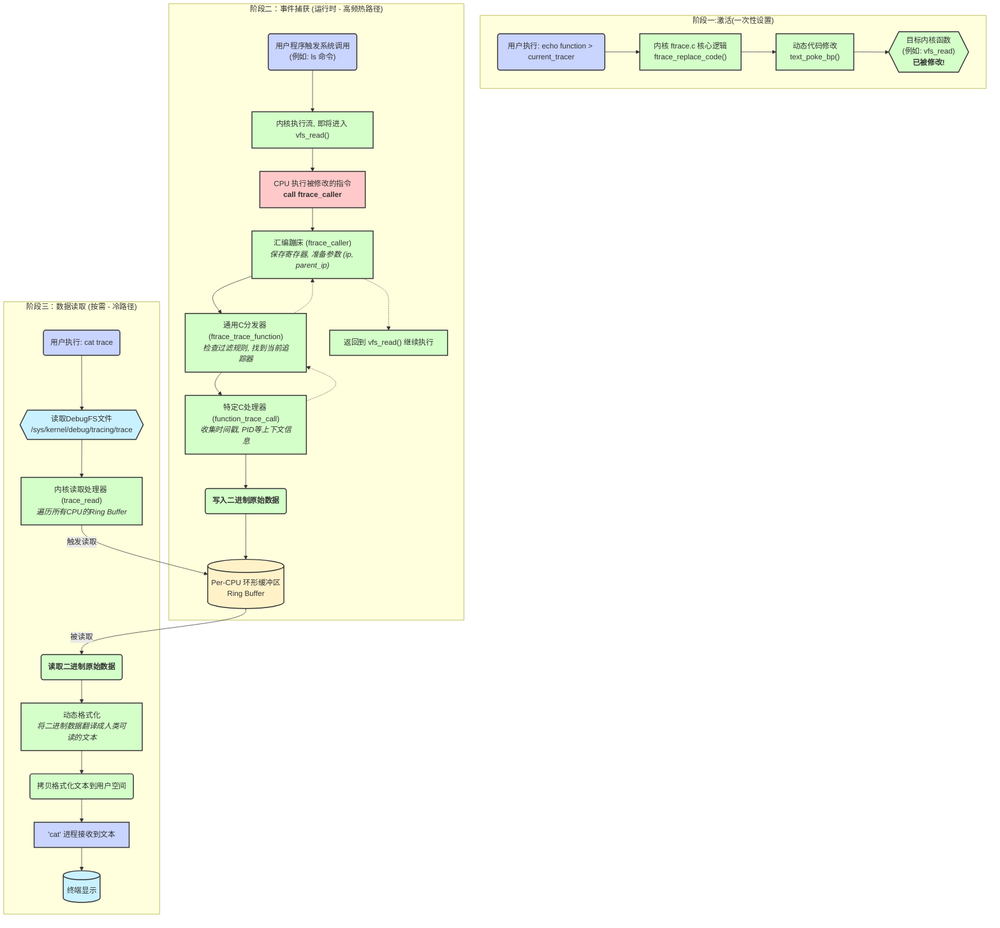

相当于一个框架, 由编译器在几乎每一个内核C函数的开头插入一条 `call __fentry__` 指令。

## ftrace 两个核心选项

两个选项对应着linux内核源码Makefile中的两个选项

#### `CONFIG_FUNCTION_TRACER`: 预埋电线 (The Wiring in the Walls)

- **作用**: 这是**基础框架**。开启这个选项，就会给编译器传递`-pg`/`-mfentry`参数。
- **结果**: 编译器会在**几乎每一个内核函数的入口处**插入一个`call __fentry__`的静态钩子。
- **比喻**: 这相当于在盖房子时，就在每一面墙里都**预先铺设好电线**。有了这些电线，这个房间未来才**有可能**安装电灯。如果你在盖房子时没有铺设电线，那么以后再想装灯就几乎不可能了
- **本质**: 它提供了追踪函数调用的**可能性**。没有它，函数追踪就无从谈起。
    

#### `CONFIG_DYNAMIC_FTRACE`: 安装电灯开关 (The Light Switch on the Wall)

- **作用**: 这是一个依赖于`CONFIG_FUNCTION_TRACER`的**增强功能**。它赋予内核在**运行时动态修改**上述钩子的能力。
    
- **结果**:
    - 当追踪功能**关闭**时，内核可以将所有`call __fentry__`指令动态地替换成`NOP`（空操作指令）。这使得在不追踪时，系统的性能开销**几乎为零**。
    - 当追踪功能**开启**时，内核再把`NOP`指令替换回`call ftrace_caller`。
- **比喻**: 这相当于在墙上安装一个**电灯开关**。即使墙里有电线，如果没有开关，灯要么永远亮着（性能开销大），要么永远灭着（没用）。开关让你可以在需要时才开灯，不需要时就关掉，既方便又节能。
- **本质**: 它提供了**动态开启和关闭**追踪的能力，并确保在关闭追踪时有**极低的性能开销**。
#### 核心关系

- `CONFIG_DYNAMIC_FTRACE` **依赖于** `CONFIG_FUNCTION_TRACER`。你不可能在一个没有预埋电线（`FUNCTION_TRACER`）的房间里安装一个有效的电灯开关（`DYNAMIC_FTRACE`）。
- 在现代内核中，**这两个选项几乎总是同时开启**。因为如果只开启`FUNCTION_TRACER`而不开启`DYNAMIC_FTRACE`，那些`call`指令会一直保持活动状态，即使不追踪也会持续调用一个空的返回函数，这会带来不必要的性能开销。`DYNAMIC_FTRACE`通过`NOP`指令解决了这个问题，是`ftrace`框架能够在线上系统安全使用的关键。


## ftrace核心原理

- **你 (用户)**: 在`menuconfig`里开启`CONFIG_FUNCTION_TRACER`。
- **构建系统 (`Makefile`)**: 检测到`CONFIG_FUNCTION_TRACER=y`，于是在编译所有内核C文件时，都默默地给`gcc`命令加上了`-pg` (`-mfentry`) 参数。
- **编译器 (`gcc`)**: 看到了`-mfentry`参数，心领神会，在为每个函数生成汇编代码时，都在函数开头勤勤恳懇地插入了一条`call __fentry__`。
	-  **默认行为 (`__fentry__` -> `ret`)**: 定义在 `arch/x86/kernel/mcount_64.S`，默认直接返回。
	- **追踪跳板 (`ftrace_caller`)**: 同样在 `arch/x86/kernel/mcount_64.S`，负责衔接汇编和C。--->"蹦床"
	- **核心逻辑 (`ftrace_trace_function`)**: 在 `kernel/trace/ftrace.c`，是通用的C处理函数。
	- **手术刀 (`text_poke_bp`)**: 在 `ftrace.c` 中被调用，负责在运行时动态修改内核代码。
```c title:ftrace_trace_function
// 函数 ftrace_replace_code 负责替换代码
static int ftrace_replace_code(struct ftrace_ops *ops, int enable)
{
    // ...
    if (enable)
        // 准备一个跳转到 ftrace_caller 的指令
        command = ftrace_make_call(rec); 
    else
        // 准备一个 NOP 指令
        command = ftrace_make_nop(rec);
    // ...
    // 调用架构相关的代码去真正修改内存
    err = ftrace_arch_code_modify_prepare();
    // ...
    err = text_poke_bp((void *)rec->ip, command, MCOUNT_INSN_SIZE, NULL);
    // ...
}
```




## 如何在嵌入式设备上部署ftrace

### 阶段一：在内核中开启 ftrace 支持 (编译前)

这是最关键的一步。您必须确保内核编译时开启了 `ftrace` 及其相关的所有功能。

1. 加载并配置内核:
    
    和之前的步骤一样，进入内核源码目录，加载您的开发板的 defconfig，然后运行 make menuconfig：
    ```Bash
    make ARCH=arm64 CROSS_COMPILE=aarch64-linux-gnu- menuconfig
    ```
    
2. 开启必要的 ftrace 选项:
    
    在菜单中，导航到 Kernel hacking --->，然后进入 Tracers --->。请确保以下选项都被选中 ([*])：
    - **`[*] Kernel Function Tracer` (`CONFIG_FUNCTION_TRACER`)**: ftrace 的基础，允许追踪内核函数。
    - **`[*] Kernel Function Graph Tracer` (`CONFIG_FUNCTION_GRAPH_TRACER`)**: 允许生成非常直观的函数调用图和耗时。
    - **`[*] Branch Profiling` (`CONFIG_BRANCH_TRACER`)**: (可选) 用于更深入的内核流分析。
    - **`[*] Dynamic Ftrace` (`CONFIG_DYNAMIC_FTRACE`)**: **强烈推荐**，确保 ftrace 在不使用时性能开销几乎为零。
    - **`[*] Enable ftrace support for kprobes` (`CONFIG_KPROBE_EVENTS`)**: 允许 ftrace 和 kprobes 协同工作。
    - **`[*] Support for tracing block IO actions` (`CONFIG_BLK_DEV_IO_TRACE`)**: 允许追踪块设备 I/O 事件。
        
    
    接下来，**返回上一级菜单** (`Kernel hacking --->`)，确保 `debugfs` 被开启，这是访问 ftrace 的入口：
    - **`[*] Debug Filesystem` (`CONFIG_DEBUG_FS`)**
        
    完成后，保存配置并退出。
    
3. 编译并部署新内核:
    
    像之前一样，编译内核镜像和设备树，然后将它们部署到您的嵌入式设备上并重启。
    ```Bash
    make -j$(nproc) ARCH=arm64 CROSS_COMPILE=aarch64-linux-gnu-
    ```
    
    **完成这一步后，您的设备就已经具备了 ftrace 的所有能力**。剩下的就是在设备上如何去“使用”它。
    
---

### 阶段二：在嵌入式设备上使用 ftrace

ftrace 的主要交互界面是 `debugfs` 文件系统，通常挂载在 `/sys/kernel/debug`。

#### 1. 挂载 `debugfs` (如果尚未挂载)

登录到您的设备终端，首先确认 `debugfs` 是否已经挂载：
```Bash
mount | grep debugfs
```

如果没有输出，您需要手动挂载它：

```Bash
mount -t debugfs none /sys/kernel/debug
```

为了让设备重启后自动挂载，可以将其加入 `/etc/fstab` 文件：

```Bash
debugfs  /sys/kernel/debug  debugfs  defaults  0  0
```

#### 2. “原生”方法：直接使用 `echo` 和 `cat`

这是最基础、最直接的使用方式，不需要任何额外的工具。所有的控制都通过读写 `/sys/kernel/debug/tracing/` 目录下的文件来完成。

**示例：追踪所有进程对 `openat` 系统调用的进入事件**

```Bash
# 进入ftrace的控制目录
cd /sys/kernel/debug/tracing

# (最佳实践) 先关闭追踪，再配置
echo 0 > tracing_on

# 清空之前的追踪记录
echo > trace

# 设置要追踪的事件。这里我们追踪 openat 系统调用的进入 (enter) 事件
echo 'syscalls:sys_enter_openat' > set_event

# 开启追踪
echo 1 > tracing_on

# 在另一个终端或者后台执行一些会触发文件打开的命令
ls /etc/

# 查看追踪结果
cat trace
```

您会看到类似这样的输出：

```
# tracer: nop
#
# entries-in-buffer/entries-written: 1/1   #P:4
#
#                                _-----=> irqs-off
#                               / _----=> need-resched
#                              | / _---=> hardirq/softirq
#                              || / _--=> preempt-depth
#                              ||| /     delay
#           TASK-PID     CPU#  ||||   TIMESTAMP  FUNCTION
#              | |         |   ||||      |         |
              ls-1234    [001] ....   12345.678901: sys_enter_openat: dfd: ffffffff, filename: 61616161, flags: 110000, mode: 0
```

#### 3. “高级”方法：使用用户空间工具 `trace-cmd`

虽然 `echo`/`cat` 很方便，但对于复杂的追踪（比如追踪全系统、高频事件），它有过载和竞争问题。`trace-cmd` 是 ftrace 的官方用户空间配套工具，它能更高效地读取二进制追踪流，并提供更强大的功能。

**如何在嵌入式系统上获得 `trace-cmd`?**
您需要在PC上为其**交叉编译**。
1. **在PC上下载源码**:
    ```Bash
    git clone https://git.kernel.org/pub/scm/utils/trace-cmd/trace-cmd.git
    cd trace-cmd
    ```
    
2. **交叉编译和安装**:
 
    ```Bash
    # 告诉构建系统使用交叉编译器
    make CC=aarch64-linux-gnu-gcc LD=aarch64-linux-gnu-ld
    
    # 将编译好的文件安装到一个临时目录，方便打包
    make DESTDIR=/tmp/trace-cmd-deploy install
    ```
    
    现在，`/tmp/trace-cmd-deploy` 目录里就有了 `trace-cmd` 程序和它需要的库。
    
3. 部署到设备:
    
    将 /tmp/trace-cmd-deploy/usr/bin/ 下的 trace-cmd 和 /tmp/trace-cmd-deploy/usr/lib/ 下的相关库文件拷贝到嵌入式设备对应的目录。
    

**如何使用 `trace-cmd`?**

`trace-cmd` 的命令比 `echo`/`cat` 组合更简洁强大。

**示例：(与上面等价的操作)**


```Bash

# trace-cmd record 启动追踪
# -e 指定事件
# ls /etc/ 是要追踪的目标命令
trace-cmd record -e syscalls:sys_enter_openat ls /etc/

# trace-cmd report 查看报告
trace-cmd report
```

`trace-cmd` 会生成一个 `trace.dat` 文件，其中包含了高效的二进制追踪数据，`report` 命令会解析它并以美观的格式展示。

### 总结：选择哪种方式？

|方式|优点|缺点|适用场景|
|---|---|---|---|
|**`echo`/`cat`**|**无需额外工具**，内核支持即可用|功能有限，高频事件下可能丢失数据，输出格式原始|紧急调试、快速查看单个简单事件、目标系统无法部署任何工具时|
|**`trace-cmd`**|**功能强大**，性能好，不丢数据，格式化输出，支持图形化工具`KernelShark`|需要交叉编译和部署|**推荐的日常使用方式**，用于严肃的系统级性能分析和调试|

对于嵌入式系统，掌握`echo`/`cat` 的原生用法是必备的生存技能，而学会交叉编译和部署 `trace-cmd` 则能让你的分析能力提升一个档次。


# 个人尝试

## 非嵌入式系统

```shell
root@song-com:/usr/lib# mount | grep debugfs
debugfs on /sys/kernel/debug type debugfs (rw,nosuid,nodev,noexec,relatime)


```
