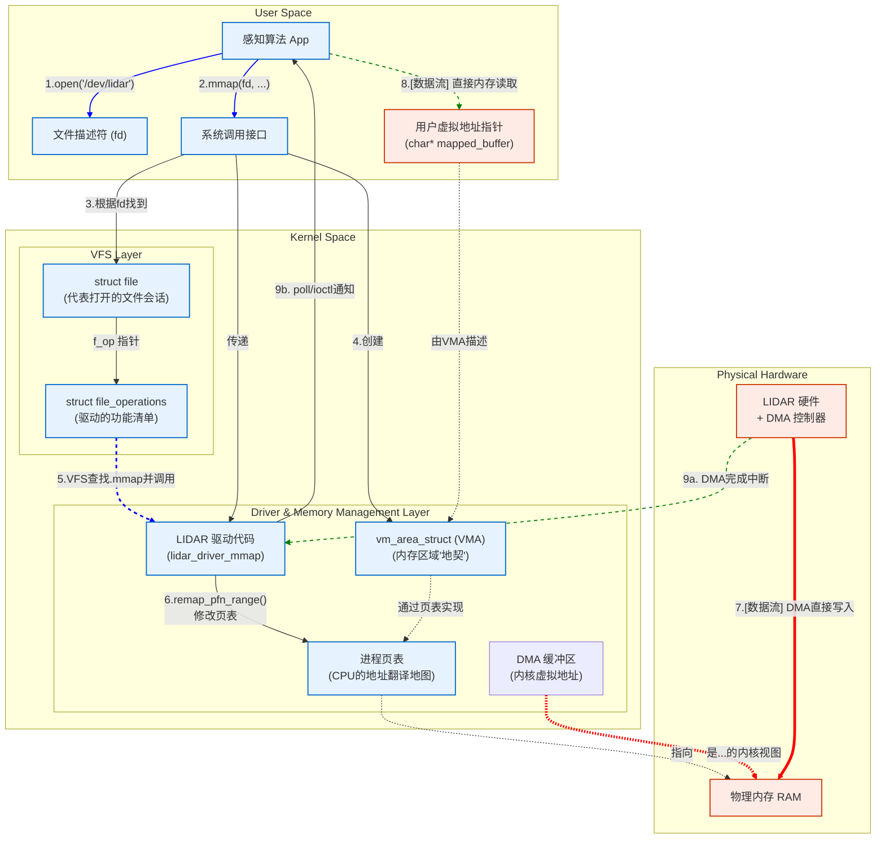

## 问题

**场景:**

> 我们的自动驾驶汽车上有一个高分辨率的激光雷达 (LIDAR)，它每秒会产生大约 500MB 的点云数据。这些数据需要从内核的设备驱动程序，高效地传递给用户空间的一个感知算法模块进行处理。我们发现，如果用传统的 `read()` 系统调用来读取数据，CPU 占用率非常高，严重影响了其他算法的运行。

**问题:**

> **1. 请解释为什么传统的 `read()` 调用在这里会成为性能瓶颈？请描述数据从设备到用户程序缓冲区的完整拷贝路径。**
> 
> **2. 请设计一个更高效的数据传输方案。你会选择哪种技术（例如 `mmap`、`DMA` 等）来最小化甚至消除数据拷贝和CPU开销？请画出你的方案的数据流图。**


## AI回答

### 传统 `read()` 调用的性能瓶颈分析

传统的 `read()` 系统调用之所以在这里成为性能瓶颈，主要源于两大开销：**数据拷贝 (Data Copies)** 和 **上下文切换 (Context Switches)**。

##### 数据拷贝路径详解
当用户空间的感知算法模块调用 `read()` 来获取500MB/s的LIDAR数据时，数据在到达你的程序内存之前，经历了一次“漫长”的旅行，并且大部分路程都需要CPU亲自“搬运”。
完整的拷贝路径如下：

1. **第零步：设备 -> 内核DMA缓冲区 (硬件完成，非CPU拷贝)**
    - LIDAR设备通过 **DMA (Direct Memory Access)** 控制器，将采集到的点云数据直接写入到物理内存中的一块由内核驱动程序预先分配好的 **DMA缓冲区**。
    - **关键点：** 这一步是硬件自动完成的，**不消耗CPU资源**。这是现代设备驱动的基础。
        
2. **第一次拷贝：内核DMA缓冲区 -> 内核页缓存/临时缓冲区 (CPU完成)**
    
    - 当用户进程调用 `read()` 时，会触发一个系统调用，使CPU从**用户态**切换到**内核态**。
    - 内核响应 `read()` 请求，需要将数据从特定于驱动的DMA缓冲区，拷贝到一个更通用的内核缓冲区，例如内核的**页缓存 (Page Cache)** 或一个临时的Socket Buffer。
    - **关键点：** 这次拷贝是由 **CPU** 执行的 (`memcpy`)。
        
3. **第二次拷贝：内核页缓存 -> 用户空间缓冲区 (CPU完成)**
    
    - 数据现在位于内核的通用缓冲区中。为了让用户进程能够访问它，内核必须再次将数据从这个内核缓冲区，拷贝到用户进程调用 `read()` 时传入的那个缓冲区地址。
    - **关键点：** 这次拷贝同样是由 **CPU** 执行的 (`memcpy`)。完成后，CPU从**内核态**切换回**用户态**，`read()` 调用返回。
        

**总结瓶颈：** 对于每一块LIDAR数据，都涉及 **2次CPU密集型的数据拷贝** 和 **2次上下文切换** (用户态 -> 内核态 -> 用户态)
我们计算一下开销：

- **数据拷贝开销：** 500 MB/s的数据，两次拷贝意味着CPU需要处理 `500 * 2 = 1000 MB/s` 的内存拷贝带宽。这会吃掉大量的CPU周期，导致CPU占用率飙升。
- **上下文切换开销：** 对于高频、小块的数据流，频繁的上下文切换本身也是一笔巨大的开销，因为它涉及TLB刷新、寄存器保存/恢复等操作。

### 高效的零拷贝 (Zero-Copy) 数据传输方案
为了解决这个瓶颈，我们的目标是 **彻底消除CPU参与的数据拷贝**。最优的方案是结合使用内核驱动管理的 **DMA 缓冲区** 和 **`mmap()` 内存映射** 技术。

- **初始化：** 感知模块调用 `mmap()`，在自己的虚拟地址空间里拿到一块“飞地”，这块“飞地”的背后就是LIDAR的DMA物理内存。
- **数据采集：** LIDAR的DMA控制器**直接将点云数据写入**这块物理内存。
- **数据处理：** 数据一旦被DMA写入，它就**立刻对用户空间的感知模块可见**，无需任何拷贝。
- **同步机制：** 驱动程序需要提供一种通知机制（例如通过 `poll()`/`select()`/`epoll` 或 `ioctl`），告诉用户空间“新的数据已经准备好了，请到缓冲区的某个位置进行处理”。用户程序处理完数据后，再通过 `ioctl` 通知驱动“这块缓冲区我已经用完，你可以释放了”。




##### 伪代码实现

```c title:内核驱动代码 hl:56,26,98,74,101,105
// ==========================================================
// KERNEL DRIVER PSEUDOCODE (/drivers/lidar/lidar_driver.c)
// ==========================================================

// --- 数据结构定义 ---
#define NUM_FRAMES 8  // 环形缓冲区包含8个帧
#define FRAME_SIZE (64 * 1024 * 1024) // 假设每帧64MB
#define BUFFER_SIZE (NUM_FRAMES * FRAME_SIZE)

// 描述每一帧元数据的结构体
struct frame_metadata {
    enum { EMPTY, FILLING, FULL } status;
    uint64_t timestamp;
    size_t   data_size; // 实际点云数据大小
};

// 驱动的私有数据结构
struct lidar_device {
    void* dma_virt_addr;      // DMA缓冲区的虚拟地址 (内核可见)
    dma_addr_t dma_phys_addr; // DMA缓冲区的物理地址 (硬件可见)
    struct frame_metadata meta[NUM_FRAMES]; // 每一帧的元数据
    
    int head; // 驱动/DMA正在写入的帧索引
    int tail; // 用户正在读取的帧索引 (驱动通过它知道哪个帧是空闲的)

    wait_queue_head_t wait_q; // 等待队列，用于在没有数据时让用户进程睡眠
};


// --- 函数实现 ---

// 驱动模块初始化 (当insmod时调用)
int lidar_driver_init() {
    // 1. 分配一块物理连续、可用于DMA的内存
    // dma_alloc_coherent会确保这块内存对CPU和设备都可见
    dev->dma_virt_addr = dma_alloc_coherent(device, BUFFER_SIZE, &dev->dma_phys_addr, GFP_KERNEL);
    if (!dev->dma_virt_addr) { return -ENOMEM; }

    // 2. 初始化环形缓冲区
    dev->head = 0;
    dev->tail = 0;
    for (int i = 0; i < NUM_FRAMES; ++i) {
        dev->meta[i].status = EMPTY;
    }
    init_waitqueue_head(&dev->wait_q);

    // 3. 配置LIDAR硬件的DMA控制器，让它开始向第一个帧写入数据
    lidar_hw_setup_dma(dev->dma_phys_addr + (dev->head * FRAME_SIZE));
    dev->meta[dev->head].status = FILLING;
    
    // 注册字符设备、创建/dev/lidar节点等...
    return 0;
}

// 当用户程序调用mmap()时，这个函数被调用
int lidar_driver_mmap(struct file *filp, struct vm_area_struct *vma) {
    // 将我们分配的DMA缓冲区的物理页，映射到用户空间的虚拟地址区域vma
    // 这是实现零拷贝的魔法步骤！
    return remap_pfn_range(vma,
                           vma->vm_start,
                           virt_to_pfn(dev->dma_virt_addr), // 物理地址
                           vma->vm_end - vma->vm_start,    // 映射大小
                           vma->vm_page_prot);
}

// 当DMA传输完成一帧数据时，硬件会产生一个中断，这个函数被调用
irqreturn_t lidar_dma_interrupt_handler() {
    // 1. 当前帧已满
    dev->meta[dev->head].status = FULL;
    dev->meta[dev->head].timestamp = get_kernel_timestamp();
    // dev->meta[dev->head].data_size = lidar_hw_get_bytes_written();

    // 2. 唤醒可能正在等待数据的用户进程
    wake_up_interruptible(&dev->wait_q);

    // 3. 移动head指针到下一个帧，形成环形
    dev->head = (dev->head + 1) % NUM_FRAMES;

    // 检查是否有缓冲区溢出 (生产者追上了消费者)
    if (dev->meta[dev->head].status != EMPTY) {
        print_error("Buffer Overrun!");
        // 处理错误...
    }
    
    // 4. 配置硬件DMA，开始向新的帧写入数据
    dev->meta[dev->head].status = FILLING;
    lidar_hw_setup_dma(dev->dma_phys_addr + (dev->head * FRAME_SIZE));
    
    return IRQ_HANDLED;
}

// 当用户程序调用ioctl()时，这个函数被调用
long lidar_driver_ioctl(struct file *filp, unsigned int cmd, unsigned long arg) {
    int frame_idx;
    switch (cmd) {
        case IOCTL_GET_FULL_FRAME: // 用户想获取一个处理好的帧
            // 等待，直到有一个帧的状态是FULL
            wait_event_interruptible(dev->wait_q, dev->meta[dev->tail].status == FULL);
            
            // 将FULL状态的帧索引返回给用户
            put_user(dev->tail, (int __user *)arg);  //传递参数给user
            return 0;

        case IOCTL_RELEASE_FRAME: // 用户已经处理完一个帧
            get_user(frame_idx, (int __user *)arg);  //从用户态获取参数
            if (frame_idx == dev->tail) {
                // 标记为EMPTY，这样DMA就可以再次使用它
                dev->meta[dev->tail].status = EMPTY;
                // 移动tail指针
                dev->tail = (dev->tail + 1) % NUM_FRAMES;
            }
            return 0;
    }
    return -EINVAL;
}
```


```c title:用户层代码 hl:50,64
// ==========================================================
// USER-SPACE PERCEPTION APP PSEUDOCODE (app/perception_main.c)
// ==========================================================
#include <sys/mman.h> // for mmap
#include <sys/ioctl.h> // for ioctl
#include <fcntl.h>    // for open
#include <unistd.h>   // for close

// --- IOCTL命令定义 (必须和驱动中的定义一致) ---
#define IOCTL_GET_FULL_FRAME _IOR('L', 1, int)
#define IOCTL_RELEASE_FRAME  _IOW('L', 2, int)

// --- 数据结构 (最好也和驱动共享) ---
#define NUM_FRAMES 8
#define FRAME_SIZE (64 * 1024 * 1024)
#define BUFFER_SIZE (NUM_FRAMES * FRAME_SIZE)

// --- 主程序 ---
int main() {
    // 1. 打开设备文件
    int fd = open("/dev/lidar", O_RDWR);
    if (fd < 0) {
        perror("Failed to open device");
        return -1;
    }

    // 2. 调用mmap将设备的DMA缓冲区映射到本进程的地址空间
    // 这是实现零拷贝的魔法步骤！
    // 返回的`mapped_buffer`是一个指针，指向一块物理上和内核共享的内存
    char* mapped_buffer = (char*)mmap(NULL,                    // 让内核选择地址
                                      BUFFER_SIZE,             // 映射大小
                                      PROT_READ,               // 我们只需要读取
                                      MAP_SHARED,              // 共享内存
                                      fd,                      // 设备文件描述符
                                      0);                      // 偏移量
    if (mapped_buffer == MAP_FAILED) {
        perror("Failed to mmap");
        close(fd);
        return -1;
    }

    printf("Successfully mapped LIDAR buffer.\n");

    // 3. 主处理循环
    while (is_running()) {
        int frame_to_process;

        // a. 等待一个可用的、装满数据的帧
        // 这个ioctl调用会阻塞，直到驱动的中断处理程序唤醒我们
        if (ioctl(fd, IOCTL_GET_FULL_FRAME, &frame_to_process) < 0) {
            perror("IOCTL_GET_FULL_FRAME failed");
            break;
        }

        // b. 直接从映射的内存中计算出该帧的地址
        // *** 无需read()，无需拷贝 ***
        char* point_cloud_data = mapped_buffer + (frame_to_process * FRAME_SIZE);

        // c. 调用感知算法处理数据
        printf("Processing data from frame %d...\n", frame_to_process);
        run_perception_algorithms(point_cloud_data);

        // d. 通知驱动，我们已经处理完这个帧了，它可以被回收了
        if (ioctl(fd, IOCTL_RELEASE_FRAME, &frame_to_process) < 0) {
            perror("IOCTL_RELEASE_FRAME failed");
            break;
        }
    }

    // 4. 清理
    munmap(mapped_buffer, BUFFER_SIZE);
    close(fd);

    return 0;
}
```


##### 关于`remap_pfn_range` 或 `io_remap_pfn_range`

对于mmap类型的VMA, 是否用page_cache 是在.mmap函数中决定的 
- 在驱动程序或文件系统开发者编写的 `file_operations` -> `.mmap` 指向的那个函数的**代码实现内部**。

通过**选择调用不同的内核API**。
- 想用Page Cache -> 使用 `generic_file_mmap` 和 `address_space` 相关的接口。
- 想绕过Page Cache -> 使用 `remap_pfn_range` 或 `io_remap_pfn_range` 等直接操作页表的底层接口。
## 我的回答

1. 
