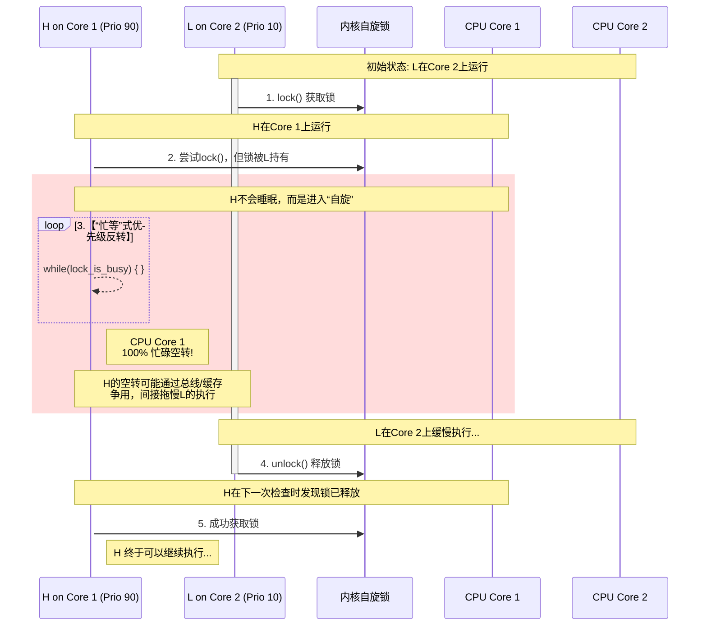
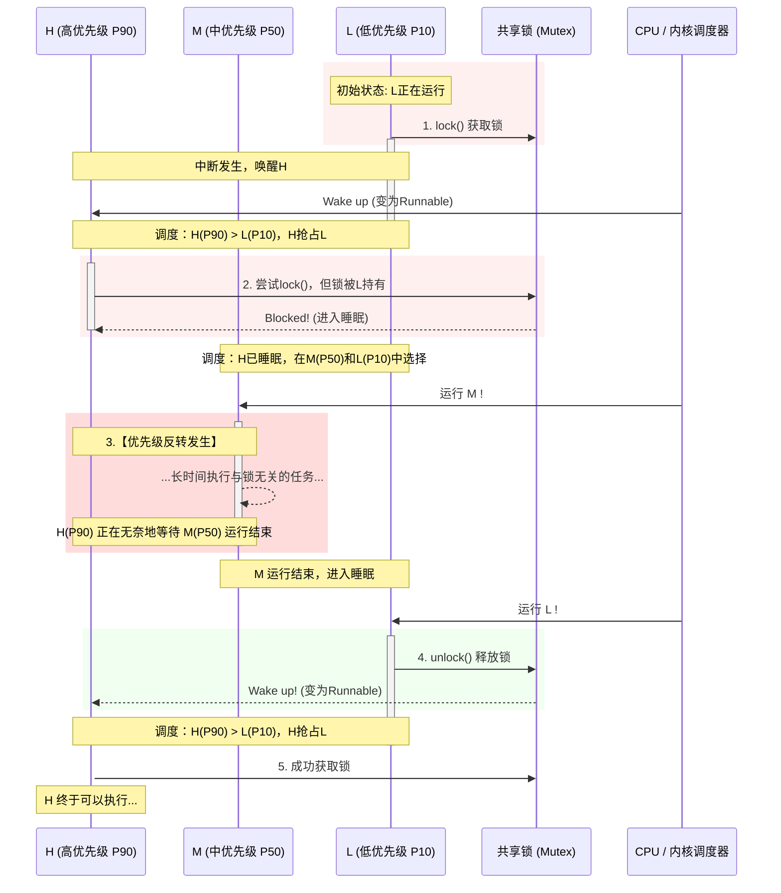

## 场景:

> 在你的机器人项目中，有一个负责姿态控制的实时进程，它必须严格按照 **200Hz (每 5ms)** 的频率运行，完成传感器读取、姿态解算和电机指令下发。但在实际测试中，你发现这个进程偶尔会出现**超过 10ms 的延迟**，导致机器人姿态不稳。这个控制进程已经被设置为 `SCHED_FIFO` 实时调度策略，并且优先级是最高的。

**问题:**
> **1. 请分析一下，在 Linux 系统中，即使一个进程拥有最高的实时优先级，还有哪些潜在的内核层原因会导致它无法被及时调度，从而产生这种意料之外的延迟（Jitter）？**
> 
> **2. 面对这个问题，你会采取怎样的系统性排查步骤？你会使用哪些工具（例如 `ftrace`, `perf` 等）来定位延迟的根源？**

## ai回答

#### **潜在原因分析**

即便一个进程被设置为 `SCHED_FIFO` 且优先级最高，以下四类事件依然可以抢占它或使其等待，导致延迟（Jitter）。

1. **中断与中断下半部（Interrupts and Bottom Halves）**
    
    - **硬中断（IRQs）**：==硬件中断的优先级高于**所有软件**，包括我的实时任务==。当中断发生时，CPU 会立即停止当前工作去执行中断服务例程（ISR）。如果系统中有高频中断（如千兆网卡、高频率定时器）或某个 ISR 执行时间过长，就会直接抢占并延迟我的任务。
		- 中断屏蔽: 上面是抢占的情况, 还有一种情况是你在等待时钟中断重新调度, 但是当前可能正在执行另一个中断任务, 你的时钟中断这次被屏蔽, 就得等下一次时钟中断
        
    - **软中断（Softirqs）**：为了让硬中断尽快返回，大量工作（如网络包处理、块设备I/O）会交由软中断处理。在非 `PREEMPT_RT` 内核中，软中断的执行优先级非常高，可以抢占用户态的实时任务。一个突发的**大流量网络包就可能导致软中断持续执行**，造成我的控制任务延迟。
        
2. **内核锁与优先级反转（Kernel Locks & Priority Inversion）**
    
    - 当我的实时任务通过系统调用进入内核态后，可能会需要获取某个内核锁（如`mutex`或`spinlock`）。如果此时该锁被一个低优先级的普通任务所持有，我的高优先级任务就必须等待，直到低优先级任务释放锁。这就是经典的“优先级反转”问题，它是实时系统的大敌。

3. **内核调度禁用导致的**
	- 有可能轮到调度你的时候, 这次有个其他的进程正在操作一些内核关键函数, 此时将preempt_disable了.  等到时钟中断发生的时候, 中断程序把你改成了就绪状态, 然后中断返回的时候, 会进入调度流程, 原本应该调度你去执行下一步操作的, 但是此时preempt标志是0, 导致无法正常完成调度.  于是你就在外面等

4. **内存管理导致的阻塞（Blocking due to Memory Management）**
    
    - **缺页中断（Page Faults）**：这是最隐蔽的延迟来源。如果我的实时任务访问了某个内存页面，而该页面恰好不在物理内存中（例如被换出到Swap区，或尚未从可执行文件加载），就会触发缺页中断。内核需要阻塞我的任务，从磁盘加载数据，这个过程耗时是毫秒级的，对于5ms的周期是致命的。
        
5. **硬件或固件的干扰（Hardware or Firmware Interference）**
    
    - **系统管理中断（SMIs）**：这是一种由系统固件（BIOS/UEFI）发起的中断，用于执行电源管理、硬件纠错等操作。SMI 的优先级高于操作系统，并且对OS透明，它会“偷走”CPU时间，导致无法解释的延迟。

## 我的回答

1. 一般这种性能问题, 要区分用户层和内核层. 
2. 从内核层来看, 从内核的功能划分来看

#### 进程管理层面

##### 1. 内核调度 
**内核调度**上, 可能是轮到当前进程调度的时候, 时钟中断返回的时候, 校验preempt是0 , 表明内核正在进行关键的操作(此时可能是一个低优先级进程), 就会引发调度不到的问题

##### 2. 内核锁引发
内核锁引发的优先级反转问题, 存在两种情况

a. **smp系统下的自旋锁**:  进程H 进程L  如果进程L在cpu0上拿到了自旋锁, 并且优先级不高, 进程H在CPU1上执行, H就会疯狂运行, 检查自旋锁, 会带来缓存的持续占用, 进一步影响进程L的运行速度.  造成的现象是进程L的任务缓慢执行, 进程H卡死在锁这里. 

	
b. **单CPU也有可能**: 比如进程H 进程M 进程L, 如果进程L拿到了互斥锁, 此时进程H来了, 时钟中断ISR让H运行,L暂停.   H开始运行, 运行了一小段, 发现需要互斥锁, 然后发现锁在锁着, 就进入了sleep状态, 继续产生调度, 此时调度的时候,又M L 调度器自然选择M去运行, 会让H还需要等待M运行完.   这个就是典型的优先级反转了. 

#### 内存管理层面

##### 3. 缺页中断

有可能使用的内存, 此时正好被swap到flash上去了. 此时就会触发缺页中断, 重新去flash上拿数据, 读取到ram中, 再返回到虚拟内存

#### 文件系统管理

这个没有

#### 驱动管理

##### 4. 硬件中断产生
硬件中断优先级高于软件进程, 万一驱动写的不好, 会有这种问题

还有一种情况: 有可能不是新的硬件中断, 而是在执行上一次中断, 此时就会屏蔽中断, 导致时钟中断不生效, 进而这次调度就浪费了. 

	