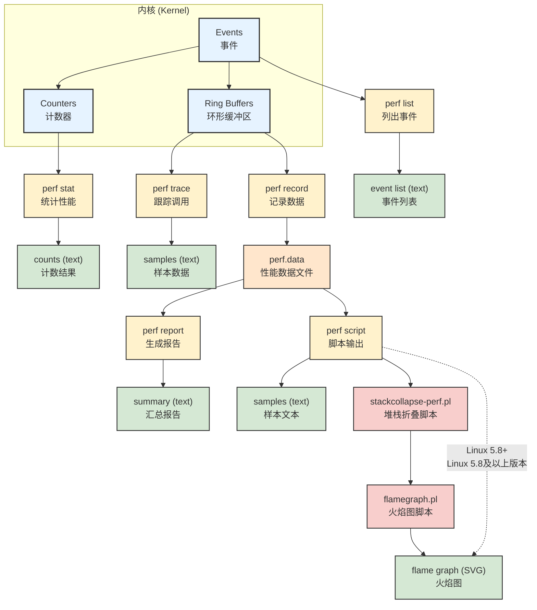

# perf的原理是什么? 

> [!info] perf, perf_event都是什么?  perf有那些功能?

> perf是linux官方的性能分析器  位于linux内核源码的`tools/perf`下面.  是内核 ==`perf_events` 可观测性子系统==的**前端**

## perf拥有的能力有那些?

- **采样技术**:  比如每隔一定时间（例如每秒1000次）中断 CPU，记录当前正在运行的函数。通过**统计**，可以找出哪些函数在 CPU 上运行的时间最长，从而定位性能瓶颈。
- **追踪技术**: 记录系统中的特定事件，比如进程调度、系统调用、函数调用等，以**了解事件发生的精确顺序和时间**。

## 相关概念

### 前后端分离

perf工具相当于前端,  而perf_events相当于后端

`perf_events`:  Linux 内核里一个专门负责**收集信息**的子系统,  实时地捕捉各种“事件”，比如 CPU 缓存命中、进程调度、系统调用等

tracepoints: 内核静态追踪
kprobes: 内核动态追踪

USDT:用户静态追踪
uprobes:用户动态追踪

## perf支持的子命令

### `perf` 常用子命令速查表

|常用程度|命令|描述|
|---|---|---|
|★★★★★|`record`|运行一个命令，并将其性能剖析数据记录到 `perf.data` 文件中。这是**离线分析**的第一步。|
|★★★★★|`report`|读取 `record` 生成的 `perf.data` 文件，并显示性能剖析报告。这是**离线分析**的第二步。|
|★★★★★|`stat`|运行一个命令并收集**性能计数器**统计信息。用于快速获取高层次的性能概览，如总CPU周期、缓存命中率等。|
|★★★★☆|`list`|列出 `perf` 支持的所有**事件类型**，包括硬件、软件和追踪点事件。这是学习和探索 `perf` 功能的起点。|
|★★★★☆|`top`|实时、交互式的系统性能剖析工具，类似于 `top` 命令，但能显示**函数级别**的性能瓶颈。非常适合快速诊断。|
|★★★☆☆|`annotate`|读取 `perf.data`，并将性能数据直接**注解**到源码或反汇编代码旁。用于进行深入的源码级优化。|
|★★★☆☆|`probe`|定义新的**动态追踪点**。用于在不修改内核源码的情况下，追踪特定内核函数。|
|★★☆☆☆|`diff`|对比两个 `perf.data` 文件，显示性能数据的**差异**。用于在优化前后进行性能对比。|
|★★☆☆☆|`script`|读取 `perf.data`，并将原始事件数据以文本形式输出，方便脚本化处理。适合高级用户进行自定义分析。|
|★☆☆☆☆|`trace`|实时追踪系统调用。功能类似于 `strace`，但基于 `perf_events` 框架。|
|★☆☆☆☆|`lock`|专门用于分析**锁**事件，帮助排查并发和同步问题。|
|★☆☆☆☆|`mem`|专门用于剖析**内存访问**，帮助排查缓存和内存瓶颈。|




# perf 子命令具体用法

## perf list

- **作用**：列出所有**当前已知**的事件类型。

- **解析**：这是最基础的用法。当你不知道能用 `perf` 追踪什么事件时，就运行这个命令。它会返回一个很长的列表，包括硬件事件（`CPU-cycles`）、软件事件（`context-switches`）、内核追踪点（`syscalls`、`sched`）等。这个列表取决于你的内核版本和系统架构。

例子: 事件巨多
```bash title:"perf list"
List of pre-defined events (to be used in -e):

  branch-instructions OR branches                    [Hardware event]
  branch-misses                                      [Hardware event]
  bus-cycles                                         [Hardware event]
  cache-misses                                       [Hardware event]
  cache-references                                   [Hardware event]
  cpu-cycles OR cycles                               [Hardware event]
  instructions                                       [Hardware event]
  ref-cycles                                         [Hardware event]

  alignment-faults                                   [Software event]
  bpf-output                                         [Software event]
  context-switches OR cs                             [Software event]
  cpu-clock                                          [Software event]
  cpu-migrations OR migrations                       [Software event]
  dummy                                              [Software event]
  emulation-faults                                   [Software event]
  major-faults                                       [Software event]
  minor-faults                                       [Software event]
  page-faults OR faults                              [Software event]
  task-clock                                         [Software event]

  duration_time                                      [Tool event]

  branch-instructions OR cpu/branch-instructions/    [Kernel PMU event]
  branch-misses OR cpu/branch-misses/                [Kernel PMU event]
  bus-cycles OR cpu/bus-cycles/                      [Kernel PMU event]
  cache-misses OR cpu/cache-misses/                  [Kernel PMU event]
  cache-references OR cpu/cache-references/          [Kernel PMU event]
  cpu-cycles OR cpu/cpu-cycles/                      [Kernel PMU event]
  instructions OR cpu/instructions/                  [Kernel PMU event]
  intel_bts//                                        [Kernel PMU event]
  intel_pt//                                         [Kernel PMU event]
  msr/aperf/                                         [Kernel PMU event]
  msr/cpu_thermal_margin/                            [Kernel PMU event]
  msr/mperf/                                         [Kernel PMU event]
  msr/tsc/                                           [Kernel PMU event]
  ref-cycles OR cpu/ref-cycles/                      [Kernel PMU event]

  rNNN                                               [Raw hardware event descriptor]
  cpu/t1=v1[,t2=v2,t3 ...]/modifier                  [Raw hardware event descriptor]
   (see 'man perf-list' on how to encode it)

  mem:<addr>[/len][:access]                          [Hardware breakpoint]

  alarmtimer:alarmtimer_cancel                       [Tracepoint event]
  alarmtimer:alarmtimer_fired                        [Tracepoint event]
  alarmtimer:alarmtimer_start                        [Tracepoint event]
  alarmtimer:alarmtimer_suspend                      [Tracepoint event]
  block:block_bio_backmerge                          [Tracepoint event]
  block:block_bio_bounce                             [Tracepoint event]
  block:block_bio_complete                           [Tracepoint event]
  block:block_bio_frontmerge                         [Tracepoint event]
  block:block_bio_queue                              [Tracepoint event]
  block:block_bio_remap                              [Tracepoint event]
  block:block_dirty_buffer                           [Tracepoint event]
  block:block_getrq                                  [Tracepoint event]
  block:block_plug                                   [Tracepoint event]
  block:block_rq_complete                            [Tracepoint event]
  block:block_rq_insert                              [Tracepoint event]
  ...
  ...
```


#### perf list `xxxx` 筛选特定事件

```shell title:"perf list 'sched*'"
root@song-com:/home/song/src/learning/perf# perf list 'sched:*'

List of pre-defined events (to be used in -e):

  sched:sched_kthread_stop                           [Tracepoint event]
  sched:sched_kthread_stop_ret                       [Tracepoint event]
  sched:sched_kthread_work_execute_end               [Tracepoint event]
  sched:sched_kthread_work_execute_start             [Tracepoint event]
  sched:sched_kthread_work_queue_work                [Tracepoint event]
  sched:sched_migrate_task                           [Tracepoint event]
  sched:sched_move_numa                              [Tracepoint event]
  sched:sched_pi_setprio                             [Tracepoint event]
  sched:sched_process_exec                           [Tracepoint event]
  sched:sched_process_exit                           [Tracepoint event]
  sched:sched_process_fork                           [Tracepoint event]
  sched:sched_process_free                           [Tracepoint event]
  sched:sched_process_hang                           [Tracepoint event]
  sched:sched_process_wait                           [Tracepoint event]
  sched:sched_stat_blocked                           [Tracepoint event]
  sched:sched_stat_iowait                            [Tracepoint event]
  sched:sched_stat_runtime                           [Tracepoint event]
  sched:sched_stat_sleep                             [Tracepoint event]
  sched:sched_stat_wait                              [Tracepoint event]
  sched:sched_stick_numa                             [Tracepoint event]
  sched:sched_swap_numa                              [Tracepoint event]
  sched:sched_switch                                 [Tracepoint event]
  sched:sched_wait_task                              [Tracepoint event]
  sched:sched_wake_idle_without_ipi                  [Tracepoint event]
  sched:sched_wakeup                                 [Tracepoint event]
  sched:sched_wakeup_new                             [Tracepoint event]
  sched:sched_waking                                 [Tracepoint event]
```

### 常用事件清单

| 事件名                      | 所属类别                          | 事件作用                                                                                 |
| ------------------------ | ----------------------------- | ------------------------------------------------------------------------------------ |
| `cpu-cycles`             | 硬件事件 (Hardware event)         | 统计 CPU 运行的时钟周期总数。这是衡量 CPU 总工作量最基本的指标。                                                |
| `instructions`           | 硬件事件 (Hardware event)         | 统计 CPU 执行的指令总数。用于计算 **IPC (每周期指令数)**，即 `instructions / cpu-cycles`，它是衡量 CPU 效率的关键指标。 |
| `cache-references`       | 硬件缓存事件 (Hardware cache event) | 统计程序访问缓存的总次数。                                                                        |
| `cache-misses`           | 硬件缓存事件 (Hardware cache event) | 统计程序访问缓存失败的次数。通过它和 `cache-references` 可以计算**缓存未命中率**，是诊断内存瓶颈的关键。                     |
| `L1-dcache-load-misses`  | 硬件缓存事件 (Hardware cache event) | 统计 L1 数据缓存加载未命中的次数。这是最快的一级缓存，未命中通常意味着性能会受到较大影响。                                      |
| `LLC-load-misses`        | 硬件缓存事件 (Hardware cache event) | 统计末级缓存（Last-Level Cache, LLC）加载未命中的次数。如果这个值很高，通常意味着数据不在任何一级缓存中，必须从主内存加载，是严重的性能问题。    |
| `bus-cycles`             | 硬件事件 (Hardware event)         | 统计 CPU 与主内存总线交互的时钟周期数。可以用来**衡量内存访问的繁忙程**度。                                           |
| `branch-instructions`    | 硬件事件 (Hardware event)         | 统计分支指令（如 `if`, `for`, `while`）执行的总数。                                                 |
| `branch-misses`          | 硬件事件 (Hardware event)         | 统计分支预测失败的次数。用于计算**分支预测失败率**，如果这个值很高，说明程序的控制流难以预测，会造成流水线停顿。                           |
| `context-switches`       | 软件事件 (Software event)         | 统计进程或线程**上下文切换**的次数。过高的上下文切换次数通常意味着调度开销大，可能存在锁竞争或 I/O 等待。                            |
| `cpu-migrations`         | 软件事件 (Software event)         | 统计**进程在不同 CPU 核心间迁移的次数**。频繁的迁移可能会导致缓存失效。                                             |
| `page-faults`            | 软件事件 (Software event)         | 统计**缺页错误**的次数。当程序访问的内存页不在物理内存中时触发，通常会导致从磁盘加载，性能开销大。                                  |
| `task-clock`             | 软件事件 (Software event)         | 统计进程在 CPU 上运行的总时间（不包括等待）。                                                            |
| `cpu-clock`              | 软件事件 (Software event)         | 类似于 `task-clock`，但它可以用于多线程和系统级分析。                                                    |
| `raw_syscalls:sys_enter` | 跟踪点事件 (Tracepoint event)      | 统计所有**系统调用**的总数。                                                                     |
| `sched:sched_switch`     | 跟踪点事件 (Tracepoint event)      | 每次发生**进程/线程切换**时都会触发。用于分析调度器行为。                                                      |

## perf stat 事件计数

 **事件计数相比于前面的record来说, 消耗性能少很多** 因为只需要计数即可
所以**快速、高层次的性能评估**或**对比** 的时候, 使用stat
如果需要深入, 细致的分析性能瓶颈的时候, 使用record

> [!info] perf常用选项
> **选定对象**:  -a表示全体  -p pid表示指定的进程
> **选定瞬时还是一段事件**:   sleep 5 表示一段事件的统计结果
> **选定事件**: -e 用于选定事件

#### perf stat command  统计指定命令

#### perf stat -p PID  统计指定进程

**例子**
```shell 
root@song-com:/home/song/src/learning/perf/01-cpu-performance# perf stat ./inefficient 100000

 Performance counter stats for './inefficient 100000':

            833.89 msec task-clock                #    0.999 CPUs utilized          
                 2      context-switches          #    0.002 K/sec                  
                 0      cpu-migrations            #    0.000 K/sec                  
                58      page-faults               #    0.070 K/sec                  
     2,792,550,415      cycles                    #    3.349 GHz                    
     3,644,079,265      instructions              #    1.30  insn per cycle         
       911,020,664      branches                  # 1092.498 M/sec                  
            57,078      branch-misses             #    0.01% of all branches        

       0.834484514 seconds time elapsed

       0.834445000 seconds user
       0.000000000 seconds sys
```

##### 如何去看输出的状态信息

###### 时间信息统计
下面这几个是执行情况

`833.89 msec task-clock                #    0.999 CPUs utilized`    
在CPU上真正运行的时间: 833ms, 占比99%--> **执行期间平均cpu占用率99%(单核)**, 如果执行期间跑在了多核上, 则可能会大于1

`0.834484514 seconds time elapsed`
程序运行的总时间  前面的utilized就是    (task-clock)/(time elapsed)

`0.834445000 seconds user`  用户空间耗时
`0.000000000 seconds sys`  内核空间耗时

###### 性能事件统计
`context-switches ` 表示上下文切换次数
`page-faults`  表示缺页中断发生次数

`cycles`  表示 程序执行期间 CPU **时钟周期**的总数
`instructions`  表示程序执行的**指令总数**。
`insn per cycle` IPC 表示**每周期的指令数量**   衡量 CPU 效率的一个非常重要的指标   等于(cycles)/(instructions)  这里表示每个时钟周期执行1.3条指令

`branches` 表示分支指令数量
`branch-misses` 表示分支预测失败数量
`0.01% of all branches` 表示分支预测失败占比  这里可以看出是比较低的

#### perf stat -a sleep 5  统计整个系统5s内的性能

#### perf stat -e LLC-loads,LLC-load-misses  统计指定的事件

`-e` 选项可以指定事件 比如可以去分析特定的缓存命中率, 或者分支预测命中率

```shell
root@song-com:/home/song/src/learning/perf/01-cpu-performance# perf stat -e cache-references,cache-misses ./inefficient 100000

Performance counter stats for './inefficient 100000':

            39,220      cache-references                                            
            18,062      cache-misses              #   46.053 % of all cache refs    

       0.835907007 seconds time elapsed

       0.831906000 seconds user
       0.003999000 seconds sys
```

- **`cache-references` (缓存引用次数)**:
    - **含义**: 你的程序在运行期间，总共向 CPU 的缓存发起了多少次访问请求。
    - **比喻**: 就像你去一个巨大的图书馆找书，`cache-references` 就是你总共打开书架寻找的次数。
        
- **`cache-misses` (缓存未命中次数)**:
    - **含义**: 在所有的缓存访问中，有多少次没有找到数据，导致 CPU 必须去**更慢的**内存（主存）中读取。
    - **比喻**: 就像你打开书架找书，`cache-misses` 就是你没找到，必须去仓库（内存）取书的次数。
        
- **`46.053 % of all cache refs` (缓存未命中率)**:
    - **含义**: 缓存未命中的比例，计算公式是 `cache-misses` 除以 `cache-references`。
    - **解读**: **这个比例是核心**。你的程序有 **46.053%** 的缓存访问都失败了，这是一个**非常高**的未命中率。
#### perf stat -e raw_syscalls:sys_enter -I 1000 -a

**作用**：以每秒一次的**间隔**，统计每秒钟发生的**系统调用**数量。  这个用法对于观察系统负载随时间的变化非常有用。

```shell title:系统调用统计
root@song-com:/home/song/src/learning/perf/01-cpu-performance# perf stat -e raw_syscalls:sys_enter -I 1000 ./inefficient 1000000
=== CPU性能问题示例：低效的素数计算 ===
计算范围: 1 到 1000000
算法: 试除法（低效版本）
预期问题: CPU密集型计算，大量除法运算

开始计算1到1000000之间的素数个数（低效算法）...
进度: 10%
#           time             counts unit events
     1.000100655                 37      raw_syscalls:sys_enter        //统计系统调用的次数                              
     2.000218212                  0      raw_syscalls:sys_enter                                      
     3.000348340                  0      raw_syscalls:sys_enter                                      
进度: 20%
     4.000475828                  1      raw_syscalls:sys_enter                                      
     5.000607028                  0      raw_syscalls:sys_enter                                      
     6.000800470                  0      raw_syscalls:sys_enter                                      
进度: 30%
     7.000927805                  1      raw_syscalls:sys_enter                                      
     8.001059564                  0      raw_syscalls:sys_enter                                      
     9.001189882                  0      raw_syscalls:sys_enter                                      
    10.001318139                  0      raw_syscalls:sys_enter                                      
    11.001439993                  0      raw_syscalls:sys_enter                                      
进度: 40%
    12.001570352                  1      raw_syscalls:sys_enter                                      
    13.001703651                  0      raw_syscalls:sys_enter                                      
    14.001832607                  0      raw_syscalls:sys_enter                                      
    15.001959974                  0      raw_syscalls:sys_enter                                      
    16.002091611                  0      raw_syscalls:sys_enter                                      
    17.002186653                  0      raw_syscalls:sys_enter                                      
进度: 50%
    18.002476384                  1      raw_syscalls:sys_enter                                      
    19.002605261                  0      raw_syscalls:sys_enter                                      
    20.002733729                  0      raw_syscalls:sys_enter                                      
    21.002865469                  0      raw_syscalls:sys_enter                                      
    22.002994694                  0      raw_syscalls:sys_enter                                      
    23.003121380                  0      raw_syscalls:sys_enter                                      
    24.003252970                  0      raw_syscalls:sys_enter                                      
    25.003382511                  0      raw_syscalls:sys_enter                                      
进度: 60%
#           time             counts unit events
    26.003517065                  1      raw_syscalls:sys_enter                                      
    27.003648214                  0      raw_syscalls:sys_enter                                      
    28.003781060                  0      raw_syscalls:sys_enter                                      
    29.003917977                  0      raw_syscalls:sys_enter                                      
    30.004054028                  0      raw_syscalls:sys_enter                                      
    31.004155380                  0      raw_syscalls:sys_enter                                      
    32.004258782                  0      raw_syscalls:sys_enter                                      
    33.004388444                  0      raw_syscalls:sys_enter                                      
    34.004517867                  0      raw_syscalls:sys_enter                                      
进度: 70%
    35.004646235                  1      raw_syscalls:sys_enter                                      
    36.004774699                  0      raw_syscalls:sys_enter                                      
    37.004906442                  0      raw_syscalls:sys_enter                                      
    38.005042104                  0      raw_syscalls:sys_enter                                      
    39.005170320                  0      raw_syscalls:sys_enter                                      
    40.005301182                  0      raw_syscalls:sys_enter                                      
    41.005432358                  0      raw_syscalls:sys_enter                                      
    42.005561244                  0      raw_syscalls:sys_enter                                      
    43.005697245                  0      raw_syscalls:sys_enter                                      
    44.005801655                  0      raw_syscalls:sys_enter                                      
进度: 80%
    45.005942608                  1      raw_syscalls:sys_enter                                      
    46.006073358                  0      raw_syscalls:sys_enter                                      
    47.006202197                  0      raw_syscalls:sys_enter                                      
    48.006324966                  0      raw_syscalls:sys_enter                                      
    49.006452896                  0      raw_syscalls:sys_enter                                      
    50.006585439                  0      raw_syscalls:sys_enter                                      
#           time             counts unit events
    51.006710339                  0      raw_syscalls:sys_enter                                      
    52.006836730                  0      raw_syscalls:sys_enter                                      
    53.006944163                  0      raw_syscalls:sys_enter                                      
    54.007076620                  0      raw_syscalls:sys_enter                                      
    55.007209707                  0      raw_syscalls:sys_enter                                      
进度: 90%
    56.007341995                  1      raw_syscalls:sys_enter                                      
    57.007476317                  0      raw_syscalls:sys_enter                                      
    58.007610004                  0      raw_syscalls:sys_enter                                      
    59.007742613                  0      raw_syscalls:sys_enter                                      
    60.007876270                  0      raw_syscalls:sys_enter                                      
    61.007972027                  0      raw_syscalls:sys_enter                                      
    62.008073469                  0      raw_syscalls:sys_enter                                      
    63.008209612                  0      raw_syscalls:sys_enter                                      
    64.008307877                  0      raw_syscalls:sys_enter                                      
    65.008441726                  0      raw_syscalls:sys_enter                                      
    66.008573931                  0      raw_syscalls:sys_enter                                      
    67.008682259                  0      raw_syscalls:sys_enter                                      
    68.008834122                  0      raw_syscalls:sys_enter                                      
进度: 100%
```
#### perf stat -e 'syscalls:sys_enter_*' -p PID

按照事件类型, 统计pid进程的情况

```shell title:查看指定进程的系统调用情况
root@song-com:/home/song/src/learning/perf# perf stat -e 'syscalls:sys_enter_*' -p 73916

 Performance counter stats for process id '73916':

                 0      syscalls:sys_enter_socket                                   
                 0      syscalls:sys_enter_socketpair                                   
                 0      syscalls:sys_enter_bind                                     
                 0      syscalls:sys_enter_listen                                   
                 0      syscalls:sys_enter_accept4                                   
                 0      syscalls:sys_enter_accept                                   
                 0      syscalls:sys_enter_connect                                   
                 0      syscalls:sys_enter_getsockname                                   
                 0      syscalls:sys_enter_getpeername                                   
                 0      syscalls:sys_enter_sendto                                   
                 0      syscalls:sys_enter_recvfrom                                   
                 0      syscalls:sys_enter_setsockopt                                   
                 0      syscalls:sys_enter_getsockopt                                   
                 0      syscalls:sys_enter_shutdown                                   
                 0      syscalls:sys_enter_sendmsg                                   
                 0      syscalls:sys_enter_sendmmsg                                   
                 0      syscalls:sys_enter_recvmsg                                   
                 0      syscalls:sys_enter_recvmmsg                                   
                 0      syscalls:sys_enter_getrandom                                   
                 0      syscalls:sys_enter_ioprio_set                                   
                 0      syscalls:sys_enter_ioprio_get                                   
                 0      syscalls:sys_enter_add_key                                   
                 0      syscalls:sys_enter_request_key                                   
                 0      syscalls:sys_enter_keyctl                                   
                 0      syscalls:sys_enter_mq_open                                   
                 0      syscalls:sys_enter_mq_unlink                                   
                 0      syscalls:sys_enter_mq_timedsend                                   
                 0      syscalls:sys_enter_mq_timedreceive                                   
                 0      syscalls:sys_enter_mq_notify                                   
                 0      syscalls:sys_enter_mq_getsetattr                                   
                 0      syscalls:sys_enter_shmget                                   
                 0      syscalls:sys_enter_shmctl                                   
                 0      syscalls:sys_enter_shmat                                    
                 0      syscalls:sys_enter_shmdt                                    
                 0      syscalls:sys_enter_semget                                   
                 0      syscalls:sys_enter_semctl                                   
                 0      syscalls:sys_enter_semtimedop                                   
                 0      syscalls:sys_enter_semop                                    
                 0      syscalls:sys_enter_msgget                                   
                 0      syscalls:sys_enter_msgctl                                   
                 0      syscalls:sys_enter_msgsnd                                   
                 0      syscalls:sys_enter_msgrcv                                   
                 0      syscalls:sys_enter_lookup_dcookie                                   
                 0      syscalls:sys_enter_quotactl                                   
                 0      syscalls:sys_enter_name_to_handle_at                                   
                 0      syscalls:sys_enter_open_by_handle_at                                   
                 0      syscalls:sys_enter_flock                                    
                 0      syscalls:sys_enter_io_uring_enter                                   
                 0      syscalls:sys_enter_io_uring_setup                                   
                 0      syscalls:sys_enter_io_uring_register                                   
                 0      syscalls:sys_enter_io_setup                                   
                 0      syscalls:sys_enter_io_destroy                                   
                 0      syscalls:sys_enter_io_submit                                   
                 0      syscalls:sys_enter_io_cancel                                   
                 0      syscalls:sys_enter_io_getevents                                   
                 0      syscalls:sys_enter_io_pgetevents                                   
                 0      syscalls:sys_enter_userfaultfd                                   
                 0      syscalls:sys_enter_eventfd2                                   
                 0      syscalls:sys_enter_eventfd                                   
                 0      syscalls:sys_enter_timerfd_create                                   
                 0      syscalls:sys_enter_timerfd_settime                                   
                 0      syscalls:sys_enter_timerfd_gettime                                   
                 0      syscalls:sys_enter_signalfd4                                   
                 0      syscalls:sys_enter_signalfd                                   
                 0      syscalls:sys_enter_epoll_create1                                   
                 0      syscalls:sys_enter_epoll_create                                   
                 0      syscalls:sys_enter_epoll_ctl                                   
                 0      syscalls:sys_enter_epoll_wait                                   
                 0      syscalls:sys_enter_epoll_pwait                                   
                 0      syscalls:sys_enter_fanotify_init                                   
                 0      syscalls:sys_enter_fanotify_mark                                   
                 0      syscalls:sys_enter_inotify_init1                                   
                 0      syscalls:sys_enter_inotify_init                                   
                 0      syscalls:sys_enter_inotify_add_watch                                   
                 0      syscalls:sys_enter_inotify_rm_watch                                   
                 0      syscalls:sys_enter_fsopen                                   
                 0      syscalls:sys_enter_fspick                                   
                 0      syscalls:sys_enter_fsconfig                                   
                 0      syscalls:sys_enter_statfs                                   
                 0      syscalls:sys_enter_fstatfs                                   
                 0      syscalls:sys_enter_ustat                                    
                 0      syscalls:sys_enter_getcwd                                   
                 0      syscalls:sys_enter_utimensat                                   
                 0      syscalls:sys_enter_futimesat                                   
                 0      syscalls:sys_enter_utimes                                   
                 0      syscalls:sys_enter_utime                                    
                 0      syscalls:sys_enter_sync                                     
                 0      syscalls:sys_enter_syncfs                                   
                 0      syscalls:sys_enter_fsync                                    
                 0      syscalls:sys_enter_fdatasync                                   
                 0      syscalls:sys_enter_sync_file_range                                   
                 0      syscalls:sys_enter_vmsplice                                   
                 0      syscalls:sys_enter_splice                                   
                 0      syscalls:sys_enter_tee                                      
                 0      syscalls:sys_enter_setxattr                                   
                 0      syscalls:sys_enter_lsetxattr                                   
                 0      syscalls:sys_enter_fsetxattr                                   
                 0      syscalls:sys_enter_getxattr                                   
                 0      syscalls:sys_enter_lgetxattr                                   
                 0      syscalls:sys_enter_fgetxattr                                   
                 0      syscalls:sys_enter_listxattr                                   
                 0      syscalls:sys_enter_llistxattr                                   
                 0      syscalls:sys_enter_flistxattr                                   
                 0      syscalls:sys_enter_removexattr                                   
                 0      syscalls:sys_enter_lremovexattr                                   
                 0      syscalls:sys_enter_fremovexattr                                   
                 0      syscalls:sys_enter_umount                                   
                 0      syscalls:sys_enter_open_tree                                   
                 0      syscalls:sys_enter_mount                                    
                 0      syscalls:sys_enter_fsmount                                   
                 0      syscalls:sys_enter_move_mount                                   
                 0      syscalls:sys_enter_pivot_root                                   
                 0      syscalls:sys_enter_sysfs                                    
                 0      syscalls:sys_enter_dup3                                     
                 0      syscalls:sys_enter_dup2                                     
                 0      syscalls:sys_enter_dup                                      
                 0      syscalls:sys_enter_select                                   
                 0      syscalls:sys_enter_pselect6                                   
                 0      syscalls:sys_enter_poll                                     
                 0      syscalls:sys_enter_ppoll                                    
                 0      syscalls:sys_enter_getdents                                   
                 0      syscalls:sys_enter_getdents64                                   
                 0      syscalls:sys_enter_ioctl                                    
                 0      syscalls:sys_enter_fcntl                                    
                 0      syscalls:sys_enter_mknodat                                   
                 0      syscalls:sys_enter_mknod                                    
                 0      syscalls:sys_enter_mkdirat                                   
                 0      syscalls:sys_enter_mkdir                                    
                 0      syscalls:sys_enter_rmdir                                    
                 0      syscalls:sys_enter_unlinkat                                   
                 0      syscalls:sys_enter_unlink                                   
                 0      syscalls:sys_enter_symlinkat                                   
                 0      syscalls:sys_enter_symlink                                   
                 0      syscalls:sys_enter_linkat                                   
                 0      syscalls:sys_enter_link                                     
                 0      syscalls:sys_enter_renameat2                                   
                 0      syscalls:sys_enter_renameat                                   
                 0      syscalls:sys_enter_rename                                   
                 0      syscalls:sys_enter_pipe2                                    
                 0      syscalls:sys_enter_pipe                                     
                 0      syscalls:sys_enter_execve                                   
                 0      syscalls:sys_enter_execveat                                   
                 0      syscalls:sys_enter_newstat                                   
                 0      syscalls:sys_enter_newlstat                                   
                 0      syscalls:sys_enter_newfstatat                                   
                 0      syscalls:sys_enter_newfstat                                   
                 0      syscalls:sys_enter_readlinkat                                   
                 0      syscalls:sys_enter_readlink                                   
                 0      syscalls:sys_enter_statx                                    
                 0      syscalls:sys_enter_lseek                                    
                 0      syscalls:sys_enter_read                                     
                12      syscalls:sys_enter_write                                    
                 0      syscalls:sys_enter_pread64                                   
                 0      syscalls:sys_enter_pwrite64                                   
                 0      syscalls:sys_enter_readv                                    
                 0      syscalls:sys_enter_writev                                   
                 0      syscalls:sys_enter_preadv                                   
                 0      syscalls:sys_enter_preadv2                                   
                 0      syscalls:sys_enter_pwritev                                   
                 0      syscalls:sys_enter_pwritev2                                   
                 0      syscalls:sys_enter_sendfile64                                   
                 0      syscalls:sys_enter_copy_file_range                                   
                 0      syscalls:sys_enter_truncate                                   
                 0      syscalls:sys_enter_ftruncate                                   
                 0      syscalls:sys_enter_fallocate                                   
                 0      syscalls:sys_enter_faccessat                                   
                 0      syscalls:sys_enter_access                                   
                 0      syscalls:sys_enter_chdir                                    
                 0      syscalls:sys_enter_fchdir                                   
                 0      syscalls:sys_enter_chroot                                   
                 0      syscalls:sys_enter_fchmod                                   
                 0      syscalls:sys_enter_fchmodat                                   
                 0      syscalls:sys_enter_chmod                                    
                 0      syscalls:sys_enter_fchownat                                   
                 0      syscalls:sys_enter_chown                                    
                 0      syscalls:sys_enter_lchown                                   
                 0      syscalls:sys_enter_fchown                                   
                 0      syscalls:sys_enter_open                                     
                 0      syscalls:sys_enter_openat                                   
                 0      syscalls:sys_enter_creat                                    
                 0      syscalls:sys_enter_close                                    
                 0      syscalls:sys_enter_vhangup                                   
                 0      syscalls:sys_enter_memfd_create                                   
                 0      syscalls:sys_enter_move_pages                                   
                 0      syscalls:sys_enter_mbind                                    
                 0      syscalls:sys_enter_set_mempolicy                                   
                 0      syscalls:sys_enter_migrate_pages                                   
                 0      syscalls:sys_enter_get_mempolicy                                   
                 0      syscalls:sys_enter_swapoff                                   
                 0      syscalls:sys_enter_swapon                                   
                 0      syscalls:sys_enter_madvise                                   
                 0      syscalls:sys_enter_process_vm_readv                                   
                 0      syscalls:sys_enter_process_vm_writev                                   
                 0      syscalls:sys_enter_msync                                    
                 0      syscalls:sys_enter_mremap                                   
                 0      syscalls:sys_enter_mprotect                                   
                 0      syscalls:sys_enter_pkey_mprotect                                   
                 0      syscalls:sys_enter_pkey_alloc                                   
                 0      syscalls:sys_enter_pkey_free                                   
                 0      syscalls:sys_enter_brk                                      
                 0      syscalls:sys_enter_munmap                                   
                 0      syscalls:sys_enter_remap_file_pages                                   
                 0      syscalls:sys_enter_mlock                                    
                 0      syscalls:sys_enter_mlock2                                   
                 0      syscalls:sys_enter_munlock                                   
                 0      syscalls:sys_enter_mlockall                                   
                 0      syscalls:sys_enter_munlockall                                   
                 0      syscalls:sys_enter_mincore                                   
                 0      syscalls:sys_enter_readahead                                   
                 0      syscalls:sys_enter_fadvise64                                   
                 0      syscalls:sys_enter_rseq                                     
                 0      syscalls:sys_enter_perf_event_open                                   
                 0      syscalls:sys_enter_bpf                                      
                 0      syscalls:sys_enter_seccomp                                   
                 0      syscalls:sys_enter_kexec_file_load                                   
                 0      syscalls:sys_enter_kexec_load                                   
                 0      syscalls:sys_enter_acct                                     
                 0      syscalls:sys_enter_delete_module                                   
                 0      syscalls:sys_enter_init_module                                   
                 0      syscalls:sys_enter_finit_module                                   
                 0      syscalls:sys_enter_set_robust_list                                   
                 0      syscalls:sys_enter_get_robust_list                                   
                 0      syscalls:sys_enter_futex                                    
                 0      syscalls:sys_enter_getitimer                                   
                 0      syscalls:sys_enter_alarm                                    
                 0      syscalls:sys_enter_setitimer                                   
                 0      syscalls:sys_enter_timer_create                                   
                 0      syscalls:sys_enter_timer_gettime                                   
                 0      syscalls:sys_enter_timer_getoverrun                                   
                 0      syscalls:sys_enter_timer_settime                                   
                 0      syscalls:sys_enter_timer_delete                                   
                 0      syscalls:sys_enter_clock_settime                                   
                 0      syscalls:sys_enter_clock_gettime                                   
                 0      syscalls:sys_enter_clock_adjtime                                   
                 0      syscalls:sys_enter_clock_getres                                   
                 0      syscalls:sys_enter_clock_nanosleep                                   
                 0      syscalls:sys_enter_nanosleep                                   
                 0      syscalls:sys_enter_time                                     
                 0      syscalls:sys_enter_gettimeofday                                   
                 0      syscalls:sys_enter_settimeofday                                   
                 0      syscalls:sys_enter_adjtimex                                   
                 0      syscalls:sys_enter_kcmp                                     
                 0      syscalls:sys_enter_syslog                                   
                 0      syscalls:sys_enter_membarrier                                   
                 0      syscalls:sys_enter_sched_setscheduler                                   
                 0      syscalls:sys_enter_sched_setparam                                   
                 0      syscalls:sys_enter_sched_setattr                                   
                 0      syscalls:sys_enter_sched_getscheduler                                   
                 0      syscalls:sys_enter_sched_getparam                                   
                 0      syscalls:sys_enter_sched_getattr                                   
                 0      syscalls:sys_enter_sched_setaffinity                                   
                 0      syscalls:sys_enter_sched_getaffinity                                   
                 0      syscalls:sys_enter_sched_yield                                   
                 0      syscalls:sys_enter_sched_get_priority_max                                   
                 0      syscalls:sys_enter_sched_get_priority_min                                   
                 0      syscalls:sys_enter_sched_rr_get_interval                                   
                 0      syscalls:sys_enter_getgroups                                   
                 0      syscalls:sys_enter_setgroups                                   
                 0      syscalls:sys_enter_reboot                                   
                 0      syscalls:sys_enter_setns                                    
                 0      syscalls:sys_enter_pidfd_open                                   
                 0      syscalls:sys_enter_setpriority                                   
                 0      syscalls:sys_enter_getpriority                                   
                 0      syscalls:sys_enter_setregid                                   
                 0      syscalls:sys_enter_setgid                                   
                 0      syscalls:sys_enter_setreuid                                   
                 0      syscalls:sys_enter_setuid                                   
                 0      syscalls:sys_enter_setresuid                                   
                 0      syscalls:sys_enter_getresuid                                   
                 0      syscalls:sys_enter_setresgid                                   
                 0      syscalls:sys_enter_getresgid                                   
                 0      syscalls:sys_enter_setfsuid                                   
                 0      syscalls:sys_enter_setfsgid                                   
                 0      syscalls:sys_enter_getpid                                   
                 0      syscalls:sys_enter_gettid                                   
                 0      syscalls:sys_enter_getppid                                   
                 0      syscalls:sys_enter_getuid                                   
                 0      syscalls:sys_enter_geteuid                                   
                 0      syscalls:sys_enter_getgid                                   
                 0      syscalls:sys_enter_getegid                                   
                 0      syscalls:sys_enter_times                                    
                 0      syscalls:sys_enter_setpgid                                   
                 0      syscalls:sys_enter_getpgid                                   
                 0      syscalls:sys_enter_getpgrp                                   
                 0      syscalls:sys_enter_getsid                                   
                 0      syscalls:sys_enter_setsid                                   
                 0      syscalls:sys_enter_newuname                                   
                 0      syscalls:sys_enter_sethostname                                   
                 0      syscalls:sys_enter_setdomainname                                   
                 0      syscalls:sys_enter_getrlimit                                   
                 0      syscalls:sys_enter_prlimit64                                   
                 0      syscalls:sys_enter_setrlimit                                   
                 0      syscalls:sys_enter_getrusage                                   
                 0      syscalls:sys_enter_umask                                    
                 0      syscalls:sys_enter_prctl                                    
                 0      syscalls:sys_enter_getcpu                                   
                 0      syscalls:sys_enter_sysinfo                                   
                 0      syscalls:sys_enter_restart_syscall                                   
                 0      syscalls:sys_enter_rt_sigprocmask                                   
                 0      syscalls:sys_enter_rt_sigpending                                   
                 0      syscalls:sys_enter_rt_sigtimedwait                                   
                 0      syscalls:sys_enter_kill                                     
                 0      syscalls:sys_enter_pidfd_send_signal                                   
                 0      syscalls:sys_enter_tgkill                                   
                 0      syscalls:sys_enter_tkill                                    
                 0      syscalls:sys_enter_rt_sigqueueinfo                                   
                 0      syscalls:sys_enter_rt_tgsigqueueinfo                                   
                 0      syscalls:sys_enter_sigaltstack                                   
                 0      syscalls:sys_enter_rt_sigaction                                   
                 0      syscalls:sys_enter_pause                                    
                 0      syscalls:sys_enter_rt_sigsuspend                                   
                 0      syscalls:sys_enter_ptrace                                   
                 0      syscalls:sys_enter_capget                                   
                 0      syscalls:sys_enter_capset                                   
                 0      syscalls:sys_enter_sysctl                                   
                 0      syscalls:sys_enter_exit                                     
                 1      syscalls:sys_enter_exit_group                                   
                 0      syscalls:sys_enter_waitid                                   
                 0      syscalls:sys_enter_wait4                                    
                 0      syscalls:sys_enter_personality                                   
                 0      syscalls:sys_enter_set_tid_address                                   
                 0      syscalls:sys_enter_fork                                     
                 0      syscalls:sys_enter_vfork                                    
                 0      syscalls:sys_enter_clone                                    
                 0      syscalls:sys_enter_clone3                                   
                 0      syscalls:sys_enter_unshare                                   
                 0      syscalls:sys_enter_mmap                                     
                 0      syscalls:sys_enter_modify_ldt                                   
                 0      syscalls:sys_enter_ioperm                                   
                 0      syscalls:sys_enter_iopl                                     
                 0      syscalls:sys_enter_rt_sigreturn                                   
                 0      syscalls:sys_enter_arch_prctl                                   

      14.011315605 seconds time elapsed
```
#### perf stat -e 'block:*' -a sleep 10

统计一段事件内的 所有指定事件的情况


## perf record

#### perf record -F 99 command

**作用**: 以 99Hz 的频率对指定命令进行 CPU 采样
`perf` 会在每秒内随机的 99 个时间点中断 CPU，记录下当前正在执行的指令，并最终生成一个报告

> [!info] 关于perf的采样
> - **`-F`**：**频率**采样。你告诉 `perf` 每秒钟要采集多少个样本。
>
>- **`-c`**：**周期**采样或**溢出采样**（overflow sampling）。你告诉 `perf` 每隔多少个事件（比如每隔1000个周期），就采集一次。 这两种方法都可以控制采样粒度，区别在于前者基于时间，后者基于事件数。

#### perf record -F 99 -a -g sleep 10
作用: 对整个系统进行 10 秒钟的 **CPU 栈踪迹采样**

**-g 工作原理**：当函数调用另一个函数时，它会把当前函数的“地址”（也就是**帧指针**）保存在栈上，作为返回的“路标”。被调用函数结束时，它会根据这个帧指针找到返回的“路标”，回到调用者那里。`-g` 就是利用这些栈上的**帧指针**
- **优点**：
    - **通用性强**：几乎所有平台和编译器都支持这种方法。
    - **开销低**：不需要额外的调试信息，回溯速度快。
- **缺点**：
    - **不准确**：许多编译器（尤其是 GCC）默认会开启 `-fomit-frame-pointer` 优化，目的是为了节省一个寄存器，从而提高性能。一旦这个优化被开启，帧指针就不会被保存在栈上，`-g` 就无法正确地回溯完整的调用栈，导致栈信息不完整或错误。

```shell title:"perf report"
Samples: 3K of event 'cycles', Event count (approx.): 45824810257
  Children      Self  Command          Shared Object                                  Symbol
-   16.01%    15.97%  CPU-Worker-0\n   libm-2.31.so                                   [.] sincosf32x                                      
   + 6.17% 0x6b726f572d555043                                                                                                              
     0.57% sincosf32x                                                                                                                      
+   15.69%    15.48%  MEM-Worker-1\n   multithreaded_workload                         [.] memory_intensive_computation                     
-   15.36%    15.02%  CPU-Worker-0\n   multithreaded_workload                         [.] worker_thread                                    
     15.15% worker_thread                                                                                                                 
+    9.82%     9.78%  MEM-Worker-1\n   libm-2.31.so                                   [.] sincosf32x                                       
+    6.17%     0.00%  CPU-Worker-0\n   [unknown]                                      [.] 0x6b726f572d555043                                                  ▒
+    4.81%     4.67%  CPU-Worker-0\n   libm-2.31.so                                   [.] __ieee754_log_fma                                                   ▒
+    4.47%     4.47%  CPU-Worker-0\n   libm-2.31.so                                   [.] __ieee754_exp_fma                                                   ▒
+    3.95%     3.93%  BRANCH-Worker-2  multithreaded_workload                         [.] branch_intensive_task                                               ▒
+    3.82%     3.75%  MEM-Worker-1\n   libm-2.31.so                                   [.] __ieee754_log_fma                                                   ▒
+    3.80%     0.00%  node             libc-2.31.so                                   [.] __libc_start_main                                                   ▒
+    3.28%     3.21%  MEM-Worker-1\n   libm-2.31.so                                   [.] __ieee754_exp_fma                                                   ▒
+    3.09%     2.96%  CPU-Worker-0\n   libm-2.31.so                                   [.] exp@@GLIBC_2.29                                                     ▒
+    3.08%     0.00%  MEM-Worker-1\n   [unknown]                                      [.] 0x000055a6dc23f710                                                  ▒
+    2.55%     2.45%  MEM-Worker-1\n   libm-2.31.so                                   [.] exp@@GLIBC_2.29                                                     ▒
+    1.93%     0.00%  node             node                                           [.] node::Start                                                         ▒
+    1.87%     0.00%  node             node                                           [.] node::Start                                                         ▒
+    1.87%     0.00%  node             node                                           [.] node::NodeMainInstance::Run                      
+    1.87%     0.00%  node             node                                           [.] node::NodeMainInstance::Run                      
+    1.87%     0.00%  node             node                                           [.] node::SpinEventLoopInternal                     
+    1.87%     0.03%  node             node                                           [.] uv_run   
```

可以看到消耗cpu的情况, 具体到了每个函数的消耗情况

#### perf record -F 99 -p Pid --call-graph dwarf sleep 10

```shell
 perf record -F 99 -p $(pgrep multithreaded) --call-graph dwarf sleep 10
```

**作用** 对pid 使用 **DWARF 调试信息**来获取更准确的栈踪迹

> 小技巧:  -p pid 可以替换成 `-p $(pgrep multithreaded)` 这样就可以找到特定的线程了. 不过得知道pgrep命令

- **工作原理**：`DWARF` 是一种标准的**调试信息**格式，它包含了程序中所有函数、变量、以及**函数调用关系**的详细元数据。`--call-graph dwarf` 不依赖于栈上的帧指针，而是直接读取这些调试信息来重建调用栈。它就像是有一个详细的“地图”，可以准确地找到每一个函数在哪里被调用。
    
- **优点**：
    - **非常准确**：不管编译器是否开启了帧指针优化，它都能精确地回溯完整的调用栈。
    - **信息丰富**：可以获取到更详细的调试信息，比如函数参数、变量值等。
- **缺点**：
    - **性能开销大**：因为需要加载和解析大量的调试信息，所以分析速度比 `-g` 慢，且会占用更多的内存。
    - **需要调试信息**：你的程序必须在编译时包含了 `-g` 选项，并且你需要在系统上安装与内核和程序版本匹配的**调试符号包**（debug symbols）。如果缺少这些信息，`--call-graph dwarf` 就会失败。

```shell hl:3,7  title:-g和dwarf文件大小比较
root@song-com:/home/song/src/learning/perf# perf record -F 99 -g -a sleep 10
[ perf record: Woken up 1 times to write data ]
[ perf record: Captured and wrote 1.675 MB perf.data (3487 samples) ]
root@song-com:/home/song/src/learning/perf# perf report
root@song-com:/home/song/src/learning/perf# perf record -F 99 -p $(pgrep multithreaded) --call-graph dwarf sleep 10
[ perf record: Woken up 41 times to write data ]
[ perf record: Captured and wrote 10.467 MB perf.data (1297 samples) ]
```

**产生的信息也比-g多很多, 下面的结果中, 可以看到更加详细的函数调用**
```shell title:dwarf产生的信息
# perf report --sort comm
Samples: 512  of event 'cycles', Event count (approx.): 19548839079  Children      Self  Command
-   47.36%    47.36%  CPU-Worker-0\n                                                                    ▒
     46.63% __GI___clone (inlined)                                                                      ▒
        start_thread                                                                                    ▒
        worker_thread                                                                                   ▒
      - compute_task (inlined)                                                                          ▒
         - 46.34% heavy_math_computation (inlined)                                                      ▒
              16.37% __sincos (inlined)                                                                 ▒
            - 6.18% __GI___exp (inlined)                                                                ▒
                 3.76% __ieee754_exp_fma                                                                ▒
              3.06% 0x55a97e99d3a4                                                                      ▒
              2.96% __ieee754_log_fma                                                                   ▒
-   37.51%    37.51%  MEM-Worker-1\n                                                                    ▒
     36.84% __GI___clone (inlined)                                                                      ▒
        start_thread                                                                                    ▒
        worker_thread                                                                                   ▒
      - compute_task (inlined)                                                                          ▒
         - 36.41% memory_intensive_computation                                                          ▒
            + heavy_math_computation (inlined)                                                          ▒
+   13.28%    13.28%  BRANCH-Worker-2                                                                   ▒
+    1.85%     1.85%  SYNC-Worker-3\n  
```
#### perf record -e LLC-load-misses -ag sleep 5

```shell title:查看cache-misses事件的分布
 perf record -e cache-misses -p $(pgrep multithreaded) --call-graph dwarf sleep 5
```

注意:这里触发的事件不是99的时钟周期了. 而是事件event


> 还可以添加 -c 100 选项
**作用：** 每当发生 100 次末级缓存加载未命中时，就进行一次采样。 
**-c表示事件的采样间隔** event的count 这里100就是表示事件发生了100次, 才去采样一次


## perf top命令

```shell
perf top -F 49 -ns comm,dso
```

可以看到热点函数**动态占比**
```shell
Samples: 94K of event 'cycles', 4000 Hz, Event count (approx.): 39693365768 lost: 0/0 drop: 0/0
  Children      Self  Shared Object                                  Symbol
+   22.40%    22.27%  libm-2.31.so                                   [.] sincosf32x
+   14.07%    13.87%  multithreaded_workload                         [.] worker_thread
+   12.35%    12.15%  multithreaded_workload                         [.] memory_intensive_computation
+    8.13%     7.94%  libm-2.31.so                                   [.] __ieee754_exp_fma
+    7.72%     7.58%  libm-2.31.so                                   [.] __ieee754_log_fma
+    6.91%     0.03%  perf                                           [.] __ordered_events__flush.part.0
+    6.87%     0.04%  perf                                           [.] deliver_event
+    5.60%     5.25%  libm-2.31.so                                   [.] exp@@GLIBC_2.29
+    5.10%     0.02%  perf                                           [.] hist_entry_iter__add
```


## 静态跟踪事件


# perf实战以及参数


### 简单例子: 采样整个系统的事件 然后分析